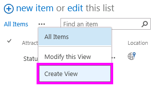
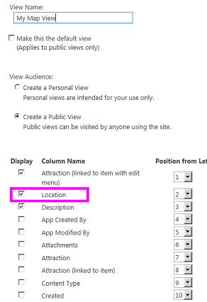

# Erstellen einer Kartenansicht für Geolocation-Feld in SharePoint 2013
Erfahren Sie, wie Standortinformationen mithilfe einer Kartenansicht in SharePoint 2013 Listen anzeigen. Sie können eine Kartenansicht über die SharePoint-Benutzeroberfläche (UI) manuell oder programmgesteuert mit den neuen Feldtyp für **Geolocation** erstellen.
SharePoint 2013 führt einen neuen Feldtyp mit dem Namen **Geolocation**, die Ihnen das Hinzufügen von SharePoint-Listen mit Standortinformationen Anmerkungen ermöglicht. Beispielsweise können jetzt stellen "Standortbasierte" enthält und Breiten- und Längengrad Koordinaten über Bing Maps anzuzeigen. Ein Eintrag wird in der Regel als eine PIN auf einer Kartenansicht betrachtet.
  
    
    

Um einer Kartenansicht in einer SharePoint-Liste anzuzeigen, müssen Sie die Bing Maps-Dienste verwenden. Das **Geolocation** -Feld ist nicht verfügbar, wenn Sie eine Liste erstellen, über die Benutzeroberfläche. Dieses Feld muss stattdessen programmgesteuert eingefügt werden. Informationen zum Rendern und Programmgesteuertes Arbeiten mit diesen Datentyp finden Sie unter [Integrieren von Standort- und Kartenfunktionen in SharePoint 2013](integrating-location-and-map-functionality-in-sharepoint-2013.md).
Das Feld **Geolocation** und Kartenansicht können Sie räumliche Kontext für alle Informationen bereitgestellt, durch die Integration von Daten aus SharePoint in einer Zuordnung in Web- und mobilen apps. In diesem Artikel wird nicht erläutert, wie das Feld **Geolocation** rendern oder enthalten Anleitungen für Entwickler zum Erstellen einer mobilen speicherortbasierte Anwendung; Es stellt Anweisung mithilfe von Bing Maps für Kartenansichten programmgesteuert zu erstellen und von der SharePoint-UI bereit.
  
    
    

Ein MSI-Paket mit dem Namen SQLSysClrTypes.msi muss auf jedem Front-End-Webserver SharePoint zum Anzeigen der **Geolocation** der Wert des Felds oder der Daten in einer Liste installiert werden. Dieses Paket installiert die Komponenten, die die neuen Geometrie, Geografie und Hierarchie-ID-Typen in SQL Server 2008 zu implementieren. Standardmäßig ist diese Datei für SharePoint Online installiert. Es ist jedoch nicht für eine lokale Bereitstellung von SharePoint Server 2013 installiert. Sie müssen ein Mitglied der Gruppe "Farmadministratoren" zum Ausführen dieses Vorgangs sein. Informationen zum Herunterladen von SQLSysClrTypes.msi finden Sie unter [Microsoft SQL Server 2008 R2 SP1 Feature Pack](http://www.microsoft.com/en-us/download/details.aspx?id=26728) für SQL Server 2008 oder [Microsoft SQL Server 2012 Feature Pack](http://www.microsoft.com/en-us/download/details.aspx?id=29065) für SQL Server 2012 im Microsoft Download Center.
## Voraussetzungen für die Erstellung einer Kartenansicht
<a name="SP15CreatingMapViews_Preqs"> </a>


- Zugriff auf eine Liste mit SharePoint 2013, mit der ausreichenden Berechtigungen, um eine Ansicht zu erstellen.
    
  
- Eine Liste von SharePoint 2013, die mit der **Geolocation** -Spalte enthält
    
  
- Ein gültiger Bing Maps-Schlüssel festgelegt Farm oder Web-Ebene, die aus der Bing Maps-Kontocenterhttp://www.bingmapsportal.com/ []()
    
    > **WICHTIG**
      > Sie sind verantwortlich für die Einhaltung von Ausdrücken und Vorschriften für Ihre Verwendung von Bing Maps-Schlüssel und alle erforderlichen Angaben für Benutzer von der Anwendung zu Daten an den Bing Maps-Dienst weitergeleitet.
- Visual Studio 2012 oder Visual Studio 2010
    
  

## Was ist eine Kartenansicht?
<a name="SP15CreatingMapViews_AMapView"> </a>

Eine Kartenansicht ist eine SharePoint-Ansicht, die eine Zuordnung anzeigt (mit Daten aus der Bing Maps-Dienst), Länge und Breite Einträge aus der **Geolocation** -Feldtyp verwenden. Wenn der Feldtyp **Geolocation** auf der SharePoint-Liste verfügbar ist, kann eine Kartenansicht entweder programmgesteuert oder über die SharePoint-UI erstellt werden. Klicken Sie in der Liste zeigt SharePoint 2013 den Speicherort auf einer Karte unterstützt von Bing Maps. Darüber hinaus werden ein neuen Ansicht vom Typ mit dem Namen **Kartenansicht** die Listenelemente als Pins für eine Bing Maps-Ajax-Steuerelement, Version 7 mit den Listenelementen als Karten im linken Bereich angezeigt.
  
    
    

> **HINWEIS**
> Eine beliebige Liste SharePoint 2013 kann bis zu zwei **Geolocation** Spalten enthalten; Sie werden keine dritte **Geolocation** -Spalte in einer Liste hinzufügen können. Eine Kartenansicht kann nur eine **Geolocation** Spalte aufweisen. Sie können mehrere Kartenansichten mit verschiedenen **Geolocation** Spalten erstellen.
  
    
    


## Erstellen einer Kartenansicht aus der SharePoint-UI
<a name="SP15CreatingMapViews_FromSharePointUI"> </a>

Die folgenden Schritte führen Sie zum Erstellen einer Kartenansicht aus der SharePoint 2013 Benutzeroberfläche vor.
  
    
    

1. Öffnen Sie die Liste SharePoint 2013 mit **Geolocation** -Spalte.
    
  
2. Wählen Sie im Menü (Edit Control Block) ECB **Ansicht erstellen**, wie in Abbildung 1 dargestellt.
    
   **Abbildung 1. Erstellen einer Ansicht aus dem ECB-Menü**

  


  

  

  
3. Wählen Sie auf der Seite **Auswählen einer Ansicht vom Typ** **Kartenansicht**, wie in Abbildung 2 dargestellt.
    
   **Abbildung 2. Auswählen eines Ansicht vom Typs**

  


  

  

  
4. Nach dem Auswählen eines Ansicht vom Typs können Sie verschiedene Felder zum Anzeigen in der Kartenansicht auswählen, wie in Abbildung 3 dargestellt.
    
   **Abbildung 3. Auswählen von Feldern für eine Kartenansicht**

  


  

    
    > **HINWEIS**
      > Zum Erstellen einer Kartenansicht ist mindestens ein **Geolocation** Feld erforderlich. Sie können nicht mehrere **Geolocation** Felder für eine Kartenansicht auswählen, obwohl Sie zwei verschiedene Kartenansichten erstellen können, die zwei verschiedene **Geolocation** Felder verwenden.
5. Nach dem Hinzufügen der erforderlichen **Geolocation** dar und den anderen Feldern, die, den Sie benötigen, wählen Sie **OK**. Eine Kartenansicht wird erstellt, wie in Abbildung 4 dargestellt.
    
   **Abbildung 4. Vollständige Kartenansicht**

  


  

  

  

## Programmgesteuertes Erstellen einer Kartenansicht
<a name="SP15CreatingMapViews_ByProgramatically"> </a>

Befolgen Sie diese Schritte, um einer Kartenansicht für eine SharePoint-Liste programmgesteuert zu erstellen.
  
    
    

1. Starten Sie Visual Studio.
    
  
2. Wählen Sie auf der Menüleiste die Optionen Sie **Datei, neues Projekt** aus. Das Dialogfeld **Neues Projekt** wird geöffnet.
    
  
3. Klicken Sie im Dialogfeld **Neues Projekt** wählen Sie **c#** im Feld **Installierte Vorlagen**, und wählen Sie dann die Vorlage **Konsolenanwendung**.
    
  
4. Benennen Sie dem Projekt, und wählen Sie dann auf die Schaltfläche **OK**.
    
  
5. Visual Studio erstellt das Projekt. Fügen Sie einen Verweis auf die folgenden Assemblys hinzu, und wählen Sie **OK**.
    
  - Microsoft.SharePoint.Client.dll
    
  
  - Microsoft.SharePoint.Client.Runtime.dll
    
  
6. Fügen Sie eine Richtlinie **using** in der Standard-cs-Datei wie folgt.
    
     `using Microsoft.SharePoint.Client;`
    
  
7. Fügen Sie den folgenden Code an die **Main** -Methode in der Datei.
    
    > **HINWEIS**
      > Die JSLink Eigenschaft wird nicht auf Umfrage oder Ereignisse unterstützt werden aufgelistet. SharePoint-Kalender ist eine Ereignisliste.

  ```cs
  
class Program
    {
        static void Main(string[] args)
        {
            CreateMapView ();
            Console.WriteLine("A map view is created successfully");
        }
        private static void CreateMapView()
        { 
         // Replace <Site URL> and <List Title> with valid values.
            ClientContext context = new ClientContext("<Site Url>"); 
            List oList = context.Web.Lists.GetByTitle("<List Title>");
            ViewCreationInformation viewCreationinfo = new ViewCreationInformation();
         // Replace <View Name> with the name you want for your map view.
             viewCreationinfo.Title = "<View Name>";
             viewCreationinfo.ViewTypeKind = ViewType.Html;
             View oView = oList.Views.Add(viewCreationinfo);
             oView.JSLink = "mapviewtemplate.js";
            oView.Update();
            context.ExecuteQuery();
        } 
    }
  ```

8. Ersetzen Sie  _<Site Url>_ und _<List Title>_ durch gültige Werte.
    
  
9. Navigieren Sie zu der Liste. Sie sollten eine neu erstellte Ansicht sehen mit dem Namen, den Sie im vorherigen Code angegeben sein.
    
  

## Grundlegendes zu farbcodierten Reißzwecken in einer Kartenansicht
<a name="SP15CreatingMapViews_ColorCode"> </a>

Zeigen Sie eine Karte Providesthree Farben von Reißzwecken (wie in Abbildung 5 dargestellt), von die jedes eine Unterschied Benutzeroberfläche zur Verfügung stellt. Ein PIN auf der Karte hat die gleiche Farbe wie die PIN des übereinstimmenden Elements im linken Bereich.
  
    
    

- **Orange** Gibt an, dass das Feld **Geolocation** für das Element mit den Bing Maps-Diensten zugeordnet ist.
    
  
- **Grau** Gibt an, dass das Feld **Geolocation** für das Element leer ist. Das Element kann nicht mit Bing Maps-Services zugeordnet werden, sodass keine PIN für dieses Element auf der Karte angezeigt wird.
    
  
- **Blau** Wenn ein Benutzer hovert eines Listenelements ändert sich die PIN Farbe von Orange auf Blau festgelegt. Ändern die PIN im linken Bereich und den entsprechenden PIN auf der Karte Farbe
    
  

**Abbildung 5. Einer Kartenansicht mit verschiedenen PIN Farben**

  
    
    

  
    
    

  
    
    
Nachdem Sie eine Kartenansicht erstellt haben, werden alle Elemente als Pins angezeigt. Der Benutzer kann weitere Informationen zu einem Element abrufen, indem eine Reißzwecke hovert wie in Abbildung 6 dargestellt.
  
    
    

**Abbildung 6. Benutzerumgebung mit Reißzwecken in einer Kartenansicht**

  
    
    

  
    
    

  
    
    

  
    
    

  
    
    

## Weitere Ressourcen
<a name="SP15CreatingMapViews_AdditionalResources"> </a>


-  [Integrieren von Standort- und Kartenfunktionen in SharePoint 2013](integrating-location-and-map-functionality-in-sharepoint-2013.md)
    
  
-  [Vorgehensweise: Hinzufügen einer Geolocation-Spalte einer Liste in SharePoint 2013 programmgesteuert](how-to-add-a-geolocation-column-to-a-list-programmatically-in-sharepoint-2013.md)
    
  
-  [Vorgehensweise: Legen Sie die Bing Maps-Taste auf Ordnerebene Web und Farm in SharePoint 2013](how-to-set-the-bing-maps-key-at-the-web-and-farm-level-in-sharepoint-2013.md)
    
  
-  [Vorgehensweise: Integrieren von Zuordnungen in Windows Phone-Anwendungen und SharePoint 2013 aufgelistet](how-to-integrate-maps-with-windows-phone-apps-and-sharepoint-2013-lists.md)
    
  
-  [Verwenden des Standortfeldtyps in mobilen Anwendungen für SharePoint 2013](http://technet.microsoft.com/de-de/library/fp161355%28v=office.15%29.aspx)
    
  

