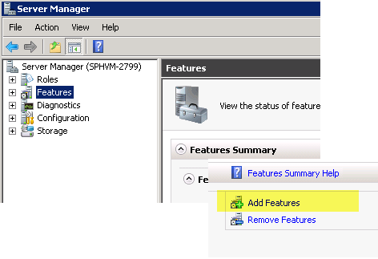
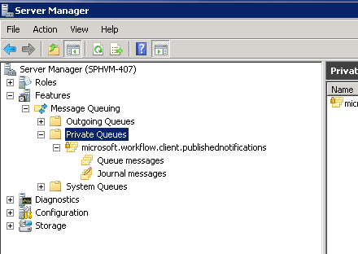

# Vorgehensweise: Konfigurieren von MSMQ für SharePoint 2013-Workflows
Informationen Sie zum Konfigurieren von Microsoft Message Queuing (MSMQ) in SharePoint asynchrones Ereignis messaging in SharePoint-Workflows unterstützen.
## Aktivieren von MSMQ

MSMQ ist ein Windows Server-Feature, das Sie auf Ihrem Computer SharePoint Server aktivieren können, um asynchrones Ereignis messaging in SharePoint-Workflows zu ermöglichen. Um asynchrones Ereignis messaging unterstützen möchten, müssen Sie MSMQ auf Ihrem Computer SharePoint Server aktivieren.
  
    
    
MSMQ wird als "Feature" in Windows Server bereitgestellt. Gehen Sie wie folgt vor, um MSMQ zu aktivieren:
  
    
    

> **WICHTIG**
> Die Screenshots in diesem Artikel sind von Windows Server 2008 R2. Die Benutzeroberfläche kann zum Aktivieren dieses Feature in Windows Server 2012 ändern.
  
    
    


1. Öffnen Sie auf Ihrem Computer SharePoint Server **Server-Manager**.
    
  
2. Wählen Sie im linken Bereich der **Features**-Symbol aus, und wählen Sie dann **Features hinzufügen**, wie in Abbildung 1 dargestellt.
    
   **Abbildung 1: Hinzufügen des Message Queuing-Features.**

  


  

  

  
3. Wählen Sie im **Assistenten zum Hinzufügen von Features**, die angezeigt wird, **Message Queuing**. Akzeptieren Sie die Standardauswahl, und klicken Sie dann klicken Sie auf **Weiter** und dann auf **Installieren**.
    
  
4. Jetzt müssen Sie den Computer neu starten.
    
  
5. Nach dem Neustart, öffnen Sie den **Server Manager**, und öffnen Sie **Message Queuing-** Symbol im linken Bereich. Beachten Sie, dass sie jetzt eine **Message Queuing-** Ordner und seiner Unterverzeichnisse enthält, wie in Abbildung 2 dargestellt.
    
    > **HINWEIS**
      > In Windows Server 2012 finden Sie nicht die Warteschlangen im **Server-Manager**. Stattdessen, wechseln Sie zur **Verwaltung der Computer**, und wählen Sie dann **Dienste und Anwendungen**.
6. Wählen Sie das Unterverzeichnis für **Private Warteschlangen**. Dies ist das Verzeichnis, in dem Ihre Workflow-Ereignisnachrichten gespeichert werden.
    
   **Abbildung 2. Das Feature für die Message Queuing-zu-Server-Manager hinzugefügt.**

  


  

    
    
    
    > **HINWEIS**
      <br/> Wenn Sie das Feature **Message Queuing** zunächst hinzufügen, ist der Ordner **Private Warteschlangen** leer. Nach der Ausführung eines Workflows, der ein Ereignis ausgelöst wird (oder eines Workflows ausgelöst, indem eine SharePoint Content Change-Ereignis ausgeführt wird), wird jedoch der Ordner **Private Warteschlangen** aufgefüllt, wie in Abbildung 2 dargestellt.
7. Um die Installation abzuschließen, müssen Sie die **SPWorkflowServiceApplicationProxy.AllowQueue** -Eigenschaft auf **true** mithilfe eines Skripts Windows PowerShell festlegen. Führen Sie in der **SharePoint-Zentraladministration Shell** folgenden Befehl:
    
  ```
  
$proxy = Get-SPWorkflowServiceApplicationProxy
$proxy.AllowQueue = $true;
$proxy.Update();

  ```


## Problembehandlung bei MSMQ

Windows-Entwicklercenter bietet ausführliche Dokumentation von MSMQ. Es folgen einige nützlichen Ressourcen:
  
    
    

-  [Zu Message Queuing](http://msdn.microsoft.com/en-us/library/windows/desktop/ms706032%28v=vs.85%29.aspx)
    
  
-  [Message Queuing-Referenz (engl.)](http://msdn.microsoft.com/en-us/library/windows/desktop/ms700112%28v=vs.85%29.aspx)
    
  
-  [Message Queuing-Fehler und Codes für Statusangaben](http://msdn.microsoft.com/en-us/library/windows/desktop/ms700106%28v=vs.85%29.aspx)
    
  

## Zusätzliche Ressourcen
<a name="bk_addresources"> </a>


-  [Message Queuing (MSMQ)](http://msdn.microsoft.com/en-us/library/windows/desktop/ms711472%28v=vs.85%29.aspx)
    
  

  
    
    

