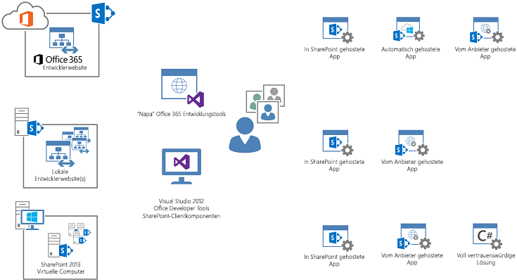
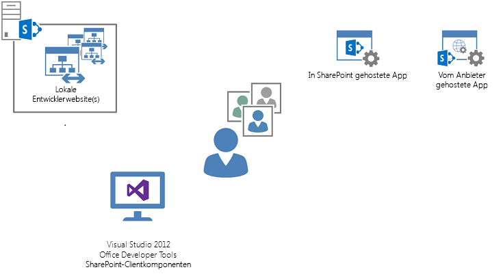
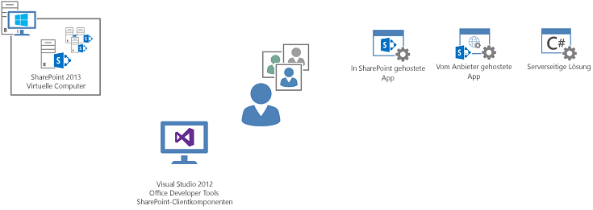
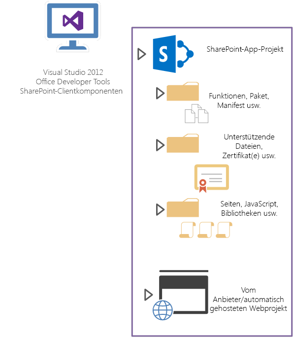
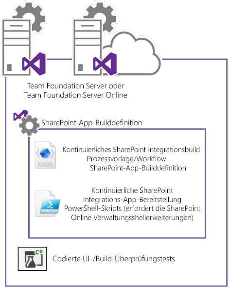
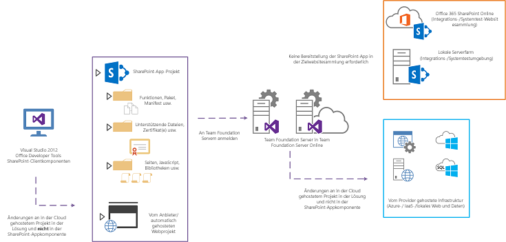
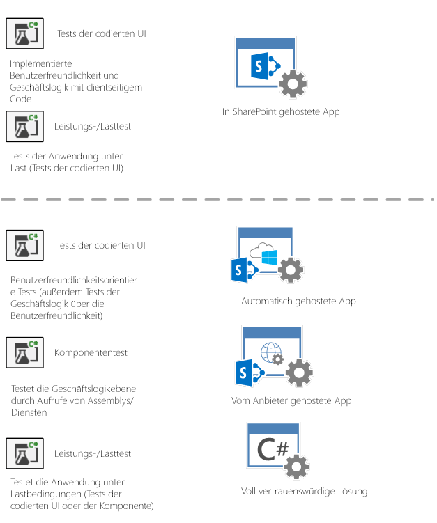

# Anwendungslebenszyklus-Verwaltung für SharePoint Server 2013
Wendet gängige Konzepte und Praktiken der Anwendungslebenszyklus-Verwaltung (Application Lifecycle Management, ALM) auf die Anwendungsentwicklung mithilfe von SharePoint Server 2013-Technologien an.
 * **Bereitgestellt von:*** Eric Charran, Microsoft Corporation
  
    
    

 * **Mitwirkende:*** Vesa Juvonen, Microsoft Corporation | Steve Peschka, Microsoft Corporation

  
    
    

> **WICHTIG**
> Dieses Thema bezieht sich auf automatisch gehostete SharePoint-Add-Ins. Das Vorschauprogramm für automatisch gehostete Apps wurde beendet. Ignorieren Sie alle Verweise auf automatisch gehostete SharePoint-Add-Ins.
  
    
    

## Übersicht über Anwendungslebenszyklus-Verwaltung (ALM)

Microsoft SharePoint Server 2013 bietet Entwicklern mehrere Möglichkeiten zur Erstellung und Bereitstellung von Anwendungen, die auf SharePoint-Technologien basieren, sowohl für lokale als auch gehostete oder öffentliche Cloud-Plattformen. SharePoint Server 2013 bietet mehr Flexibilität für die Formen, die Anwendungen annehmen können, sowie neue Optionen für die Verwendung von auf Standards basierenden Technologien mit Anwendungen. Obwohl diese Anwendungsfunktionen und Bereitstellungsoptionen, die das neue Anwendungsmodell in SharePoint bietet, eine effektive Möglichkeit für Entwickler darstellen, neue und überzeugende Anwendungen zu erstellen, müssen Entwickler in den Entwicklungsprozess Überlegungen bezüglich Qualität, Tests und ALM einfließen lassen. In diesem Artikel werden gängige ALM-Konzepte und -Praktiken auf die Anwendungsentwicklung mithilfe von SharePoint Server 2013 angewendet.
  
    
    

### Neuerungen

SharePoint Server 2013 stellt einen Paradigmenwechsel für die Implementierung von Anwendungen dar. Aufgrund dieser Veränderungen in der Anwendungsentwicklung mit SharePoint-Technologien sollten Anwendungsentwickler und -architekten über fundierte Kenntnisse im Bereich neuer Muster und Praktiken für die Anwendungsentwicklung und neuer Entwicklungsmodelle für SharePoint Server 2013 verfügen. Das Anwendungsmodell für die Entwicklung von Lösungen mit SharePoint hat sich zwar geändert, jedoch stimmen viele der für die Lösungsentwicklung verwendeten Muster, einschließlich der Auswahl der Technologien und Implementierungstechniken, mit vorhandenen Anwendungsentwicklungstechnologien überein.
  
    
    
Die folgenden Ressourcen beschreiben die Anwendungstypen, die mithilfe von SharePoint Server 2013-Technologien entwickelt werden können, und enthalten Überlegungen für lokale und Cloudanwendungen. Informationen zu Hostingoptionen für SharePoint-Add-Ins finden Sie unter  [Auswählen von Mustern für die Entwicklung und das Hosting Ihres Add-Ins für SharePoint](http://msdn.microsoft.com/library/05ce5435-0a03-4ddc-976b-c33b08d03457%28Office.15%29.aspx).
  
    
    
Darüber hinaus empfiehlt Microsoft Kunden, die für die Entwicklung von Anwendungen mit SharePoint Server 2013 verwendeten Technologien zu prüfen, da die Auswahl für die Lösungsimplementierung größer ist. Kunden können sich beim Erstellen von Anwendungen auf die Verwendung von auf Standards basierenden Technologien wie HTML5 und JavaScript für Darstellungs- und Oberflächenebenen konzentrieren, während OData und OAuth für den dienstbasierten Zugriff auf Back-End-Dienste einschließlich SharePoint verwendet werden können. Kunden sollten sorgfältig prüfen, ob voll vertrauenswürdiger Code (d. h. in SharePoint bereitgestellte kompilierte Assemblys) erforderlich ist, obgleich die weitere Verwendung dieses weiterhin gültigen und in einigen Situationen erforderlichen Entwicklungsparadigmas den ALM-Prozess erheblich belastet.
  
    
    
Weitere Informationen zu den neuen flexiblen Entwicklungstechnologien für Anwendungen in SharePoint Server 2013 finden Sie unter  [Übersicht über die SharePoint 2013-Entwicklung](sharepoint-2013-development-overview.md).
  
    
    

### Vorteile und Änderungen

Da von SharePoint unterstützte Anwendungsentwicklungstechnologien jetzt eine flexiblere Auswahl an Sprachen und Programmierungsarchitekturen bieten, müssen Entwickler bestehende ALM-Praktiken an gängige Entwicklungstechniken anpassen, um deren Vorhandensein in SharePoint zu berücksichtigen. Konzepte wie Tests, Builderstellung, Bereitstellung und Qualitätskontrolle können um die Bereitstellung in SharePoint als eine SharePoint-Anwendung erweitert werden. Dies kann bedeuten, dass gängige ALM-Praktiken für das neue flexible Entwicklungsmodell, das durch SharePoint Server 2013-Anwendungen ermöglicht wird, auf den Implementierungsprozess angewendet werden müssen, auch wenn viele Entwickler daran gewöhnt sind, serverseitige Farmlösungen zu schreiben und bereitzustellen, welche die Kernfunktionen von SharePoint erweitern.
  
    
    
Immer mehr Kunden steigen auf in der Cloud gehostete Implementierungen von SharePoint Server 2013 um, und Entwickler müssen wissen, wie ALM-Konzepte auf Entwicklung, Tests und Zielumgebungen für die Bereitstellung ausgedehnt werden können, die sich außerhalb der physischen Grenzen der Organisation befinden. Dazu zählt die Prüfung der Technologiestrategie auf ihre Eignung zur Durchführung von Anwendungsentwicklung, Tests und Bereitstellung.
  
    
    
Entwickler ebenso wie Architekten können sich in der Erstellung von Lösungen, die aus mehreren Anwendungskomponenten bestehen, die verschiedene Typen von Hostingoptionen verwenden oder kombinieren, als sehr versiert erweisen. Während dieses Anpassungsprozesses sollten auf diese Anwendungen einseitig ALM-Verfahren angewendet werden. So müssen Entwickler vielleicht z. B. eine Anwendung bereitstellen, welche die Bereitstellung von lokalen Diensten (d. h. IIS, ASP.NET, MVC, WebAPI und WCF), Microsoft Azure, SharePoint Server 2013 und SQL Azure umfasst, und gleichzeitig die Anwendungskomponenten testen können, um die Qualität zu ermitteln oder festzustellen, ob sich seit dem vorherigen Build Fehler eingeschlichen haben. Diese Anforderungen können eine erhebliche Veränderung der Art und Weise bedeuten, wie Entwickler und Teams den täglichen Build- und Bereitstellungsprozess betrachten, der für lokale oder serverseitige Lösungen bekannt ist.
  
    
    

### Überlegungen für Entwicklungsteams

Organisationen mit mehr als einem Anwendungsentwickler oder -architekten sollten die Teamentwicklung für SharePoint Server 2013 sorgfältig planen, damit Anwendungen mit höchster Qualität bereitgestellt werden und eine ausreichende Produktivität der Entwickler gewährleistet ist. Da die Methode zur Durchführung von Anwendungsentwicklung flexibler geworden ist, benötigen Teams nicht nur eine klare Linie für ALM-Praktiken und -Muster, sondern auch dafür, wie jeder Entwickler Code schreibt. Außerdem muss sichergestellt werden, dass qualitativ hochwertiger Code Bestandteil des Buildprozesses für Anwendungen wird.
  
    
    
Diese Überlegungen beginnen mit der Auswahl der geeigneten Entwicklungsumgebung. In der Vergangenheit waren Entwickler dazu gezwungen, Entwicklungsarbeiten auf separaten Maschinen durchzuführen, die an ein gemeinsames Coderepository wie Visual Studio TFS 2012 angeschlossen waren, das Funktionen für Erstellung, Bereitstellung und Tests bereitstellte. TFS stellt weiterhin eine wichtige instrumentelle Komponente einer ALM-Strategie dar, die für Entwicklungsaktivitäten zentral ist, allerdings sollten sich Teams überlegen, wie sie TFS für die verschiedenen Typen von Entwicklungsumgebungsoptionen verwenden können.
  
    
    
Je nach Zielumgebung und Lösungstyp (d. h. welche Komponenten lokal und welche in Cloud-Infrastruktur oder bei Cloud-Diensten gehostet werden) können Entwickler jetzt aus einer Kombination neuer Entwicklungsumgebungsoptionen wählen. Diese Optionen bestehen aus neuen Auswahlmöglichkeiten, wie der SharePoint-Entwicklungswebsitevorlage und einem Office 365-Entwicklungsmandanten, sowie älteren Auswahlmöglichkeiten, wie z. B. auf virtuellen Maschinen basierte Entwicklung mithilfe von Hyper-V in Windows 8 oder Windows Server 2012.
  
    
    
Im folgenden Abschnitt werden für Anwendungsentwickler und -teams Überlegungen zur Entwicklungsumgebung beschrieben.
  
    
    

## Überlegungen zur Entwicklungsumgebung

Die Auswahl einer Entwicklungsumgebung sollte auf Basis mehrerer Faktoren erfolgen. Diese Überlegungen werden größtenteils durch den Typ der entwickelten Anwendung und die Zielplattform für die Anwendung beeinflusst. Wenn Entwickler in der Vergangenheit Anwendungen für SharePoint Server 2010 erstellten, stellten sie virtuelle Maschinen bereit und führten die Entwicklung in Isolation durch. Dies lag daran, dass die Bereitstellung voll vertrauenswürdiger Lösungen Neustarts von SharePoint-Kernabhängigkeiten wie IIS erfordert hätte, was verhindert hätte, dass mehrere Entwickler eine einzelne SharePoint-Umgebung verwenden. Da sich Entwicklungstechnologien verändert haben und es nun mehr Optionen für Entwickler gibt, die Anwendungen erstellen, sollten Entwickler und Teams wissen, welche verschiedenen Entwicklungsumgebungen ihnen zur Verfügung stehen. Abbildung 1 zeigt die Entwicklungsumgebung und die verschiedenen Tools, einschließlich der Typen von Lösungen, die in den Zielumgebungen bereitgestellt werden können.
  
    
    

**Abbildung 1: Entwicklungsumgebungen - Komponenten und Tools**

  
    
    
 [
  
    
    
](http://go.microsoft.com/fwlink/?LinkId=391723) [Zum Vergrößern hier klicken.](http://go.microsoft.com/fwlink/?LinkId=391723)
  
    
    

### Philosophie zur Entwicklungsumgebung

Aufgrund der Investitionen in die Art und Weise, wie Anwendungen mit SharePoint Server 2013 entworfen und implementiert werden können, sollten Entwickler ermitteln, ob die Entwicklung mithilfe von serverseitigem Code erfolgen muss. Wenn Entwickler Anwendungen erstellen, die das Cloud-Hosting-Modell verwenden, müssen weniger Entwicklungsarbeiten durchgeführt werden, die virtualisierte Umgebungen verwenden. Dies gilt insbesondere für SharePoint. Entwickler sollten Lösungen möglichst mit dem Remote-Entwicklungsmodell erstellen, das vorhandene cloudbasierte (öffentliche und private) Infrastruktur verwendet. Wenn Entwicklungsumgebungen schnell und problemlos bereitgestellt werden können, ohne Virtualisierung erstellen und orchestrieren zu müssen, können Entwickler anstatt auf die Verwaltung der Infrastruktur mehr Zeit auf die Produktivität und Qualität der Entwicklung verwenden.
  
    
    
Die Entscheidung, ob eine virtualisierte Instanz von SharePoint Server 2013 anstatt der neuen SharePoint-Entwicklungswebsitevorlage erforderlich ist, hängt davon ab, ob die Anwendung erfordert, dass in SharePoint voll vertrauenswürdiger Code bereitgestellt und ausgeführt wird. Ist kein voll vertrauenswürdiger Code erforderlich, empfehlen wir die Verwendung der Entwicklungswebsitevorlage, die in Office 365 Entwicklungsmandanten oder in einer lokalen Implementierung von SharePoint einer Organisation zu finden ist. Entwicklerwebsitevorlagen sind dafür gedacht, dass Entwickler Anwendungen von Visual Studio direkt in SharePoint bereitstellen können. Office 365-Entwicklerwebsites sind für Anwendungsisolation und OAuth vorkonfiguriert, sodass Entwickler sofort mit dem Schreiben und Testen von Anwendungen beginnen können.
  
    
    
In den folgenden Abschnitten wird ausführlich beschrieben, wann Entwickler die verschiedenen Umgebungsoptionen zur Erstellung von Anwendungen verwenden können.
  
    
    

### O365-Entwicklungswebsites (öffentliche Cloud)

Abbildung 2 zeigt, wie Entwickler Office 365 als eine Entwicklungsumgebung verwenden können, und umfasst die Typen von Tools, mit denen SharePoint-Anwendungen erstellt werden, die in Office 365 gehostet werden können.
  
    
    

**Abbildung 2. Office 365-App-Entwicklung**

  
    
    
 [
  
    
    
](http://go.microsoft.com/fwlink/?LinkId=391724) [Zum Vergrößern hier klicken.](http://go.microsoft.com/fwlink/?LinkId=391724)
  
    
    
Entwickler mit MSDN-Abonnements können einen Entwicklungsmandanten erhalten, der eine SharePointWebsite für Entwickler enthält. Die SharePointWebsite für Entwickler ist für die Entwicklung von Anwendungen vorkonfiguriert. Benutzer können Visual Studio 2012 nicht nur für die Entwicklung von Anwendungen verwenden. Mit Office 365-Entwicklerwebsites kann Napa innerhalb der Website zur Erstellung von Anwendungen verwendet werden. Weitere Informationen zum Einstieg in eine Website für Office 365-Entwickler finden Sie unter  [Einrichten einer Entwicklungsumgebung für SharePoint-Add-Ins in Office 365](http://msdn.microsoft.com/library/b22ce52a-ae9e-4831-9b68-c9210af6dc54%28Office.15%29.aspx).
  
    
    
Developer können damit beginnen, Anwendungen zu erstellen, die in Office 365, lokal oder in anderer Infrastruktur in einem vom Anbieter gehosteten Modell gehostet werde. Der Vorteil dieser Umgebung ist, dass Infrastruktur, Virtualisierung und andere Hosting-Überlegungen für eine SharePoint-Entwicklungsumgebung von Office 365 abstrahiert werden, sodass Entwickler Anwendungen sofort erstellen können. Eine wichtige Überlegung für diese Art von Entwicklungsumgebung ist, dass keine Anwendungen erstellt werden können, bei denen voll vertrauenswürdiger Code in SharePoint bereitgestellt werden muss. Microsoft empfiehlt den weitestmöglichen Einsatz des SharePoint clientseitigen Objektmodells (CSOM) und clientseitiger Technologien wie JavaScript. Falls voll vertrauenswürdiger Code erforderlich ist (aber keine Ausführung der Bereitstellung des Codes auf SharePoint erforderlich ist), empfehlen wir, den serverseitigen Code in einem automatisch gehosteten oder vom Anbieter gehosteten Modell bereitzustellen. Beachten Sie, dass diese Lösungen mit voll vertrauenswürdigem Code, die in vom Anbieter gehosteter Infrastruktur bereitgestellt werden, auch das CSOM verwenden, aber Sprachen wie C# verwenden können. Es ist auch wichtig zu beachten, dass diese Anwendungen, die in einem vom Anbieter gehosteten Modell bereitgestellt werden, andere Technologiestacks verwenden können und weiterhin das CSOM für die Interaktion mit SharePoint Server 2013 verwenden.
  
    
    
Entwicklungsteams, die separate Features oder Anwendungen erstellen, die eine größere Lösung enthalten, benötigen ein zentralisiertes Entwicklungsziel, um Testkomponenten zu integrieren. Da jeder Entwickler Features und Anwendungen auf seiner eigenen Office 365-Entwicklersite erstellt, sollte eine zentralisierte Websitesammlung in einem Zielmandanten oder einer lokalen Umgebung so bereitgestellt werden, dass dort die Anwendungskomponenten jedes Entwicklers bereitgestellt werden können. Dieser Ansatz ermöglicht die zentrale Durchführung von Integrationstests für Lösungskomponenten. Im  [Abschnitt zur Durchführung von Tests](#Testing) in diesem Dokument wird näher auf diesen Prozess eingegangen.
  
    
    

#### NapaOffice 365-Entwicklungstools

Die Napa-Entwicklungstools können von Entwicklern verwendet werden, um die Erstellung von Anwendungen in einer Office 365-Entwicklerwebsite zu vereinfachen. Die Napa-Tools sind für Entwickler oder Poweruser gedacht, die mit clientseitigen Technologien vertraut sind, um rasch Anwendungen für einen Prototyp, eine Machbarkeitsstudie oder eine schnelle Geschäftslösung zu entwickeln und bereitzustellen. Diese Tools bieten die Möglichkeit, Anwendungsfunktionen in SharePoint zu entwickeln. Während des Lebenszyklus einer Anwendung kann unter bestimmten Umständen ein Import der Anwendung in Visual Studio erforderlich sind. Zu diesen Umständen zählen folgende:
  
    
    

- Wenn mehr als ein Entwickler zu einer Lösung beitragen muss bzw. einen Teil der Lösung entwickeln muss
    
  
- Wenn eine Anwendung einen Abhängigkeitsgrad von Benutzern erreicht, der die Anwendung von Praktiken der Lebenszyklusverwaltung erfordert
    
  
- Wenn sich funktionsbezogene Anforderungen für die Anwendung mit der Zeit ändern und ergänzende Lösungskomponenten erforderlich sind (wie kompilierte Dienste oder Datenquellen)
    
  
- Wenn die Anwendung in andere Anwendungen oder Lösungskomponenten integriert werden muss
    
  
- Wenn Entwickler Qualitätskontrollmaßnahmen wie automatisierte Builds und Tests verwenden müssen
    
  
Sobald eine dieser Bedingungen oder eine ähnliche Bedingung eintritt, müssen Entwickler die Lösung in eine Umgebung unter Quellcodeverwaltung wie TFS exportieren und Überlegungen und Verfahren des ALM-Entwurfs auf die künftige Entwicklung der Anwendung anwenden.
  
    
    

### Entwicklungswebsites (Remoteentwicklung)

Für Organisationen oder Entwickler, die SharePoint-Anwendungen nicht hauptsächlich in Office 365-Entwicklerwebsites entwickeln möchten, können zur Entwicklung von SharePoint-Anwendungen lokale Entwicklungswebsites verwendet werden. In diesem Modell werden die Funktionen der Office 365-Entwicklerwebsites durch lokale Entwicklungswebsites ersetzt, die in einer SharePoint-Farm gehostet werden. Kunden können eine Private Cloud für die Entwicklung erstellen, indem Sie auf internen Entwicklerwebsiteinstanzen eine SharePoint-Farm bereitstellen. Kunden können ihre eigene Governance-Automatisierung verwenden, um Entwicklerwebsite-Vorlagenerstellung zu ermöglichen, oder die in SharePoint integrierten Funktionen zur Bereitstellung von Entwicklerwebsiteinstanzen verwenden. Abbildung 3 illustriert diesen Aufbau.
  
    
    

**Abbildung 3. Lokale App-Entwicklung mit der Entwicklerwebsitevorlage**

  
    
    
 [
  
    
    
](http://go.microsoft.com/fwlink/?LinkId=391725) [Zum Vergrößern hier klicken.](http://go.microsoft.com/fwlink/?LinkId=391725)
  
    
    
Abbildung 3 beschreibt die Entwicklungstools und Anwendungstypen, die Entwicklerwebsites ermöglichen, wenn eine lokale SharePoint-Farm als Host verwendet wird. Beachten Sie, dass NapaOffice 365-Entwicklungstools in dieser Umgebung nicht eingesetzt werden können, da diese nur in Office 365-Entwicklungswebsites verwendet werden können.
  
    
    
Die SharePoint-Farm, die Website für Entwickler-Instanzen hostet, muss überwacht werden und Service-, Recovery Point- und zeitbezogene Ziele erfüllen, damit Entwickler, die damit Anwendungen erstellen, produktiv und unterbrechungsfrei arbeiten können. Kunden können auf diese Umgebung Private Cloud-Konzepte wie Elastizität, Skalierungseinheiten und eine Verwaltungs-Fabric anwenden. Betrieb und Verwaltung müssen auf die SharePoint-Farm angewendet werden, in der auch die Entwicklerwebsites verwaltet werden. Dadurch lässt sich eine unkontrollierte Verbreitung zahlreicher Entwicklerwebsites vermeiden, die nicht in Verwendung sind. Außerdem bietet dies die Möglichkeit zu ermitteln, wann die Umgebung skaliert werden muss.
  
    
    
Kunden können IaaS-Funktionen (Infrastructure-as-a-Service) wie Microsoft Azure verwenden, um die SharePoint-Farms zu hosten, die Entwicklerwebsites enthalten und hosten. Sie können auch ihre eigenen lokalen virtuellen oder physischen Umgebungen verwenden. Beachten Sie, dass bei Verwendung dieses Modells SharePoint nicht für jeden Entwickler installiert werden muss. Zur Remoteanwendungsentwicklung müssen nur Visual Studio und Office- und SharePoint 2013-Entwicklungstools auf der Arbeitsstation des Entwicklers installiert sein.
  
    
    
Entwickler müssen vom Anbieter gehostete Infrastruktur schaffen, um die vom Anbieter gehosteten Anwendungen bereitzustellen. Vom Anbieter gehostete Komponenten einer SharePoint-Anwendung können zwar in einer Vielzahl von Technologien implementiert werden, doch Entwickler müssen eine Infrastruktur zum Hosten dieser Komponenten der Anwendungen bereitstellen, die außerhalb von SharePoint ausgeführt werden. Wenn ein Team z. B. eine SharePoint-Anwendung entwickelt, bei der sich die Komponente für die Benutzeroberfläche und sonstige Komponenten in einer ASP.NET-Anwendung befinden, sollte das Entwicklungsteam lokale Versionen von IIS,SQL Server usw. verwenden und herkömmliche ALM-Teamentwicklungsmuster für ASP.NET verwenden.
  
    
    

### Eigenständige Farmumgebungen (virtualisierte Farmentwicklung)

Bei Lösungen, welche erfordern, dass voll vertrauenswürdiger Code in einer SharePoint-Farm ausgeführt wird, ist eine vollständige (häufig virtualisierte) Implementierung von SharePoint Server 2013 erforderlich. Eine Anleitung zum Erstellen einer lokalen Entwicklungsumgebung für SharePoint finden Sie unter  [Einrichten einer lokalen Entwicklungsumgebung für SharePoint-Add-Ins](http://msdn.microsoft.com/library/b0878c12-27c9-4eea-ae3b-7e79e5a8838d%28Office.15%29.aspx).
  
    
    
Abbildung 4 zeigt die Typen von Anwendungen, die mithilfe einer lokalen virtualisierten Umgebung erstellt werden können.
  
    
    

**Abbildung 4. Lokale Entwicklung mit einer virtuellen Umgebung**

  
    
    
 [
  
    
    
](http://go.microsoft.com/fwlink/?LinkId=391726) [Zum Vergrößern hier klicken.](http://go.microsoft.com/fwlink/?LinkId=391726)
  
    
    
Entwickler können Remoteentwicklung für die SharePoint und in der Cloud gehosteten Anwendungen in ihren eigenen SharePoint-Farmen sowie die Entwicklung von Farmlösungen mit voller Vertrauenswürdigkeit verwenden. Diese Farmen werden oft in einem Virtualisierungsserver gehostet, der auf der Arbeitsstation des Entwicklers oder in einer zentralen Private Cloud gehostet wird, die für Entwickler leicht zugänglich ist. Die SharePoint-Farmumgebung ist normalerweise von den Farmen anderer Entwickler getrennt und bietet einen Isolationsgrad, der beim Entwickeln von voll vertrauenswürdigem Code erforderlich ist und den Neustart kritischer Dienste (z. B. IIS) erfordern kann.
  
    
    
Remoteentwicklung und die Entwicklung von voll vertrauenswürdigem Code können innerhalb der eigenständigen Farm erfolgen, da jede Entwicklungsfarm isoliert ist und nur einem Entwickler zugeordnet ist.
  
    
    
Organisationen oder Entwickler müssen die SharePoint-Farmen, die in den virtuellen Computern ausgeführt werden, verwalten und aktualisieren. Entwickler, die an einer einzelnen Anwendung mitarbeiten, müssen die Parität zwischen den Entwicklungsfarmen wahren, die in den virtuellen Computern ausgeführt werden. Dadurch wird sichergestellt, dass jede für die Anwendung entwickelte Codekomponente konsistent ist. Weitere gängige Überlegungen sind eine Standardkonfiguration für die Farmen, einschließlich Domänenzugriff und Anmeldeinformationen, Dienstanwendungs-Anmeldeinformationen, Testidentitäten oder -konten und andere umgebungsbezogene Konfigurationselemente (wie Zertifikate).
  
    
    
Ähnlich einer zentralisierten Farm für Entwicklungswebsites können diese virtuellen Maschinen, auf denen SharePoint-Entwicklerfarmen ausgeführt werden, in IaaS-Plattformen wie Microsoft Azure und lokalen Private Cloud-Angeboten gehostet werden.
  
    
    
Obgleich virtuelle Maschinen einen hohen Grad an Isolation und Unabhängigkeit von anderen virtuellen Entwicklermaschinen bieten, sollten Teams gleiche Konfigurationen für virtuelle Maschinen anstreben. Dazu zählen eine gemeinsame Konfiguration für Domäne, Konto und Sicherheit und SharePoint und eine Verbindung zu einem Quellcodeverwaltungs-Repository wie Visual Studio Team Foundation Server (TFS).
  
    
    

## Überlegungen zum ALM-Entwurf

Bei der Erstellung von SharePoint-Anwendungen müssen einige Punkte beachtet werden, um zu Konsistenz- und Qualitätszwecken Governance- und gängige Entwicklungspraktiken bereitzustellen. Wenn ALM-Prinzipien auf die SharePoint-Anwendungsentwicklung angewendet werden, müssen sich Entwickler auf technische sowie prozessgesteuerte Überlegungen konzentrieren.
  
    
    
Zur Anwendungsentwicklung, insbesondere wenn Teams von Entwicklern an den gleichen Projekten arbeiten, ist normalerweise die Unterstützung einer ALM-Plattform wie Visual Studio Team Foundation Server 2012 erforderlich. SharePoint-Anwendungen erfordern wie andere technische Lösungen Coderepository-Verwaltung und Versionsverwaltung, Builddienste, Testdienste und Praktiken der Releaseverwaltung. Im folgenden Abschnitt werden Überlegungen für ALM mit Bezug auf die verschiedenen Anwendungsmodelle für SharePoint-Anwendungen beschrieben.
  
    
    

### Übersicht

Für jede Art von SharePoint-Anwendung müssen die ALM-Überlegungen unverändert angewendet werden. Praktiken und Verfahren rund um Build, Tests und Änderungsverwaltung müssen allerdings angepasst werden.
  
    
    
Einige SharePoint-Anwendungen verwenden clientseitige Technologien. Die meisten Entwickler, die Erfahrung in der Entwicklung von SharePoint Server 2010-Anwendungen haben, müssen sich daran gewöhnen, nicht kompilierten Code zu entwickeln und darauf ALM-Prinzipien anzuwenden. So müssen etwa auch Konzepte wie ein "Build" auf eine Lösung angewendet werden, die möglicherweise keinen kompilierten Code aufweist. ALM-Plattformen wie Visual Studio 2012 weisen integrierte Funktionen zur Validierung von Builds auf. Dabei wird der Code zuerst kompiliert, und anschließend werden Buildüberprüfungstests ausgeführt.
  
    
    
Bei SharePoint-Anwendungen sollte der Build- und Testprozess mit den herkömmlichen Anwendungsentwicklungsprozessen übereinstimmen. Dazu zählt die Erstellung eines Buildzeitplans durch die ALM-Plattform, welche die Lösung kompiliert und in der Zielumgebung bereitstellt.
  
    
    

### Buildprozesse

Die SharePoint-Anwendungsbuildprozesse werden durch die ALM-Plattform erleichtert. Visual Studio Team Foundation Server 2012 bietet sowohl Build- als auch Testdienste, die beim Einchecken der Lösung von Visual Studio 2012 (fortlaufende Integration) oder in bestimmten geplanten Zeitabständen ausgelöst werden können.
  
    
    

#### SharePoint-Buildkomponenten

Wenn Entwickler Buildprozesse für die Entwicklung von SharePoint-Anwendung planen, müssen sie die Interaktionen zwischen den Komponenten berücksichtigen (siehe Abbildung 5).
  
    
    

**Abbildung 5. In SharePoint gehostete App-Buildkomponenten**

  
    
    

  
    
    

  
    
    
Die Illustration in Abbildung 5 ist eine logische Darstellung einer SharePoint-Anwendung. Diese Illustration zeigt eine Von SharePoint gehostetes Add-In und hebt wichtige Anwendungsobjekte als Bestandteil eines Visual Studio 2012Von SharePoint gehostetes Add-In-Projekts hervor. Das SharePoint-App-Projekt enthält die Features, das Paket und das Manifest, welche bei SharePoint registriert werden. Das Projekt enthält außerdem Seiten, Skriptbibliotheken und andere Elemente der Benutzeroberfläche, welche die SharePoint-Anwendung bilden. Darüber hinaus enthält das SharePoint-Projekt unterstützende Dateien, welche die zur Bereitstellung in einer SharePoint-Zielumgebung erforderlichen Zertifikate umfassen.
  
    
    

**Abbildung 6. Vom Anbieter und automatisch gehostete App-Build-Komponenten**

  
    
    

  
    
    

  
    
    
Abbildung 6 zeigt eine in der Cloud gehostete (d. h. automatisch oder vom Anbieter gehostete) SharePoint-Anwendung. Der Hauptunterschied in der Projektstruktur ist, dass die Visual Studio 2012-Lösung zusätzlich zu einem oder mehreren Projekten, welche die in der Cloud gehosteten Anwendungskomponenten enthalten, ein SharePoint-Anwendungsprojekt enthält. Dazu können Webanwendungen, SQL-Datenbankprojekte oder Dienstanwendungen zählen, die in Azure oder einer lokalen vom Anbieter gehosteten Infrastruktur (wie ASP.NET) bereitgestellt werden, und andere Lösungskomponenten zählen. Eine Anleitung zum Packen und Bereitstellen besonders vertrauenswürdiger Anwendungen finden Sie unter  [Packen und Veröffentlichen besonders vertrauenswürdiger Add-Ins für SharePoint](http://msdn.microsoft.com/library/3c28aed8-c037-407c-9154-39a74073e170%28Office.15%29.aspx).
  
    
    

**Abbildung 7. ALM mit Visual Studio Team Foundation Server**

  
    
    

  
    
    

  
    
    
Abbildung 7 zeigt TFS als die ALM-Plattform. Teams verwenden TFS zum Speichern von Code und zur Durchführung von Teamentwicklungsarbeiten mit lokal bereitgestelltem TFS oder mit cloudbasierten TFS-Diensten von Microsoft. TFS kann für die Durchführung von Build- und Bereitstellungsaktivitäten mit einer SharePoint-Anwendung durch Builddefinitionen konfiguriert werden. TFS kann auch zur Durchführung von Buildüberprüfungstests verwendet werden, die durch die Ausführung kodierter UI-Tests automatisiert werden können, die Teil der Builddefinition sind.
  
    
    

**Abbildung 8. TFS-Buildziele**

  
    
    

  
    
    

  
    
    
Abbildung 8 zeigt die Zielumgebungen, in denen durch eine TFS-Builddefinition ausgeführte Skripts die SharePoint-Anwendungskomponenten bereitstellen. Bei in SharePoint gehosteten Anwendungen umfasst dies die Bereitstellung in SharePoint Online oder in lokalen SharePoint-Anwendungskatalogen.
  
    
    
Bei in der Cloud gehosteten SharePoint-Anwendungen werden die Komponenten der Lösung, die zusätzliche Infrastruktur außerhalb von SharePoint erfordern, in Zielumgebungen bereitgestellt. Bei automatisch gehosteten Anwendungen ist dies Microsoft Azure. Bei vom Anbieter gehosteten Anwendungen kann es sich bei dieser Infrastruktur um Microsoft Azure oder andere lokale oder IaaS-gehostete Umgebungen handeln.
  
    
    

#### Erstellen eines Builds für SharePoint-Anwendungen

TFS stellt Builddienste bereit, die in die Quellcodeverwaltung eingecheckte Lösungen kompilieren und die Ausgabe auf automatisierte Weise an einem zentralen Ort zur Bereitstellung in Zielumgebungen ablegen können. Die vorrangig verwendete Methode, um TFS für automatisierte Builds, Bereitstellungen und das Testen von SharePoint-Anwendungen zu konfigurieren, stellt die Erstellung einer Builddefinition in Visual Studio dar. Die Builddefinition enthält Informationen darüber, welche Codeprojekte kompiliert werden sollen, sowie alle Aktivitäten nach der Kompilierung, wie die Durchführung von Tests und die eigentliche Bereitstellung in den Zielumgebungen. Weitere Informationen zum Team Foundation-Builddienst finden Sie unter  [Einrichten des Team Foundation-Builddiensts](http://msdn.microsoft.com/de-de/library/vstudio/ee259687.aspx).
  
    
    
Um eine fortlaufende Integration zu erzielen, kann die Builddefinition ausgelöst werden, wenn Entwickler Code einchecken. Außerdem kann die Ausführung der Builddefinition in festen zeitlichen Abständen geplant werden.
  
    
    
Bei SharePoint-Anwendungen sollten Entwickler das Builddefinitionsprojekt  [Fortlaufende Integration von Office/SharePoint 2013 in TFS 2012](http://officesharepointci.codeplex.com/) verwenden, um geplante Builds oder fortlaufende Integration zu erzielen. Dieses Projekt bietet Builddefinitionen, Windows PowerShell-Skripts und Prozessanleitungen zum Konfigurieren von Visual Studio Online oder einer lokalen Version von TFS zur Erstellung und Bereitstellung von SharePoint-Anwendungen in einem fortlaufenden Integrationsmodell. Entwickler sollten die Komponenten in diesem Projekt herunterladen und ihre TFS-Instanz entsprechend konfigurieren. Eine Anleitung zum Konfigurieren von TFS mit der bereitgestellten Builddefinition für SharePoint-Anwendungen und zum Konfigurieren der Builddefinition für die Verwendung der Windows PowerShell-Skripte zur Bereitstellung der SharePoint-Anwendung in einer Zielumgebung finden Sie unter [Fortlaufende Integration von Office/SharePoint 2013 in TFS 2012 - Dokumentation](http://officesharepointci.codeplex.com/documentation).
  
    
    

#### Konfigurieren von Build- und Bereitstellungsverfahren

Abbildung 9 zeigt einen Standardprozess für SharePoint-Anwendungsbuilds und Bereitstellungen, wenn die Builddefinition in der TFS-Instanz des Teams erstellt, konfiguriert und bereitgestellt wurde.
  
    
    

**Abbildung 9. Build- und Bereitstellungsprozess mit TFS**

  
    
    
 [
  
    
    
](http://go.microsoft.com/fwlink/?LinkId=391727) [Zum Vergrößern hier klicken.](http://go.microsoft.com/fwlink/?LinkId=391727)
  
    
    
Der Entwickler checkt die SharePointVisual Studio 2012-Lösung ein. Je nach gewünschter Konfiguration (d. h. fortlaufende Integration oder geplanter Build) führen TFS-Builddienste die von der SharePoint-Anwendungsbuilddefinition definierten Schritte aus. Diese vom Entwicklern konfigurierte Definition enthält die Vorlage für den Buildprozess mit fortlaufender Integration sowie Anleitungen nach dem Build zur Ausführung von Windows PowerShell-Skripts zur Anwendungsbereitstellung. Beachten Sie, dass die Erweiterungen der SharePoint Online-Verwaltungsshell erforderlich sind, um die Anwendung in SharePoint Online bereitzustellen. Weitere Informationen zu Erweiterungen der SharePoint Online-Verwaltungsshell finden Sie im Download Center auf der Seite zur  [SharePoint Online-Verwaltungsshell](http://www.microsoft.com/de-de/download/details.aspx?id=35588).
  
    
    
Nachdem der Build ausgelöst wurde, kompiliert TFS die mit der SharePoint-Anwendung verknüpften Projekte und führt Windows PowerShell-Skripts aus, um die Lösung in der SharePoint-Zielumgebung bereitzustellen.
  
    
    

#### Der SharePoint-Anwendung vertrauen

Im Anschluss an die Bereitstellung der Anwendungskomponenten in den Zielumgebungen sollte beachtet werden, dass ein Mandantenadministrator (oder Websitesammlungsadministrator) der Anwendung auf der App-Informationsseite in SharePoint vertrauen muss, bevor jemand auf die Anwendung zugreift oder automatisierte Tests durchgeführt werden, die Teil des Builds sein können. Diese Anforderung bezieht sich auf automatisch gehostete und in SharePoint gehostete Apps. Dieser manuelle Prozess stellt eine Änderung im Buildprozess dar, da Tests, die normalerweise am Anschluss an die Bereitstellung in der Zielumgebung ausgeführt würden, angehalten werden müssen, bis der Anwendung vertraut wurde.
  
    
    
Beachten Sie, dass Entwickler bei in der Cloud (automatisch oder vom Anbieter) gehosteten Anwendungen die Nicht-SharePoint-Komponenten in der in der Cloud gehosteten Infrastruktur getrennt vom Anwendungspaket bereitstellen können, das in SharePoint bereitgestellt wurde.
  
    
    

**Abbildung 10. Bereitstellen von Nicht-SharePoint-Komponenten**

  
    
    
 [
  
    
    
](http://go.microsoft.com/fwlink/?LinkId=391728) [Zum Vergrößern hier klicken.](http://go.microsoft.com/fwlink/?LinkId=391728)
  
    
    
Wenn Entwickler Änderungen an der Lösung vornehmen, welche die SharePoint-Anwendung darstellt, kann es, wie Abbildung 10 zeigt, Fälle geben, in denen Änderungen an den Projekten in der Lösung vorgenommen werden, die nicht für das SharePoint-Anwendungsprojekt selbst gelten. In diesem Fall muss das SharePoint-Anwendungsprojekt nicht erneut bereitgestellt werden, da es nicht geändert wurde. Die mit den in der Cloud gehosteten Projekten verbundenen Änderungen müssen erneut bereitgestellt werden.
  
    
    
Änderungen an der Anwendung, die in Infrastruktur außerhalb von SharePoint bereitgestellt wird, können getrennt von den Anwendungskomponenten vorgenommen werden, die in der Zielwebsitesammlung oder im Zielmandanten bereitgestellt werden. Für Entwickler bedeutet dies, dass ein automatisierter Buildprozess erstellt werden kann, um die in der Cloud gehosteten Komponenten häufig (bei Auslösung) und getrennt vom SharePoint-Anwendungsprojekt bereitzustellen. Somit ist der manuelle Schritt zur Genehmigung der Berechtigung der Anwendung auf der App-Informationsseite in SharePoint nicht erforderlich, was den Bereitstellungs- und Testprozess für die Builddefinition reibungsloser macht. Die SharePoint-Anwendungskomponente der Lösung müsste nur bereitgestellt werden, wenn die Elmente in diesem Projekt geändert wurden und eine erneute Bereitstellung erforderlich ist.
  
    
    

### Durchführung von Tests

Wie im  [Abschnitt zu Buildprozessen](#ALMBuildProcess) beschrieben, stellen Anwendungstests eine Methode dar, mit der ermittelt werden kann, ob die Kompilierung und Bereitstellung der Anwendung erfolgreich war. Der Einsatz von Tests zur Überprüfung des Builds und der Bereitstellung der Anwendung ermöglicht dem Team ein besseres Verständnis der Qualität und erlaubt ihm zu erkennen, wann eine kürzliche Änderung am Anwendungscode die SharePoint-Anwendung beeinträchtigt hat.
  
    
    
Abbildung 11 zeigt, welche Arten von Testansätzen für SharePoint-Anwendungsmodelle am besten geeignet sind.
  
    
    

**Abbildung 11. Testansätze**

  
    
    
 [
  
    
    
](http://go.microsoft.com/fwlink/?LinkId=391729) [Zum Vergrößern hier klicken.](http://go.microsoft.com/fwlink/?LinkId=391729)
  
    
    
Abbildung 11 schlägt die Verwendung verschiedener Typen von Tests zum Testen von SharePoint-Anwendungen nach Typ vor. Kodierte UI-Tests sollten für in SharePoint gehostete Anwendungen verwendet werden, bei denen sich Geschäftslogik und Benutzeroberfläche auf der gleichen Ebene befinden. Geschäftslogik kann zwar in JavaScript-Bibliotheken abstrahiert werden, jedoch wird diese Logik vorrangig über die Benutzeroberfläche getestet.
  
    
    
In der Cloud (d. h. automatisch und vom Anbieter) gehostete Anwendungen können vollständig kodierte UI-Tests und auch Komponententests zur Überprüfung der Dienstkomponenten der Lösung verwenden. So kann der Entwickler aus einer funktionsbezogenen Perspektive Vertrauen in die Qualität der Implementierung der gehosteten Infrastruktur der Anwendung gewinnen.
  
    
    
Die folgenden Abschnitte enthalten die Überlegungen zu kodierten UI-Tests und anderen Testtypen im Hinblick auf SharePoint-Anwendungen.
  
    
    

#### Clientseitiger Code und kodierte UI-Tests

Für Buildüberprüfungstests sowie vollständige Systemtests werden kodierte UI-Tests empfohlen. Diese Tests basieren auf aufgezeichneten Aktionen, um nicht nur die Geschäftslogik und die mittlere Anwendungsebene, sondern auch die Benutzeroberfläche zu testen. Bei SharePoint-Anwendungen, die clientseitigen Code verwenden, können sich Einstiegspunkte und Ausführung der Geschäftslogik größtenteils in der Benutzeroberflächenebene befinden. Aus diesem Grund können kodierte UI-Tests nicht nur die Benutzeroberfläche, sondern auch die Geschäftslogik der Anwendung testen. Weitere Informationen zum kodierten UI-Test finden Sie unter  [Überprüfen von Code mithilfe der Benutzeroberflächenautomatisierung](http://msdn.microsoft.com/de-de/library/dd286726.aspx).
  
    
    
Kodierte UI-Tests können in Von SharePoint gehostetes Add-Ins verwendet werden, bei denen Benutzeroberfläche und Geschäftslogik nicht getrennt sind. Diese Tests können wie andere Tests über eine Builddefinition in TFS ausgeführt werden, sodass sie die Funktionalität einer Anwendung nach der Bereitstellung (und nachdem der Anwendung von SharePoint vertraut wurde) überprüfen können.
  
    
    

#### Nicht kodierte UI-Tests

In Fällen, in denen sich die Anwendungslogik außerhalb der Benutzeroberflächenebene der Anwendung befindet, wie bei in der Cloud gehosteten Anwendungen, sollte eine Kombination aus kodierten und nicht kodierten UI-Tests verwendet werden. Tests wie herkömmliche Komponententests können verwendet werden, um die Buildqualität der Dienstlogik zu überprüfen, die in einer vom Anbieter gehosteten Infrastruktur implementiert wurde. Dadurch kann der Entwickler aus einer testbezogenen Perspektive umfassendes Vertrauen in das ordnungsgemäße Funktionieren der vom Anbieter gehosteten Komponenten gewinnen.
  
    
    

#### Webleistungs- und Auslastungstests

Durch Webleistungs- und Auslastungstests gewinnen Entwickler Vertrauen in das ordnungsgemäße Funktionieren der Anwendung unter erwarteten oder prognostizierten Benutzerlasten. Bei diesen Tests wird auch ermittelt, inwiefern die Anwendung gleichzeitig eine vorhersehbare Benutzerbasis verarbeiten kann, die mit der Zeit in angemessenem Umfang ansteigt. Sowohl kodierte Tests als auch Komponententests können als Quelle für den Webleistungs- und Auslastungstest dienen. Mithilfe einer ALM-Plattform wie TFS können diese Tests verwendet werden, um einen Auslastungstest für Ihre Anwendung durchzuführen.
  
    
    
Beachten Sie, dass das Testen der Infrastruktur nicht das vorrangige Ziel dieser Tests ist, wenn mit diesen SharePoint-Anwendungen getestet werden. Für die Infrastruktur, ob in SharePoint oder vom Anbieter gehostet, sollte ein ähnlicher Bezugswert für Auslastung und Leistung festgelegt werden. Die Webleistungs- und Auslastungstests für die Anwendung machen zwar Herausforderungen der Infrastruktur deutlich, sollten aber hauptsächlich als Methode zum Testen der Anwendungsleistung betrachtet werden.
  
    
    
Weitere Informationen zu Webleistungs- und Auslastungstests finden Sie unter  [Ausführen von Leistungstests für eine Anwendung vor der Veröffentlichung](http://msdn.microsoft.com/de-de/library/vstudio/dn250793.aspx).
  
    
    

#### Qualität und Testumgebungen

Viele Organisationen besitzen mehrere Testumgebungen, die physisch oder virtuell und voneinander getrennt sein können. Diese Umgebungen können in Abhängigkeit vom ALM-Prozess eines Teams und von den rechtlichen Anforderungen oder einer Kombination dieser beiden Faktoren variieren. Um die Anzahl und die Typen von Testumgebungen zu ermitteln, die Teams verwenden sollten, wurden die folgenden Richtlinien auf Basis funktionsbezogener Praktiken erstellt, die sich speziell auf SharePoint-Anwendungen beziehen. Es sind aber auch ALM-Praktiken enthalten, die für Softwareentwicklung im Allgemeinen gelten.
  
    
    

#### Entwicklertests

Entwicklertests können in der Umgebung durchgeführt werden, in der die Entwickler ihre Komponente der Lösung erstellen. Zahlreiche Entwickler, die jeweils an verschiedenen Aspekten oder Komponenten einer größeren Anwendung arbeiten, führen jeweils Komponententests und kodierte UI-Tests durch und stellen den Anwendungscode in ihrer Entwicklungswebsite bereit.
  
    
    

**Abbildung 12. Prozess für Entwicklertests**

  
    
    
 [
  
    
    
](http://go.microsoft.com/fwlink/?LinkId=391731) [Zum Vergrößern hier klicken.](http://go.microsoft.com/fwlink/?LinkId=391731)
  
    
    
Entwickler führen Tests in Visual Studio mit den in ihrer eigenen Office 365-Entwicklerwebsite oder in der lokalen Entwicklerwebsite bereitgestellten Lösungskomponenten durch. Bei in der Cloud gehosteten Anwendungen werden die Tests in Visual Studio auch mit den Lösungskomponenten durchgeführt, die sich in vom Anbieter gehosteter Infrastruktur befinden. Diese Komponenten befinden sich im Microsoft Azure-Abonnement des Entwicklers.
  
    
    
Beachten Sie, dass bei diesem Ansatz davon ausgegangen wird, dass Entwickler einzelne Office 365-Entwicklerwebsites und Microsoft Azure-Abonnements besitzen, die durch MSDN-Abonnements bereitgestellt werden. Auch wenn Entwickler Anwendungen für die lokale Bereitstellung erstellen, können diese Entwicklerdienste für Entwicklung und Tests verwendet.
  
    
    
Wenn Entwickler diese Dienste nicht besitzen oder Entwicklungsarbeiten vollständig lokal durchführen müssen, führen sie Tests für ihre Komponenten mit der Entwicklungswebsitesammlung einer lokalen Farm und entwicklerspezifischer, vom Anbieter gehosteten Infrastruktur durch. Die vom Anbieter gehostete Infrastruktur kann sich in speziellen virtuellen Maschinen des Entwicklers befinden. Zur Entwicklung voll vertrauenswürdiger Lösungen benötigen Entwickler eine eigene virtuelle SharePoint-Farm und vom Anbieter gehostete Infrastruktur.
  
    
    

#### Integrations- und Systemtests

Um die Anwendung zu testen, sollten alle Entwicklungskomponenten in einer zentralen Umgebung zusammengeführt und bereitgestellt werden. Diese Integrationsumgebung bietet einen Ort, an dem Entwickler die von ihnen erstellten Komponenten der Lösung bereitstellen und beobachten können, wie sie mit anderen Lösungskomponenten interagieren, die von anderen Entwicklern geschrieben wurden.
  
    
    

**Abbildung 13. Integrationstestumgebung**

  
    
    
 [
  
    
    
](http://go.microsoft.com/fwlink/?LinkId=391732) [Zum Vergrößern hier klicken.](http://go.microsoft.com/fwlink/?LinkId=391732)
  
    
    
Für diese Art von Test erstellt die ALM-Plattform die SharePoint-Anwendung und stellt diese und alle erforderlichen Komponenten in den Zielumgebungen bereit. Bei in SharePoint gehosteten Anwendungen handelt es sich hierbei entweder um eine Office 365-Website oder eine lokale/IaaS-SharePoint Server 2013-Websitesammlung, die speziell für Integrations- und Systemtests erstellt wurde. Bei in der Cloud gehosteten SharePoint-Anwendungen stellt TFS die Komponenten auch in einem zentralen Microsoft Azure-Abonnement bereit, wo die Dienste speziell für Integrations- und Systemtests konfiguriert werden. TFS führt dann mit der SharePoint-Anwendung sowie Komponenten, welche die Lösung in gehosteter Infrastruktur benötigt, kodierte UI- oder Komponententests durch.
  
    
    

#### Benutzerakzeptanztests und QA-Tests

Für Benutzerakzeptanztests haben Organisationen oft separate Umgebungen, in denen diese Tests getrennt von Integrations- und Systemtests durchgeführt werden. Eine Trennung dieser Testumgebung verhindert, dass automatisierte fortlaufende Freigaben und Tests Benutzerakzeptanztests beeinträchtigen, wobei Benutzer über einen längeren Zeitraum Tests mit einem speziellen Build der Anwendung durchführen.
  
    
    

**Abbildung 14. Benutzerakzeptanztests**

  
    
    
 [
  
    
    
](http://go.microsoft.com/fwlink/?LinkId=391733) [Zum Vergrößern hier klicken.](http://go.microsoft.com/fwlink/?LinkId=391733)
  
    
    
Wie in Abbildung 14 gezeigt, führen Benutzer, die mit der Durchführung von Akzeptanztests oder Testressourcen der Organisation beauftragt wurden, Testskripts in einer stabilen Umgebung aus, die auf einen umfassend veröffentlichten Build der Anwendung konzentriert ist. Codebereitstellung und Tests werden zwar in der Integrationsumgebung fortgeführt, doch Benutzer führen manuelle Tests durch, um zu überprüfen, ob die Anwendung die erforderlichen Verwendungs- und Testfälle erfüllt. Die Anwendung und jegliche vom Anbieter gehostete Infrastruktur werden - normalerweise von einem Versions-Manager - in dieser Testumgebung bereitgestellt. Auch eine automatisierte Bereitstellung ist möglich. Diese Art von Bereitstellung verwendet in TFS eine spezielle Builddefinition für Benutzerakzeptanztests, die derjenigen entspricht, welche die Bereitstellung für die Integrations- und Systemtestumgebung durchführt.
  
    
    
Bei in der Cloud gehosteter Infrastruktur ist eine Bereitstellung in einem Microsoft Azure-Abonnement möglich, das auch von der Integrations- und Systemtestumgebung verwendet wird, wenn die Dienste so benannt und konfiguriert sind, dass sie nebeneinander als verschiedene Dienste oder Datenbanken bereitgestellt werden können. Dieser Ansatz bietet eine Reihe von Diensten und Datenbanken im Microsoft Azure-Testabonnement für Integrations- und Systemtests sowie Benutzerakzeptanz und QA-Tests (siehe Abbildung 15).
  
    
    

**Abbildung 15. Integrations- und Benutzerakzeptanztests**

  
    
    
 [
  
    
    
](http://go.microsoft.com/fwlink/?LinkId=391734) [Zum Vergrößern hier klicken.](http://go.microsoft.com/fwlink/?LinkId=391734)
  
    
    

#### Praktiken zum Heraufstufen von Code

Der Prozess des Heraufstufens von Code zwischen den Entwicklungs- und Testumgebungen sowie der Produktionsumgebung sollte mithilfe eines klar definierten Releaseverwaltungsprozesses erfolgen. Abbildung 16 zeigt, wie Entwickler ihre Lösungskomponenten in Entwicklungsumgebungen bereitstellen, um Komponententests durchzuführen.
  
    
    

**Abbildung 16. Releaseverwaltungsprozess**

  
    
    
 [
  
    
    
](http://go.microsoft.com/fwlink/?LinkId=391735) [Zum Vergrößern hier klicken.](http://go.microsoft.com/fwlink/?LinkId=391735)
  
    
    
Im Anschluss an das Einchecken bei TFS stellt ein automatisiertes Buildverfahren die Lösung zusammen und stellt sie in der Zielumgebung für Integrations- und Systemtests bereit, wo Buildüberprüfungstests als Bestandteil der Builddefinition in TFS ausgeführt werden. Dieser Ansatz umfasst die Bereitstellung der vom Anbieter gehosteten Komponenten der Lösung in der Zielumgebung (Microsoft Azure oder lokale Umgebungen). Beachten Sie, dass bei Microsoft Azure-Infrastruktur für Integrations- und Systemtests sowie Benutzerakzeptanz- und QA-Tests das gleiche Microsoft Azure-Abonnement verwendet werden kann, vorausgesetzt, dass diese in unterschiedlichen Namespaces und eigenen SQL-Datenbanken bereitgestellt werden.
  
    
    
Ein Versions-Manager oder eine separate TFS-Build-Definition, die in den meisten Fällen manuell aufgerufen wird, kann Komponenten in der Umgebung für Benutzerakzeptanz- und QA-Tests bereitstellen. Mit diesem Ansatz lässt sich die Buildversion steuern, mit der Benutzer testen. Versions-Manager können die Builds von einer TFS-Freigabe herunterladen und den Bereitstellungsprozess selbst ausführen. Von der Heraufstufung bis zur Produktion ist die Releaseverwaltung an der Bereitstellung der Anwendung in der Produktionsumgebung und der Überwachung der Installation und der Buildüberprüfung durch Tests beteiligt.
  
    
    

## Patches und Upgrades für Anwendungen

Microsoft bietet spezielle Anleitungen dafür, wie Anwendungsentwickler Anwendungen aktualisieren können. Die SharePoint Server 2013-Plattform unterstützt das Benachrichtigen von Benutzern bei neuen Anwendungsversionen.
  
    
    
Überlegungen zur Festlegung einer Strategie rund um Upgrades und Patches für SharePoint-Anwendungen finden Sie unter  [Aktualisieren von Add-Ins für SharePoint](http://msdn.microsoft.com/library/3edcb33c-fa9e-4e9e-82d6-5519fd981324%28Office.15%29.aspx).
  
    
    
Für Änderungen an Anwendungen entspricht das Muster, dessen Befolgung empfohlen wird, vorhandenen Mustern für Codeentwicklung und Sustained Engineering. Dazu zählen eindeutiges Verzweigen und Zusammenführen für Programmfehlerbehebungen und Featureentwicklung sowie inkrementelle Bereitstellungen in Zielanwendungskatalogen. Die obige Anleitung kann verwendet werden, um Änderungen an Anwendungen für SharePoint durchzuführen und diese in Zielanwendungskatalogen oder dem Store bereitzustellen.
  
    
    
Die Informationen in  [Aktualisierungsverfahren für Add-Ins für SharePoint](http://msdn.microsoft.com/library/3dba209d-cb98-4e5d-b4b2-fad31e667ca1%28Office.15%29.aspx) bieten zusätzliche taktische Anleitungen zu den Aktualisierungsverfahren für SharePoint-Anwendungen. Dazu zählt die Beschleunigung von Entwicklungstests durch die Verkürzung des Zyklus, in dem Anwendungsupdates in der Farm in Testumgebungen übernommen werden. Darüber hinaus bietet dieser Artikel Anleitungen dazu, wie Sie in verschiedenen Anwendungsbereitstellungsmodellen den Status berücksichtigen.
  
    
    

## Zusätzliche Ressourcen

-  [Auswählen von Mustern für die Entwicklung und das Hosting Ihres Add-Ins für SharePoint](http://msdn.microsoft.com/library/05ce5435-0a03-4ddc-976b-c33b08d03457%28Office.15%29.aspx)
    
  
-  [Einrichten des Team Foundation-Builddiensts](http://msdn.microsoft.com/de-de/library/vstudio/ee259687.aspx)
    
  
-  [Verwenden einer Office 365 SharePoint-Website, um vom Anbieter gehostete Add-Ins auf einer lokalen SharePoint-Website zu autorisieren](http://msdn.microsoft.com/library/2f65ba3f-b246-4064-b4fb-ad18399d387a%28Office.15%29.aspx)
    
  
-  [Übersicht über die SharePoint 2013-Entwicklung](sharepoint-2013-development-overview.md)
    
  
-  [Was ist das Open Data Protocol?](http://www.odata.org/)
    
  
-  [Das OAuth 2.0-Autorisierungsframework](http://oauth.net/)
    
  

  
    
    

