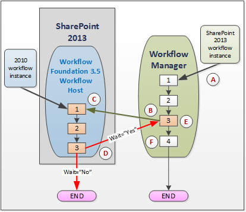
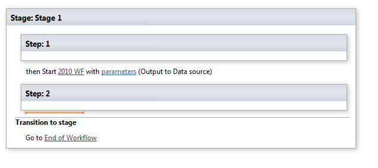

# Verwenden von Workflow-Interop für SharePoint 2013
Enthält eine Erörterung der Verwendung von SharePoint-Workflow Interop im Workflow-Designer Visual Studio 2012. Workflow-Interop ermöglicht Ihnen, einen Workflow SharePoint 2010 innerhalb eines Workflows SharePoint 2013 von aufgerufen werden soll. Dies ist ein wichtiges Feature, mit dem Sie die vorhandenen Workflowfeatures wiederverwenden und zum Aufrufen von für Workflow-Aktivitäten, die nicht in SharePoint 2013 integriert werden.

  
    
    

> **WICHTIG**
> Informationen zum Verwenden von SharePoint-Workflow-Interop-Funktionen in SharePoint Designer 2013, finden Sie unter  [Grundlegendes zur Koordination Aktionen in SharePoint Designer 2013](understanding-coordination-actions-in-sharepoint-designer-2013.md).
  
    
    

## SharePoint-Workflowinteroperabilität

Es folgt das Problem. Sie haben legacy SharePoint 2010 Workflows, die Sie auf Ihrer SharePoint 2013 Plattform wiederverwenden möchten. Oder, schlechter, Sie neue SharePoint 2013 Workflows erstellen, und Sie benötigen, Aktivitäten aufgerufen werden soll, die nur in der SharePoint 2010-Plattform verfügbar sind. Und Sie nicht wissen, was zu tun. Tatsächlich, die Lösung ist einfach: Verwenden von SharePoint-Workflow Interop.
  
    
    
SharePoint-workflowinteroperabilität kann SharePoint 2010 Workflows (basierend auf Windows Workflow Foundation 3) reibungslos das Workflowmodul SharePoint 2013 entwickelt dem Windows Workflow Foundation 4 basiert. Während die neue Windows Workflow Foundation 4 Ausführung Engine in Workflow-Manager,, der als externer Dienst ausgeführt wird gehostet wird, enthält SharePoint 2013 noch den Vorversionen SharePoint Workflow-Host die verwendet wird, um SharePoint 2010 Workflows zu verarbeiten. SharePoint-workflowinteroperabilität handelt die beiden ausführungsumgebungen, wie in Abbildung 1 dargestellt.
  
    
    

**Abbildung 1. SharePoint-workflowinteroperabilität in Aktion**

  
    
    

  
    
    

  
    
    
Lassen Sie uns durchgehen des Prozess, der in Abbildung 1 dargestellt. Verwenden Sie die Buchstaben auf Punkt der Hervorhebung in der Abbildung verweisen:
  
    
    

  
    
    
> ( **A** ) eine Instanz eines Workflows SharePoint 2013 gestartet in dann Windows Workflow Foundation 4-basierte Workflow-Manager. Beachten Sie, dass der Workflow-Manager nicht in SharePoint ist, aber stattdessen als externer Dienst ausgeführt wird.
    
  

  
    
    
> ( **B** ) erreichen Sie einen Punkt im SharePoint 2013 Workflow - Schrittnummer 3 im Workflow-Manager -, an den Sie einen Workflow SharePoint 2010 aufrufen möchten. In der Workflow-Designer Visual Studio 2012 führen Sie dies durch die Implementierung der Aktivitätsfeeds **Start 2010 WF** wie in Abbildung 2 dargestellt.
    
   **Abbildung 2. Stufenkachel zum Starten eines Workflows für SharePoint 2010.**

  

  

    
    
    Aus der Sicht des SharePoint-Objektmodells erfolgt dies mithilfe der  [StartWorkflow](https://msdn.microsoft.com/library/Microsoft.SharePoint.WorkflowServices.WorkflowInteropService.StartWorkflow.aspx) -Methode für die [WorkflowInteropService](https://msdn.microsoft.com/library/Microsoft.SharePoint.WorkflowServices.WorkflowInteropService.aspx) -Klasse.
    
  

  
    
    
> ( **C** ) beginnt zu diesem Zeitpunkt der SharePoint 2010 Workflow in der Windows Workflow Foundation 3.5 Workflow-Host innerhalb von SharePoint ausgeführt. Aber ein wichtiger Aspekt angezeigt wird. In einigen Szenarien sollten Sie den Workflow 2013 warten, bis des 2010-Workflows, bis Sie abgeschlossen (und möglicherweise einige Daten zurückgeben) vor dem Ausführen den 2013-Workflow fortfahren. In anderen Szenarien Dies kann nicht erforderlich sein, und beide Workflows unabhängig und parallel ausgeführt.
    
    Um dieses Verhalten zu steuern, bietet die  [WorkflowInterop](https://msdn.microsoft.com/library/Microsoft.SharePoint.WorkflowServices.Activities.WorkflowInterop.aspx) -Klasse, die ausgeführten Workflows im Workflow-Host Windows Workflow Foundation 3.5 steuert, eine [Wait](https://msdn.microsoft.com/library/Microsoft.SharePoint.WorkflowServices.Activities.WorkflowInterop.Wait.aspx) -Eigenschaft. Durch Festlegen dieser Boolean-Eigenschaft auf " **Ja** " (im Dialogfeld Designer) oder auf **true** in der für die Eigenschaft **Wait** bewirkt, dass den 2013-Workflow angehalten wird, bis die 2010 Ausführung beendet und eine Meldung **completed** zurückgegeben.
    
    
    

   **Abbildung 3. Das Dialogfeld Eigenschaften eines Workflow zu starten.**

  

  

  

  

  
    
    
> ( **D** ) die praktische Auswirkung der Auswahl von **true** oder **false** auf die **Wait** -Eigenschaft ( **Yes** oder **No** im Dialogfeld Eigenschaften) wird hier dargestellt. Wenn **Wait** **true**ist, klicken Sie dann der 2010-Workflow übergibt ein  [WorkflowCompleted](https://msdn.microsoft.com/library/Microsoft.SharePoint.WorkflowServices.WorkflowInteropEventReceiver.WorkflowCompleted.aspx) -Ereignis (und optional gibt Daten als Eigenschaft [DynamicValue](http://msdn.microsoft.com/library/2af7983b-8357-4e0f-9ba9-dfdeed05a8a7.aspx) ). Weitere Informationen über dynamische Werte finden Sie unter [Understanding Dynamic Value](http://msdn.microsoft.com/library/c5702628-9625-4d19-95c5-13923e91fea1.aspx).
    
    Natürlich **Wait** auf **false**festgelegt ist, klicken Sie dann 2010-Workflows ausgeführt wird, dann normal beendet.
    
  

  
    
    
> ( **E** ) dieser Schritt ist nur relevant, wenn der Aufruf des Workflows 2010 **Wait=true**angegeben. In diesem Fall der 2013-Workflow **WorkflowCompleted** -Ereignis empfangen und startet die Ausführung des Workflows 2013 an der Stelle, die sie unterbrochen.
    
  

  
    
    
> ( **F** ) 2013-Workflow dann nach abgeschlossener Ausführung und normal beendet. Wenn **Wait=false**, klicken Sie dann den 2013-Workflow ausgeführt wird und unabhängig von der 2010-Workflow wird beendet.
    
  

## Workflow-Interop-design

SharePoint-workflowinteroperabilität ist eine messaging-Framework, das eine Instanz 1: 1-Zuordnung zwischen WF-3 und 4 WF-Workflow-Aktivitäten unterstützt. WF 3 und 4 WF interagieren über den Nachrichtenaustausch von, die durch eine Reihe von WF 4 Aktivitäten auf  [WorkflowInteropService](https://msdn.microsoft.com/library/Microsoft.SharePoint.WorkflowServices.WorkflowInteropService.aspx) eingebunden sind.
  
    
    
Zur Unterstützung der Workflow-Interop bietet die Workflowentwurfsoberfläche in SharePoint Designer Zugriff auf eine neue Workflowaktivität **Start 2010 WF**, ist ein Wrapper für die  [StartWorkflow](https://msdn.microsoft.com/library/Microsoft.SharePoint.WorkflowServices.WorkflowInteropService.StartWorkflow.aspx) -Methode. Dadurch können Sie einen Listenworkflow oder Website-Workflow starten.
  
    
    
Die Aktivität ist tatsächlich eine Folge von Nachrichten, die stattfinden zwischen den Workflow-Manager und SharePoint 2010 Workflow-Host, der in SharePoint 2013 ausgeführt wird. Diese beiden sind von messaging-Ebene vermittelt, wie in Abbildung 4 dargestellt. Die Sequenz beginnt im Workflow-Manager SharePoint 2013 mit einem Aufruf der Methode **StartWorkflow**. Die Meldung "Start" wechselt zu den Workflowdienst innerhalb von SharePoint, wobei wiederum er den Workflow im Workflow-Host SharePoint 2010 gestartet. Nach Abschluss der Ausführung des Workflows 2010 ist ein Ereignis ausgelöst, die eine "Abgeschlossene" Nachricht über Herausgeber des Ereignisses zurück an den 2013-Workflow-Manager sendet.
  
    
    

**Abbildung 4. SharePoint Workflow Interop-messaging-Protokoll**

  
    
    

  
    
    

  
    
    

  
    
    

  
    
    

## Zusätzliche Ressourcen

-  [Erste Schritte mit Workflows in SharePoint 2013](get-started-with-workflows-in-sharepoint-2013.md)
    
  
-  [Grundlegendes zu SharePoint 2013-Workflows](sharepoint-2013-workflow-fundamentals.md)
    
  
-  [Grundlegendes zur Koordination Aktionen in SharePoint Designer 2013](understanding-coordination-actions-in-sharepoint-designer-2013.md)
    
  
-  [WorkflowInteropService](https://msdn.microsoft.com/library/Microsoft.SharePoint.WorkflowServices.WorkflowInteropService.aspx)
    
  
-  [WorkflowInteropEventReceiver](https://msdn.microsoft.com/library/Microsoft.SharePoint.WorkflowServices.WorkflowInteropEventReceiver.aspx)
    
  

  
    
    

