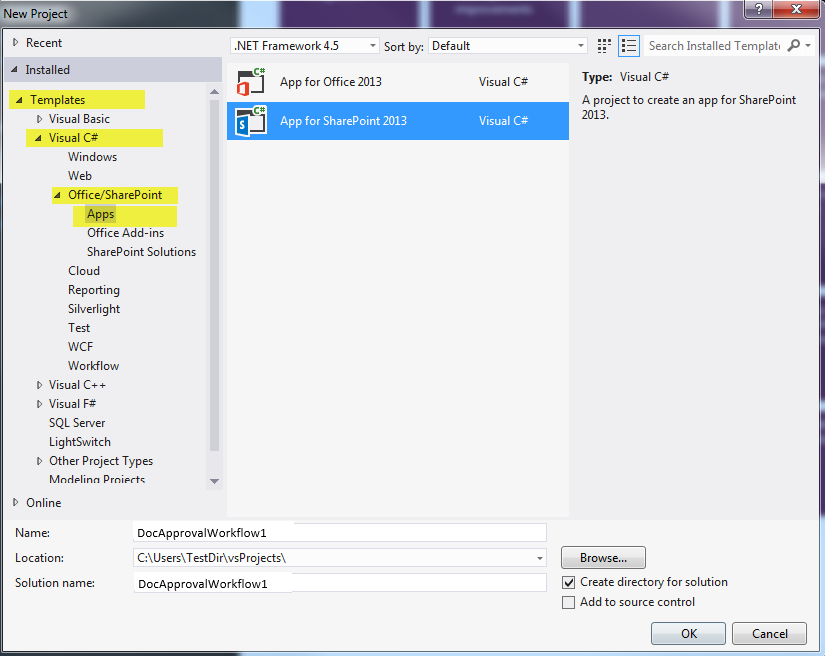
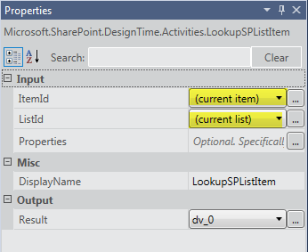
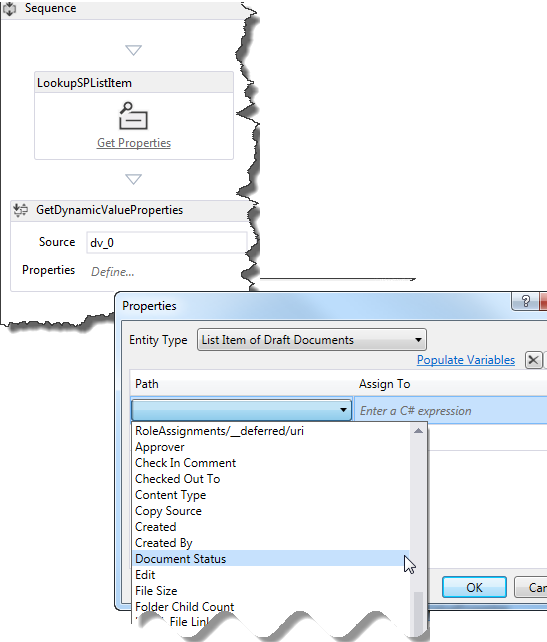
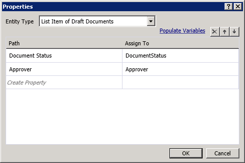

# Create a SharePoint workflow app using Visual Studio 2012
Walk through the process of creating a workflow SharePoint Add-in using Microsoft Visual Studio 2012.
## Prerequisites
<a name="bmPreReq"> </a>

This development scenario presumes that a SharePoint Server 2013 farm and a Workflow Manager 1.0 farm are installed and paired. These two farms can be located on the same or on separate server computers. The scenario further presumes that workflow development is taking place remotely - that is, on a computer separate from either of the server computers - and is using Microsoft Visual Studio 2012 or later.
  
    
    

- On the server platforms:
    
  - Windows Server 2008 R2.
    
  
  - Microsoft SharePoint Server 2013
    
  
  - Workflow Manager 1.0
    
  
- On the development platform:
    
  - Microsoft Visual Studio 2012 or later.
    
  
  - Office Developer Tools for Visual Studio 2013.
    
    > **NOTE**
      > Office Developer Tools for Visual Studio 2013 is only required when using Visual Studio 2012. Later versions of Visual Studio include the Office Developer Tools. 
For assistance setting up and configuring your SharePoint workflow development environment, see the following:
  
    
    

-  [Prepare to set up and configure a SharePoint workflow development environment](prepare-to-set-up-and-configure-a-sharepoint-workflow-development-environment.md)
    
  
-  [Configure workflow in SharePoint Server 2013](http://technet.microsoft.com/en-us/library/jj658586%28v=office.15%29)
    
  
-  [Video series: Install and configure Workflow in SharePoint Server 2013](http://technet.microsoft.com/en-us/library/dn201724%28v=office.15%29)
    
  

## Get started
<a name="bmGetStarted"> </a>

A common workflow scenario in business settings is the document review and approval process. In this walkthrough, we create an SharePoint Add-in that automates the routing, notifications, and approval (or rejection) of a document using a SharePoint workflow. We create this workflow using the SharePoint workflow designer in Microsoft Visual Studio 2012.
  
    
    
Here's a flowchart that depicts the course of the workflow we're going to create.
  
    
    

**Figure 1. Flowchart depicting the document approval workflow.**

  
    
    

  
    
    

  
    
    
In summary, the workflow does the following: 
  
    
    

  
    
    

1. A document change event associated with a specific document library launches the workflow instance.
    
  
2. If the document's status is set to "Ready For Review," the workflow assigns a task to a prearranged reviewer, then sends the reviewer an email notification about the task.
    
  
3. If the reviewer fails to approve the document, the document file remains in the Draft Documents library; however, the document status is set to "Rejected."
    
  
4. If the reviewer approves the document, the workflow copies the document into a Published Documents library. The original file remains in the Draft Documents library, but its status is set to "Published."
    
  

    
> **IMPORTANT**
> Before you start this walkthrough, ensure that you have a properly installed and configured workflow development environment. For more information, see  [Prepare to set up and configure a SharePoint workflow development environment](prepare-to-set-up-and-configure-a-sharepoint-workflow-development-environment.md). Also, ensure that you have a SharePoint Server 2013 instance that you can develop your workflow against. For more information, see  [Install SharePoint 2013](http://technet.microsoft.com/en-us/library/cc303424.aspx). 
  
    
    


## Prepare your environment
<a name="bmPrepare"> </a>

The first step is preparing our SharePoint site with document libraries that our workflow will use.
  
    
    

1. Launch Visual Studio 2012 and create a new project using the **App for SharePoint 2013** template, as depicted in Figure 2.
    
    > **NOTE**
      > In this walkthrough, the solution file is named "DocApprovalWorkflow1". It is recommended that you use the same name. However, if you name your solution differently, be sure that you make necessary adjustments in the instructions that follow. 

   **Figure 2. Create new project in Visual Studio 2012**

  


  

  

  
2. On your associated SharePoint site, create two new document libraries by doing the following:
    
  - In **Solution Explorer**, right-click on the "DocApprovalWorkflow1" icon and select **Add** > **New Item** and then select **List**.
    
  
  - In the resulting **SharePoint Customization Wizard**, enter "Draft Documents" in the name field; then select "Document Library" in the drop-down under the first radio button, as depicted in Figure 3. 
    
  
  - Click **Next**, then take default settings, and then click **Finish**.
    
   **Figure 3. SharePoint customization wizard for List settings.**

  


  

  

  
3. Create the second document library using the same steps as above, except name this second library "Published Documents".
    
  
4. Add two custom columns to **both** of the new document libraries that you just created:
    
  - Create a custom column named "Approver" and make it a **Person or Group** list column type.
    
  
  - Create a custom column named "Document Status" and make it a **Choice** list column type (see Figure 4).
    
  
5. On the **Document Status** column, add five choices by expanding the **Type** property in the property grid, then clicking the ellipsis button ( **…**) on the **Items** property. Enter the choice values in the dialog box that appears, as shown in Figure 4.
    
  - Draft in Progress
    
  
  - Ready for Review
    
  
  - Approved for Publishing
    
  
  - Rejected
    
  
  - Published
    
  

   ****

  


  

  

  

## Create the basic workflow
<a name="bmCreateWorkflow"> </a>

Now we're ready to create the workflow itself.
  
    
    

1. In Visual Studio, create a new workflow by right-clicking on the **DocApprovalWorkflow1** icon (in **Solution Explorer**) and selecting **Add** > **New Item**, and then selecting **Workflow** (see Figure 5).
    
   **Figure 5. Add New Item > Workflow wizard.**

  


  

  

  
2. When prompted, name the workflow "DocumentApprovalWorkflow" and select **List Workflow** as the workflow type (see Figure 6).
    
   **Figure 6. Specify workflow name and type.**

  


  

  

  
3. In the **SharePoint Customization Wizard**, associate the new workflow with the Draft Document library; then, opt to create a new history list and a new workflow task list, as shown in Figure 7. Then click **Next**.
    
   **Figure 7. Completing the SharePoint Customization Wizard for the new workflow.**

  


  

  

  
4. Set the workflow to start automatically when an item in the Draft Documents library is changed. You can also leave the check box for manually starting the workflow selected; this allows you to easily test the workflow without needing to change a document. See Figure 8.
    
   **Figure 8. Set the activation parameters for the workflow.**

  


  

    
    > **NOTE**
      > You can change the workflow association type after the workflow has been created by using the property grid with the workflow selected in **Solution Explorer** (see Figure 9). Then click **Finish**. 

   **Figure 9. The workflow property grid.**

  


  

  

  
5. Finally, configure your SharePoint Server to manage outgoing email using the SMTP service. For instructions, see  [Configure outgoing email for a SharePoint 2013 farm](http://technet.microsoft.com/en-us/library/cc263462.aspx). This is necessary to allow the workflow to send email notifications related to workflow tasks.
    
  

## Implement the workflow logic
<a name="bmImplementLogic"> </a>

Now that we have our SharePoint Server set up and our basic workflow created, we can now design the workflow logic.
  
    
    

1. Open the workflow designer by double-clicking on the workflow project item in **Solution Explorer**. You will see the workflow designer surface (and the workflow toolbox); the designer is populated with an initial workflow stage named **Sequence**.
    
  
2. Our first step is to grab the **LookupSPListItem** activity from the toolbox (see Figure 10) and drop it in the **Sequence** stage on the designer surface. We use this activity to get the status of the document at any given time, which the **LookupSPListItem** activity returns as a [DynamicValue](http://msdn.microsoft.com/en-us/library/windowsazure/microsoft.activities.dynamicvalue%28v=azure.10%29.aspx) object that contains a set of SharePoint list item properties as key-value pairs.
    
   **Figure 10. LookupSPListItem activity selector.**

  


  

  

1. To configure the **LookupSPListItem** activity, first click on it in the designer to select it. This activates the property grid for the activity.
    
  
2. Use the combo boxes in the property grid to configure the **LookupSPListItem** activity to use "current item" for **ItemId** and "current list" as **ListId**, as shown in Figure 11.
    
   **Figure 11. Configuring LookupSPListItem properties.**

  


  

  

  
3. On the **LookupSPListItem** activity tile, click the **Get Properties** link. This completes two important steps for you:
    
1. First, it creates a variable of type **DynamicValue** and binds it to the out-argument (named _Result_) of the of the **LookupSPListItem** activity. Properties of the list item are stored in this variable.
    
  
2. Second, it adds a new activity named **GetDynamicValueProperties** (see Figure 12) and sets the newly created **DynamicValue** variable as the in-argument of this new activity. This activity lets you extract the list item properties from the **DynamicValue** variable.
    
  
4. On the **GetDynamicValueProperties** activity, click on *Define…*  to open a dialog box that lets you pick the properties you wish to extract. In selecting properties, refer to Figure 12, which shows a portion of the designer surface merged with the open **Properties** dialog box.
    
   **Figure 12. Selecting the DynamicValue properties that you wish to extract.**

  


  

  

1. For **Entity Type**, select **List Item of Draft Documents**.
    
  
2. In the data grid, in the **Path** column, click *Create Property*  to open a combo box that contains available properties for list items in the Draft Documents library. Select **Document Status** from the combo box.
    
  
3. On the next row in the data grid, click  *Create Property*  again; this time, select **Approver** from the combo box.
    
  
4. Now click the **Populate Variables** link on the dialog box. This creates a variable of the appropriate data type for each row and assigns it in the **Assign To** column of the data grid, as shown in Figure 13.
    
   **Figure 13. Get Document Status and Approver properties.**

  


  

  

  
5. We now have the list item values that we need. Next step is to set up the workflow to check whether the document is "ready for review" and to take the appropriate action when it is.
    
1. From the toolbox, drag the **If** activity onto the workflow designer surface. (You'll find the **If** activity in the **Control Flow** section of the toolbox.)
    
  
2. Set the **If** condition to `DocumentStatus.Equals("Ready for Review")`, as shown in Figure 14.
    
   **Figure 14. Creating an If/Then clause to trigger a task.**

  


  

  

  
3. Next, from the **SP - Task** section of the toolbox, drag a **SingleTask** activity and drop it in the **Then** box of your **If** activity. In effect, you have configured the workflow such that **If** the document is ready for review, **Then** it will then complete this task.
    
  
6. Our next step is to configure the task that we just created using the configuration dialog box, shown in Figure 15.
    
   **Figure 15. Task configuration dialog box.**

  


  

  

1. First, we assign the task to an approver. To do this, click the **Configure** link in the **SingleTask** activity tile.
    
  
2. Set the **Assigned to:** field to "Approver".
    
  
3. Notice that the **Task title:** field is automatically populated with "Workflow task".
    
  
4. In the **Body:** field, enter a simple message with instructions for the approver, such as "Please review this document for approval to publish."
    
  
5. Click **OK** to save.
    
  

    Notice that at this point you have a validation error on the **SingleTask** activity. With the **SingleTask** tile selected, look at the **AssignedTo** property in the property grid and note that it has an error icon. Hover over the property name to see a tooltip that describes the problem. We see that the **AssignedTo** property expects a **String** value; however, the **Approver** variable is of **Int32** data type.
    
    To correct this error, cast the variable to a **String** data type by appending ".ToString()" to "Approver" in the **AssignedTo** row on the property grid, as shown in Figure 16.
    

   **Figure 16. Casting the "Approver" variable to string data type in the property grid.**

  


  

    At the present point in this walkthrough you have created and configured a workflow task that does two things: It sets a document to be reviewed, but also sends an email to the task assignee (the "Approver" in this case) notifying him or her that a task has been assigned and is waiting for actions.
    
  
7. Let's look at the property grid for the **SingleTask** activity. Scroll to the bottom of the property grid and note in the **Output** section there are two properties, **Outcome** and **TaskItemId**, which are out-arguments.
    
    Note the name of the **Outcome** variable: _outcome_0_ (or similar). We use this variable to check the outcome of the task - that is, whether the approver has approved or rejected the document.
    
    > **NOTE**
      > The **Outcome** out-argument returns an **Int32** value corresponding to the index of the outcome - that is, **0** for "Approved" and **1** for "Rejected". These integers are the default values provided in the out-of-box SharePoint site column named "Task Outcome."
8. Now, in order for the workflow to check the outcome of the task, we need to add another **If** activity and place it following the **SingleTask** activity, but inside the **Then** area, as shown in Figure 17. Setting the **If** condition to " `outcome_0 == 0`" tells us whether the document was approved.
    
   **Figure 17. Adding the IF activity to check the task status.**

  


  

  

  
9. If the approver has set the task to "Approved," we update the document status to "Approved for Publishing," then copy the document file to the Published Documents library. Alternatively, if the approver has rejected the document, we need to set the document status to "Rejected."
    
1. In this new **If** activity, drag an **UpdateListItem** activity into the **Then** box.
    
  
2. Configure the **UpdateListItem** activity in its property grid such that **ItemId** is set to "(current item)" and **ListId** is set to "(current list)", as shown in Figure 18.
    
  
3. Next, with the **UpdateListItem** activity selected, click the ellipsis button ( **…**) adjacent to the **ListItemPropertiesDynamicValue** field in the property grid. This action opens a dialog box that allows you to specify which list item properties you want to update.
    
   **Figure 18. Setting the list item properties to update.**

  


  

  

  
4. In the dialog box, first use the combo box to set **Entity Type** to **List Item of Draft Documents** (shown in Figure 18). Then, in the data grid, click **Create Property** and from the drop-down list select "Document Status." Then, under the **Value** column, type "Approved for Publication" (including quotation marks) and click **OK**.
    
  
10. In the **Then** area of the current **If** activity, drag a **CopyItem** activity and place it directly below the **UpdateListItem** activity, as shown in Figure 19.
    
   **Figure 19. Adding a CopyItem activity to the workflow.**

  


  

    Then, configure properties of the **CopyItem** activity in the property grid as depicted in Figure 20. Property values are highlighted.
    

   **Figure 20. Configuring the CopyItem activity.**

  


  

    
    > **NOTE**
      > For the purpose of this walkthrough we are going to assume that all of our published documents come out of the Draft Documents library; therefore, we do not need to worry about controlling for duplicate file names. 
11. Finally, we need to add an activity to handle the case where the reviewer rejects the document. We do this by adding an **UpdateListItem** activity to the **Else** area of our current **If** activity. Configure this **UpdateListItem** activity just as you did the prior one in step 9(c), except that now we want to set the document status to "Rejected," as shown in Figure 21.
    
   **Figure 21. Configuring properties of UpdateListItem activity for rejected documents.**

  


  

  

  
This completes "Creating a SharePoint document approval workflow." The completed workflow is shown in Figure 22.
  
    
    

**Figure 22. Completed SharePoint document approval workflow.**

  
    
    

  
    
    

  
    
    

  
    
    

  
    
    

## Package and deploy the workflow
<a name="bk_deploy"> </a>

Following are resources that provide guidance for packaging and deploying your workflow as an SharePoint Add-in:
  
    
    

-  [Deploying and installing apps for SharePoint: methods and options](http://msdn.microsoft.com/en-us/library/fp179933.aspx)
    
  
-  [Publish apps for SharePoint](http://msdn.microsoft.com/en-us/library/jj164070.aspx)
    
  
-  [How to: Create and Deploy Declarative Workflows in Sandboxed Solutions](http://msdn.microsoft.com/en-us/library/gg615452%28v=office.14%29.aspx) (Using SharePoint Designer 2013)
    
  

> **CAUTION**
> SharePoint Add-ins that contain integrated workflows (which can be associated with lists on the parent web) are differentiated from normal workflow apps by changing the following tag to **true** in the `workflowmanifest.xml` file in the app package:
  
    
    


```XML

<SPIntegratedWorkflow xmlns="http://schemas.microsoft.com/sharepoint/2014/app/integratedworkflow">
    <IntegratedApp>true</IntegratedApp>
</SPIntegratedWorkflow>

```


## Additional resources
<a name="bk_addresources"> </a>


-  [Workflows in SharePoint 2013](workflows-in-sharepoint-2013.md)
    
  
-  [Prepare to set up and configure a SharePoint workflow development environment](prepare-to-set-up-and-configure-a-sharepoint-workflow-development-environment.md)
    
  
-  [SharePoint workflow development best practices](sharepoint-workflow-development-best-practices.md)
    
  
-  [Develop SharePoint 2013 workflows using Visual Studio](develop-sharepoint-2013-workflows-using-visual-studio.md)
    
  

  
    
    

