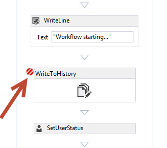
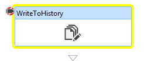
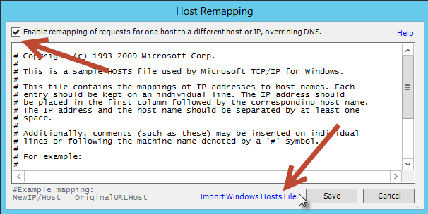
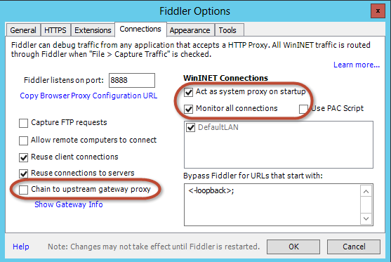
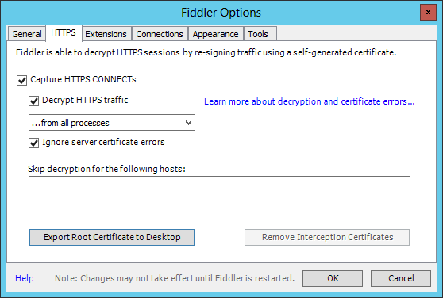
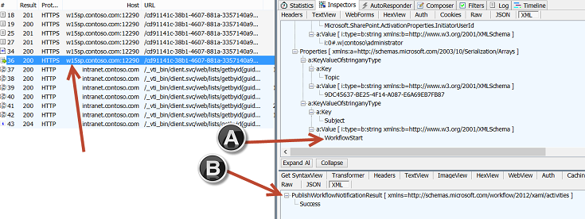
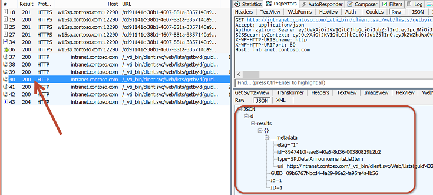
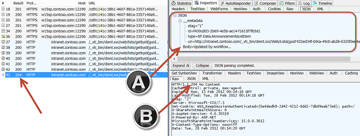

# Debugging SharePoint Server 2013 workflows
Demonstrates how SharePoint Server 2013 now relies on Workflow Manager 1.0 for all workflow processing and management, and demonstrates debugging options.
 **Provided by:** [Andrew Connell](http://social.msdn.microsoft.com/profile/andrew%20connell%20%5bmvp%5d/),  [www.AndrewConnell.com](http://www.andrewconnell.com)
  
    
    


## 

Microsoft has taken a different approach to workflows in SharePoint Server 2013 than in previous versions of SharePoint. The workflow team worked with the Azure team to create a new product called Workflow Manager. Workflow Manager hosts the latest version of the Windows Workflow Foundation runtime and all the necessary services in an available and scalable way. It takes advantage of the Microsoft Azure Service Bus for performance and scalability, and when deployed, it runs exactly the same in an on-premises deployment as in the cloud, similar to Office 365. SharePoint 2013 is then connected and configured to hand off all workflow execution and related tasks to the Workflow Manager farm.
  
    
    
This change in the architecture required some changes to the two primary workflow authoring tools (SharePoint Designer 2013 and Visual Studio 2012) customers used to create custom workflows. However, the debugging techniques employed by developers in SharePoint 2007 and SharePoint 2010 still apply. The new architecture allows for a new option for workflows created using either SharePoint Designer 2013 or Visual Studio 2012 in that Fiddler can be used to monitor traffic between SharePoint Server 2013 and Workflow Manager.
  
    
    

## SharePoint 2013 workflow debugging overview

Debugging custom workflows created for SharePoint Server 2013 resembles previous versions, including SharePoint 2010 and SharePoint 2007. Some debugging options available will depend on the tool that is used to create the workflow (SharePoint Designer 2013 or Visual Studio 2012) and the kind of SharePoint deployment, such as on-premises or Office 365 (hosted).
  
    
    
There are four workflow debugging techniques that can be leveraged by workflow authors:
  
    
    

- Logging to the workflow history list
    
  
- Setting breakpoints
    
  
- Sending debug messages to the console
    
  
- Monitoring traffic between SharePoint and Workflow Manager with Fiddler
    
  
Each option has advantages and disadvantages. It helps to have an understanding of what is possible when using the two workflow authoring tools (SharePoint Designer 2013 or Visual Studio 2012), as well as the type of workflow deployment (on-premises or Office 365). The following table contains a matrix of authoring tools, deployment targets, and the options available in each scenario.
  
    
    


||**SharePoint 2013 On-Premises**|**Office 365 SharePoint Online**|
|:-----|:-----|:-----|
|SharePoint Designer 2013, SharePoint Online  <br/> | Log to history list <br/>  Fiddler <br/> | Log to history list <br/> |
|Visual Studio 2012  <br/> | Log to history list <br/>  Breakpoints <br/>  Console debug messages <br/>  Fiddler <br/> | Log to history list <br/>  Breakpoints <br/> |
   

## Debugging with the workflow history list

The only debugging option that is available in every type of SharePoint 2013 deployment is writing log messages to the workflow history list. By using this method, you can use either the **Log to History List** action in SharePoint Designer 2013 or the **WriteToHistory** activity in Visual Studio 2012 to write a string message as a new item to the list, specified in the workflow association, which is the container for all history logging messages. These can be simple strings or constructed by concatenating the contents of variables within the workflow.
  
    
    
Using the history list as a debugging tool is not ideal because users can see the messages. Therefore, when the debugging session is complete and the workflow is used in production, the workflow developer will want to remove these messages, creating an additional step between debugging and deployment. Nonetheless, this is the only option available in any scenario, regardless of which tool is used to create the workflow or which type of SharePoint 2013 deployment.
  
    
    

## Debugging using Visual Studio 2012 breakpoints

Another debugging option is to take advantage of breakpoints. Breakpoints are available only for workflows created using Visual Studio 2012, since SharePoint Designer 2013 has no capability to set breakpoints or to attach a debugger to the running process. These are available in both SharePoint 2013 on-premises and hosted deployments such as Office 365. In this scenario, you would set a breakpoint on an activity within the workflow and then start the workflow in debug mode.
  
    
    

**Figure 1. Start the workflow**

  
    
    

  
    
    

  
    
    
Visual Studio will deploy the workflow to the target SharePoint environment and attach a debugger. When the workflow process reaches the activity the breakpoint is set on, Visual Studio regains focus and lets you examine the values of workflow variables and step through each activity from Visual Studio 2012, as shown in the following figure.
  
    
    

**Figure 2. Workflow breakpoint**

  
    
    

  
    
    

  
    
    

  
    
    

  
    
    

## Debugging workflows using debug messages and the test service host

The introduction of Workflow Manager to the SharePoint 2013 workflow story introduces two new debugging opportunities available when you are creating custom workflows using Visual Studio 2012 and testing them in an on-premises deployment. Visual Studio 2012 includes a **WriteLine** activity that accepts a single string-based message as an input.
  
    
    

**Figure 3. WriteLine activity**

  
    
    

  
    
    

  
    
    
This activity will write the message that resembles the **System.Diagnostics.Debug.WriteLine()** method in a standard .NET Windows Console Application. The Workflow Manager 1.0 development tool includes a console utility that is named the **Test Service Host** that Visual Studio 2012 will open when a new debugging session is started and when testing with an on-premises SharePoint 2013 deployment. This console utility, **Microsoft.Workflow.TestServiceHost.exe** found in **C:\\Program Files (x86)\\Workflow Manager Tools\\1.0**, attaches to the registered Workflow Manager instance and listens for messages written using the **WriteLine** activity, as shown in the following figure.
  
    
    

**Figure 4. Messages for WriteLine activity**

  
    
    

  
    
    

  
    
    
These messages resemble code comments or debug messages in a console application. Unlike writing to the workflow history list, you don't need to remove these before deploying the workflow to production. Unless the **Test Service Host** utility is connected to Workflow Manager, the messages are harmless.
  
    
    
This debugging option is not available for workflows created using SharePoint Designer 2013, because there is no action that maps to the **WriteLine** activity. Unfortunately, this debugging option is available only to SharePoint 2013 on-premises installations, since the port used by the Test Service Host utility is typically not publically accessible outside an on-premises network. This is also true for Office 365. The ports SharePoint uses to connect to Workflow Manager are the same ones used by the Test Service Host, and those are only accessible within the trusted network. However, this does not mean that you need to change their workflows to remove any **WriteLine** activities before deployment to Office 365. These activities can be left in the workflow as they are not seen unless the **Test Service Host** is connected to Workflow Manager.
  
    
    

## Debugging using Fiddler to monitor HTTP traffic

The last debugging option for SharePoint Server 2013 workflows is a new addition for workflow developers due to the change in how workflows are handled in the current platform. Recall that in SharePoint Server 2013, all workflow processing is handed off to an external product, Workflow Manager 1.0. When a workflow has to communicate with SharePoint, such as updating the current state of the workflow, collecting data from items or users in a SharePoint site, or when working with tasks, Workflow Manager's activities leverage the SharePoint 2013 REST API to perform these operations. SharePoint communicates with Workflow Manager using a client library that serves as a proxy to REST services exposed by Workflow Manager. Both SharePoint 2013 and Workflow Manager communicate with one another using the standard HTTP and HTTPS protocols.
  
    
    
This architecture yields a new debugging option for workflow authors. By using the HTTP debugging proxy tool Fiddler, you can monitor every request and corresponding response between the two products. In addition, any custom services called by the custom workflows using the **HttpSend** activity in Visual Studio 2012 or corresponding **Call HTTP Web Service** action in SharePoint Designer 2013 can also be monitored and inspected by Fiddler. This debugging model is also available, regardless of the tool that you use to create custom workflows (SharePoint Designer 2013 or Visual Studio 2012).
  
    
    
The only time this option is not available is when you are testing workflows using an Office 365 deployment of SharePoint 2013. Since all traffic between SharePoint Server 2013 and Workflow Manager occurs server-side, it is not possible to connect to one of the servers in Office 365 and start Fiddler from the console.
  
    
    
This new option gives you transparency and insight into the workflow engine that was not possible when developing workflows in previous versions of SharePoint before SharePoint Server 2013. 
  
    
    
For example, you can see the raw responses coming back from Workflow Manager or SharePoint Server 2013 in a web service call. At times Workflow Manager may respond with a specific error message. SharePoint Server 2013 includes user-friendly error messages but these may not be sufficiently specific. Using Fiddler, you can see the exact error message returned to help troubleshoot the issue. 
  
    
    
Another use case is examining the response from a successful web service call. When working with web services in workflows, regardless of the authoring tool, that you need to know the exact property name (and path if it is a complex response) for a value that is contained in a response. By using Fiddler, you can see the complete response data.
  
    
    

### Understanding SharePoint and Workflow Manager for debugging with Fiddler

To debug workflows in SharePoint 2013 and Workflow Manager 1.0 with Fiddler, some configuration and setup steps must be performed in a developer environment before debugging. Before completing the steps, it helps to have an understanding of how Fiddler works and how workflows work in SharePoint 2013.
  
    
    

#### Fiddler can only inspect traffic from the local server

The only traffic Fiddler can intercept and inspect are requests originating from the local server where Fiddler was started. This can present a challenge when Fiddler is used as a debugging tool for SharePoint Server 2013 workflows. 
  
    
    
If SharePoint Server 2013 and Workflow Manager 1.0 are installed on different servers and if Fiddler is started from SharePoint Server, the only traffic that Fiddler will display is the traffic where the request originated from SharePoint. None of the traffic originating from Workflow Manager 1.0, even if it is targeted to the SharePoint Server, will be intercepted.
  
    
    
Therefore, when developing workflows, it is easier to debug them if both SharePoint Server 2013 and Workflow Manager 1.0 are installed on the same server. Note that this is not a requirement; you can start Fiddler on both the SharePoint Server and Workflow Manager servers, although it is more complex to monitor two instances on two servers for the same workflow process.
  
    
    

#### Fiddler can only inspect traffic from the current logged-on user

 Fiddler can only intercept and inspect traffic from the current logged-on user. To view traffic that originated from SharePoint, you must log on to SharePoint Server using the Windows account that is configured as the identity of the application pool that hosts the web application for the SharePoint site initiating the workflow.
  
    
    
The same is true with Workflow Manager. To intercept and inspect traffic that originates from Workflow Manager, you must log on to the server using the Windows identity configured during the provisioning of the Workflow Manager farm as the service account for Workflow Manager.
  
    
    
When using Fiddler to debug workflows, it is easier to debug them if not only both Workflow Manager and SharePoint Server 2013 are installed and configured on the same server, but they also use the same Windows identity as the service account. All traffic from both Workflow Manager and SharePoint Server 2013 can then be intercepted and inspected by Fiddler.
  
    
    

#### SharePoint must trust Fiddler's certificate

Before using Fiddler for debugging SharePoint Server 2013 workflows, you need to understand how encrypted traffic is handled. Encrypted traffic over HTTP, known as HTTPS, is implemented by using a certificate's private key to encrypt some data and then send it to another recipient. The recipient has the certificate's public key that is paired with the private key. When a request is received by the recipient, the recipient can validate that the request came from the sender because the encrypted content's signature matches the public key, which can only be true if it was encrypted with the certificate's private key.
  
    
    
Fiddler can intercept HTTPS traffic and be configured to decrypt it so it is in a human-readable format for inspection in the tool. After displaying the request, Fiddler then uses its own certificate to re-encrypt the traffic and send it to the intended recipient. This can cause an issue, though, because now the recipient received the original response but it is not secured using the certificate from the original sender. This can be an issue when debugging SharePoint workflows because Fiddler's certificate is not trusted by SharePoint. Therefore, in order to use Fiddler to intercept and inspect HTTPS traffic between SharePoint Server 2013 and Workflow Manager, the Fiddler certificate must be trusted by SharePoint.
  
    
    

### Configure SharePoint Server 2013 and Workflow Manager 1.0 for workflow debugging with Fiddler

The following sections explain how to configure Fiddler and SharePoint for workflow debugging.
  
    
    

#### Configure the .NET Framework default proxy configuration

The first step is to first define the default proxy configuration for .NET Framework. These changes will allow Fiddler to intercept the traffic coming from both SharePoint Server 2013 and the Workflow Manager. Open the **machine.config** file in both of the following locations:
  
    
    

-  `%systemdrive%\\Windows\\Microsoft.NET\\Framework\\v4.0.30319\\Config\\machine.config`
    
  
-  `%systemdrive%\\Windows\\Microsoft.NET\\Framework64\\v4.0.30319\\Config\\machine.config`
    
  
Next, add the following markup to the bottom of each file, just before the closing **<configuration>** element:
  
    
    


```

<system.net>
  <defaultProxy enabled="true">
    <proxy bypassonlocal="false" usesystemdefault="true" />
  </defaultProxy>
</system.net>
```

Save the changes and close the files.
  
    
    

#### Configure Fiddler to intercept and inspect HTTPS traffic

The next step is to configure Fiddler to intercept encrypted traffic and decrypt it for configuration.
  
    
    

1. Start Fiddler.
    
  
2. If you are using the local HOSTS file, ensure that the entries are included in Fiddler by selecting the **Tools -> HOSTS** menu option.
    
  
3. Check the **Enable remapping of requests for one host to a different host or IP, overriding DNS**,
    
  
4. Click the **Import Windows Hosts File**, and then click the **Save** button.
    
  

**Figure 5. Host Remapping**

  
    
    

  
    
    

  
    
    
Next, configure Fiddler's connection options. 
  
    
    

  
    
    

1. Select the **Tools -> Fiddler Options** menu option.
    
  
2. Click the **Connections** tab.
    
  
3. Clear the **Chain to upstream gateway proxy** selection.
    
  
4. Select the **Act as system proxy on startup** and **Monitor all connections** options, as shown in the following figure.
    
   **Figure 6. Fiddler connection options.**

  


  

  

  
5. Select the **HTTPS** tab in the **Fiddler Options** dialog.
    
  
6. Check the **Capture HTTPS CONNECTs**.
    
  
7. Select **Decrypt HTTPS Traffic**.
    
  
8. Select **… from all processes**.
    
  
9. Check **Ignore server certificate errors**.
    
  
10. Click the **Export Root Certificate to Desktop** button.
    
  
11. When prompted with a warning, click **Yes** to **Trust the Fiddler Root certificate**.
    
  
This process will configure Windows to trust the certificate, although SharePoint does not trust it yet.
  
    
    

**Figure 7. HTTPS tab**

  
    
    

  
    
    

  
    
    
 **Note**: If a security WRning appears with a message instructing not to trust the Fiddler certificate, click **Yes** to continue installing the certificate.
  
    
    

#### Configure SharePoint to trust the certificate

The last step is to configure SharePoint to trust the Fiddler certificate that was exported in the previous step. 
  
    
    

1. Log on as a SharePoint farm administrator.
    
  
2. Start the SharePoint 2013 Management Shell.
    
  
3. Load the SharePoint 2013 Snap-In.
    
  ```
  
PS C:\\> Add-PSSnapIn Microsoft.SharePoint.PowerShell
  ```

4. Use the certificate utility to install the Fiddler certificate.
    
  ```
  PS C:\\> $fidderCertificatePath = [full path to exported FiddlerRoot.cer certificate file]
PS C:\\> certutil.exe -addstore -enterprise -f -v root $fidderCertificatePath
PS C:\\> $fiddlerCertificate = Get-PfxCertificate -FilePath $fidderCertificatePath
PS C:\\> New-SPTrustedRootAuthority -Name "Fiddler" -Certificate $fiddlerCertificate

  ```

5. Run IISRESET to make sure that SharePoint picks up the certificate trust change.
    
  

### Walkthrough: Debugging a SharePoint 2013 workflow with Fiddler

This simple walkthrough demonstrates using Fiddler to debug a SharePoint Server 2013 workflow authored using Visual Studio 2012. When the workflow starts, it retrieves a customer ID from a field in a custom list. This customer ID is used to query a publically accessible service to retrieve additional details about the customer. It then uses these values to update the original list item. The workflow can be found in the following MSDN code sample:  [SharePoint 2013 Workflow: Call an External Web Service](http://code.msdn.microsoft.com/officeapps/SharePoint-2013-workflow-48ea87d4.aspx).
  
    
    
This walkthrough has the following prerequisites:
  
    
    

- SharePoint Server 2013 and Workflow Manager 1.0 are installed on the same server.
    
  
- The Windows identity **CONTOSO\\SP_Content** is configured for the application pool identity that hosts the web application serving the SharePoint site that starts the workflow.
    
  
- The SharePoint Server 2013 site used to start the workflow is **http://intranet.contoso.com**
    
  
- The Workflow Manager 1.0 farm endpoint is **w15sp.contoso.com**.
    
  
- SharePoint Server 2013 and Workflow Manager 1.0 are configured to allow OAuth over HTTP.
    
    > **CAUTION**
      > This should never be done on the production server, but only for testing and debugging. 

1. Log on to the server where Workflow Manager and SharePoint 2013 are installed with the Windows identity configured as the Workflow Manager 1.0 farm account and SharePoint 2013 application pool identity.
    
  
2. Start Fiddler. While Fiddler will now intercept traffic from the current user, if there are any existing connections or processes running, Fiddler may miss those as it was not running when the connections were initially established. To force both Workflow Manager and SharePoint Server to recycle and have their traffic to each other get intercepted by Fiddler, recycle SharePoint by running an IISRESET and recycle Workflow Manager by stopping and starting the Windows service **Workflow Manager Backend**. This can be done with the following two commands at an administrative command prompt.
    
  ```
  
PS C:\\> IISRESET
PS C:\\> net stop WorkflowServiceBackend
PS C:\\> net start WorkflowServiceBackend

  ```

3. Start the workflow.
    
  
In the figure below, notice that sessions #18-36 originated from SharePoint 2013 and sessions #37-43 originated from Workflow Manager.
  
    
    

**Figure 8. Starting the workflow**

  
    
    

  
    
    

  
    
    
Notice that in session #36, SharePoint Server 2013 is requesting that Workflow Manager start a workflow (indicated as [A] in the figure) and Workflow Manager responds (indicated as [B] in the figure) with a "Success" message:
  
    
    

**Figure 9. "Success" message response**

  
    
    

  
    
    

  
    
    
Session #40 is where Workflow Manager is retrieving the list item ID and GUID from SharePoint.
  
    
    

**Figure 10. Retrieving item ID and GUID**

  
    
    

  
    
    

  
    
    
Session #43 is where Workflow Manager is updating the list item in SharePoint with a new value for the announcement item's **Body** field by passing a JavaScript Object Notation (JSON) object (indicated as [A] in the figure) along as the payload. SharePoint responds with an HTTP status of 204, which indicates that it successfully processed the request, but there is no message in the response.
  
    
    

**Figure 11. Updating the list item**

  
    
    

  
    
    

  
    
    

  
    
    

  
    
    

## Conclusion

The workflow story in the SharePoint Server 2013 release introduced a new layer of abstraction, Workflow Manager 1.0. This new architecture changed how workflows are processed. SharePoint Server 2013 now relies on Workflow Manager 1.0 for all workflow processing and management.
  
    
    
One task you need to perform when creating custom applications and business processes in workflows is debugging your work. The new workflow architecture of SharePoint Server 2013 offers the same debugging options that existed in previous versions of SharePoint. However, the new architecture offers two new options when creating custom workflows using the new architecture. This article explained the legacy debugging options as well as the new options using the **WriteLine** activity and using Fiddler for intercepting and inspecting traffic between SharePoint Server 2013 and Workflow Manager 1.0.
  
    
    

## Additional resources
<a name="bk_addresources"> </a>


-  [Fiddler](http://fiddler2.com/home)
    
  

  
    
    

