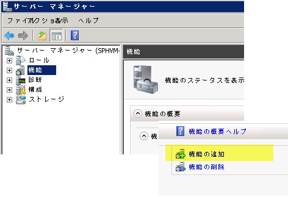
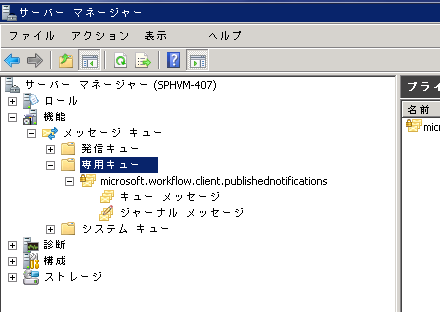

# SharePoint 2013 ワークフローで MSMQ を構成する方法
SharePoint で Microsoft Message Queuing (MSMQ) を構成し、SharePoint ワークフローで非同期のイベント メッセージングをサポートする方法を説明します。 
## MSMQ を有効にする

MSMQ は、SharePoint ワークフローで非同期のイベント メッセージングを使用できるようにするために SharePoint Server コンピューターで有効にできる Windows Server 機能です。非同期のイベント メッセージングをサポートするには、SharePoint Server コンピューターで MSMQ を有効にする必要があります。
  
    
    
MSMQ は Windows Server の "機能" として提供されています。MSMQ を有効にするには、次の操作を実行します。
  
    
    

> **重要**
> ここに含まれるスクリーン ショットは Windows Server 2008 R2 から取得しています。Windows Server 2012 でこの機能を有効にする場合、UI が変更されている可能性があります。 
  
    
    


1. SharePoint Server コンピューターで、 **サーバー マネージャー**を開きます。
    
  
2. 図 1 に示すように、左ウィンドウで [ **機能**] アイコンを選択し、[ **機能の追加**] を選択します。
    
   **図 1. メッセージ キュー機能の追加。**

  


  

  

  
3. 表示される [ **機能の追加ウィザード**] で、[ **メッセージ キュー**] を選択します。既定の選択内容をそのまま使用して [ **次へ**]、[ **インストール**] の順にクリックします。
    
  
4. コンピューターを再起動する必要があります。
    
  
5. 再起動したら **サーバー マネージャー**を開き、左ウィンドウで [ **メッセージ キュー**] アイコンを開きます。図 2 に示すように、[ **メッセージ キュー**] フォルダーとサブディレクトリが含まれるようになります。
    
    > **メモ**
      > Windows Server 2012 では、[ **サーバー マネージャ**] にキューはありません。代わりに、[ **コンピューターの管理**] に移動して [ **サービスとアプリケーション**] を選択します。 
6. [ **専用キュー**] という名前のサブディレクトリを選択します。これは、ワークフロー イベント メッセージが格納されるディレクトリです。
    
   **図 2. サーバー マネージャーに追加されたメッセージ キュー機能**

  


  

    
    
    
    > **メモ**
      <br/> [ **メッセージ キュー**] 機能を最初に追加するとき、[ **専用キュー**] フォルダーは空になっています。しかし、イベントを開始するワークフローが実行されると (または SharePoint コンテンツ変更イベントによってトリガーされたワークフローが実行されると)、[ **専用キュー**] フォルダーは図 2 に示すように設定されます。 
7. インストールを完了するには、Windows PowerShell スクリプトを使用して **SPWorkflowServiceApplicationProxy.AllowQueue** プロパティを **true** に設定する必要があります。 **SharePoint の管理シェル**で以下を実行します。
    
  ```
  
$proxy = Get-SPWorkflowServiceApplicationProxy
$proxy.AllowQueue = $true;
$proxy.Update();

  ```


## MSMQ のトラブルシューティング

Windows デベロッパー センターでは MSMQ のドキュメントを幅広く提供しています。役立つリソースを次にいくつか示します。
  
    
    

-  [About Message Queuing](http://msdn.microsoft.com/ja-jp/library/windows/desktop/ms706032%28v=vs.85%29.aspx)
    
  
-  [Message Queuing Reference](http://msdn.microsoft.com/ja-jp/library/windows/desktop/ms700112%28v=vs.85%29.aspx)
    
  
-  [Message Queuing Error and Information Codes](http://msdn.microsoft.com/ja-jp/library/windows/desktop/ms700106%28v=vs.85%29.aspx)
    
  

## その他のリソース
<a name="bk_addresources"> </a>


-  [Message Queuing (MSMQ)](http://msdn.microsoft.com/ja-jp/library/windows/desktop/ms711472%28v=vs.85%29.aspx)
    
  

  
    
    

