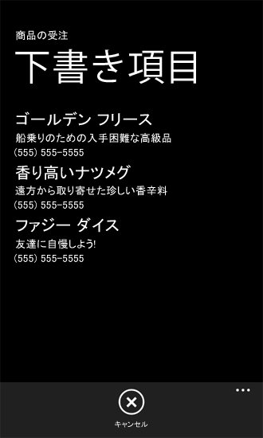
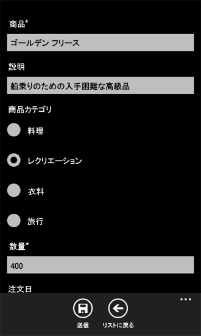

# [方法] Windows Phone 上に SharePoint リスト アイテムを保存および取得する
Windows Phone アプリケーションのライフ サイクルと、ネットワーク データをローカルに保存する方法について説明します。
Windows Phone アプリの開発において最も重要な考慮事項の 1 つは、状態情報の管理です。状態情報は、アプリケーション全体と、アプリケーション内の個々のページまたはデータ アイテムの両方について管理します。Windows Phone アプリを開発する際は、アプリのユーザーがネットワーク リソース (SharePoint リストなど) への接続を失う可能性があることを考慮する必要があります。Windows Phone アプリ用の開発インフラストラクチャでは、アプリのライフ サイクル内のさまざまな段階で状態情報を扱うためのメカニズムが提供されています。
  
    
    


> **重要**
> Windows Phone 8 のアプリを開発する場合は、Visual Studio 2010 Express ではなく Visual Studio Express 2012 を使用する必要があります。開発環境を除き、この記事のすべての情報は Windows Phone 8 と Windows Phone 7 の両方のアプリの作成に適用されます。 <br/> 詳細については、「 [[方法]: SharePoint 用モバイル アプリの開発環境をセットアップする](how-to-set-up-an-environment-for-developing-mobile-apps-for-sharepoint.md)」を参照してください。 
  
    
    


## SharePoint リスト データを Windows Phone 上にローカルに保存する
<a name="BKMK_StoringDataLocally"> </a>

Windows Phone では、同時に実行されるアプリは 1 つだけです。ユーザーがスマートフォン上の他のアプリに切り替えると (たとえば、スマートフォン上の [ **スタート**] ボタンを押すことによって)、それまで実行されていたアプリは非アクティブ化されます (Windows Phone 開発の用語では、廃棄 (トゥームストーン化 ) と呼ばれます)。ユーザーがこの非アクティブ化されたアプリに戻った場合 ([ **戻る**] ボタンを押すことによって) は、アプリを再アクティブ化することができますが、これには、アプリケーション ライフ サイクルの変化に対応して状態情報を処理できるようにロジックを提供しておく必要があります。状態情報は、既定では、アクティブから非アクティブになり、そこから再び戻った場合に保持されません。(Windows Phone アプリのアプリケーション ライフ サイクルについての詳細は、 [Windows Phone の実行モデルの概要](http://msdn.microsoft.com/ja-jp/library/ff817008%28VS.92%29.aspx)を参照してください。)
  
    
    
Windows Phone アプリでは、 **PhoneApplicationService** クラスが、アプリケーション状態の管理に使用できる標準的なライフサイクル イベントを提供しています。Windows Phone SharePoint リスト アプリケーション テンプレートから作成したプロジェクトでは ( **Silverlight for Windows Phone** テンプレートのいずれかから作成したプロジェクトと同様)、これらの標準 Windows Phone アプリケーション ライフサイクル イベントが App.xaml ファイルで宣言され、分離コード ファイル App.xaml.cs でイベント ハンドラーに関連付けられています。SharePoint リスト アプリの場合、App.xaml ファイルでの宣言は次のようなマークアップになります。
  
    
    


```

<Application.ApplicationLifetimeObjects>
    <!--Required object that handles lifetime events for the application-->
    <shell:PhoneApplicationService 
        Launching="Application_Launching" Closing="Application_Closing"Activated="Application_Activated" Deactivated="Application_Deactivated"/>
</Application.ApplicationLifetimeObjects>
```

App.xaml ファイルで宣言されている **Application_Activated** および **Application_Deactivated** イベント ハンドラーは App.xaml.cs 分離コード ファイルで実装されています。この実装には、そのスマート フォン アプリが終了されない限りアプリで使用できるようにアプリケーション状態をキャッシュするという既定のロジックが含まれています。これらのイベントに対するハンドラーの実装には、データを保存する **PhoneApplicationService** クラスの **State** プロパティ ( **Dictionary** オブジェクトへのアクセスを提供する) が使用されています。この **State** プロパティに保存されたデータは一時的なものです。つまり、アプリが非アクティブ化 (廃棄) されたときには保持されますが、アプリが終了されたときには保持されません。プロジェクトでアプリケーション ライフサイクル イベントを扱う際に考慮すべき重要な点として、ユーザーが他のアプリに切り替えると Windows アプリは非アクティブ化されること、そして非アクティブ化されたアプリは Windows Phone オペレーティング システムによって状況によっては終了される可能性があることを覚えておいてください。永続的ストレージに保存されていないスマートフォン上のデータは、 **PhoneApplicationService** の **State** プロパティを使用して一時的ストレージに保存されていた場合でも、すべて失われます。
  
    
    
SharePoint リストからデータを取得する Windows Phone アプリでは、複数のセッションを通してスマートフォン上で使用するデータは、サーバーが使用可能である場合は当然、SharePoint Server を実行しているサーバーから取得されます。しかし、場所やその他の要因によってサービスの対応範囲はさまざまであるため、Windows Phone デバイスで SharePoint Server への継続的な接続が使用可能でない場合もあります。SharePoint Server を実行しているサーバーへの接続がない場合でもアプリのユーザーがデータにアクセスできるようにするには、または単純に、サーバーが使用できるかどうかにかかわらずアプリの複数のセッションを通して使用するデータを永続的ストレージに保存するには、 **PhoneApplicationService** クラスの **Closing** イベントと **Launching** イベントを使用します。
  
    
    
これらのイベント用の **Application_Launching** ハンドラーおよび **Application_Closing** ハンドラーは App.xaml で宣言され、App.xaml.cs ファイルで定義されていますが、実装はされていません。アプリが終了する際のアプリケーション状態情報の保存および取得を実現するには、 **Application_Closing** イベント ハンドラーを実装し、そのアプリ専用の分離ストレージにデータを保存することによって、アプリの複数のセッションを通してデータが永続化されるようにします。さらに、 **Application_Launching** イベント ハンドラーを実装し、アプリの新しいセッションが開始されたとき (アプリが起動されたとき) に、本来のデータ ソースである SharePoint Server を実行するサーバーへの接続がない場合でも、分離ストレージからデータを取得できるようにします。
  
    
    

> **ヒント**
> データは、暗号化してからローカル デバイスに保存することが推奨されます。暗号化についての詳細は、 [方法: Windows Phone アプリケーションでデータを暗号化する](http://msdn.microsoft.com/ja-jp/library/hh487164%28VS.92%29.aspx)を参照してください。 
  
    
    


### アプリケーションの状態を保存および取得するイベント ハンドラーを実装する


1.  [[方法] Windows Phone 用の SharePoint 2013 リスト アプリを作成する](how-to-create-a-windows-phone-sharepoint-2013-list-app.md) の手順に従い、Visual Studio で Windows Phone SharePoint リスト アプリケーション テンプレートを使用して Windows Phone アプリを作成します。
    
  
2. **ソリューション エクスプローラー**で App.xaml ファイルを選択します。
    
  
3. 分離コード ファイル App.xaml.cs を編集用に開くには、 F7 を押します。
    
  
4. **Application_Launching** エベント ハンドラーの実装 (空の実装) の場所を探し、それを以下のコードに置き換えます。
    
  ```cs
  
private void Application_Launching(object sender, LaunchingEventArgs e)
{
    if (IsolatedStorageSettings.ApplicationSettings.Contains(DataProvider.ListTitle))
    {
        App.MainViewModel = (ListViewModel)IsolatedStorageSettings.ApplicationSettings
                                              [DataProvider.ListTitle];                
        App.MainViewModel.Initialize();
    }
}
  ```

5. **Application_Closing** イベント ハンドラーの実装 (空の実装) の場所を探し、それを以下のコードに置き換えます。
    
  ```cs
  
private void Application_Closing(object sender, ClosingEventArgs e)
{
    if (IsolatedStorageSettings.ApplicationSettings.Contains(DataProvider.ListTitle))
    {
        IsolatedStorageSettings.ApplicationSettings[DataProvider.ListTitle] = App.MainViewModel;
    }
    else
    {
        IsolatedStorageSettings.ApplicationSettings.Add(DataProvider.ListTitle, App.MainViewModel);
    }
    IsolatedStorageSettings.ApplicationSettings.Save();
}
  ```

6. ファイルを保存します。
    
  
これらを実装したら、アプリを実行し、SharePoint Server を実行しているサーバーからのデータでアプリ内のメインの ViewModel を初期化します。スマートフォン上でアプリを終了し ([ **戻る**] ボタンを押してアプリの最初のページを越えて戻ることにより) **Application_Closing** イベントを発生させます。この後、サーバーへの接続がないままアプリを実行すると、( **Application_Closing** イベントで) **IsolatedStorageSettings** **Dictionary** オブジェクトに保存された ViewModel が取得されて初期化されます。アプリの前回のセッションで分離ストレージに保存された SharePoint リスト アイテムがアプリのリスト フォーム (List.xaml) に表示されます。
  
    
    

## リスト アイテムをオフラインで編集するメカニズムを実装する
<a name="BKMK_ImplementingOfflineEditing"> </a>

 **Closing** イベントおよび **Launching** イベント用のハンドラーを前のセクションの手順に従ってアプリに実装した場合は、サーバーへの接続が可能だったときにサーバーから取得した SharePoint リスト データが、アプリの次のセッションでサーバーへの接続がない場合でも表示されるようになります。これは、リスト アイテムがスマートフォン上のローカル永続的ストレージから取得されているためです。しかし前のセクションでの実装の場合、リスト アイテムはオフラインのときに表示はできますが、サーバーとの接続が再び可能にならない限り、編集したり、その変更内容をサーバーに戻したりすることはできません。以下の手順では、接続がない場合に、編集したリスト アイテムをローカルに保存するメカニズムをアプリに追加します。そしてサーバーとの接続が再び可能になったときに、この編集したリスト アイテムを取得し、変更内容をサーバーに書き戻すことができるようにします。
  
    
    
このセクションの手順では、Windows Phone SharePoint リスト アプリケーション テンプレートから作成した Windows Phone アプリ プロジェクトで作業していることを前提とします。また、表 1 に示されている列とフィールド型を含む、サーバー上のカスタム リスト テンプレートから作成された商品注文リストを使用しているものとします。
  
    
    

**表 1. サンプルの商品注文リスト**


|**列**|**型**|**必須かどうか**|
|:-----|:-----|:-----|
|商品 (名称など)  <br/> |1 行テキスト (Text)  <br/> |はい  <br/> |
|説明  <br/> |1 行テキスト (Text)  <br/> |いいえ  <br/> |
|数量  <br/> |数値  <br/> |はい  <br/> |
|注文日  <br/> |日付/時刻 (DateTime)  <br/> |いいえ  <br/> |
|完了日  <br/> |日付/時刻 (DateTime)  <br/> |いいえ  <br/> |
|連絡先番号  <br/> |1 行テキスト (Text)  <br/> |いいえ  <br/> |
   

### オフラインでのアイテムの編集をサポートするクラスを実装する


1. 表 1 に示した商品注文リストを基に作成した Visual Studio プロジェクトから始めます。 **ソリューション エクスプローラー**で、このプロジェクトを表すノード (たとえば SPListAppLocalStorage など) を選択します。
    
  
2. [ **プロジェクト**] メニューの [ **クラスの追加**] を選択します。 
    
    [ **新しい項目の追加**] ダイアログ ボックスが表示され、C# の **クラス** テンプレートが選択されています。
    
  
3. クラス ファイルの名前を DraftItemStore.cs として、[ **追加** ] をクリックします。
    
    クラス ファイルがプロジェクトに追加され、それが編集できるように開かれます。
    
  
4. クラス ファイルの内容を次のコードに置き換えます。
    
  ```cs
  
using System;
using System.Net;
using System.Windows;
using System.Collections.Generic;
using System.IO.IsolatedStorage;

namespace SPListAppLocalStorage // Based on project name by default.
{
    public class DraftItemStore
    {
        const string DraftsKey = "Drafts";

        public static void AddDraftItem(string id, EditItemViewModel model)
        {
            Dictionary<string, EditItemViewModel> draftCollection = GetDraftItemCollection();
            draftCollection[id] = model;
            SaveDrafts(draftCollection);
        }

        public static void RemoveDraftItem(string id)
        {
            Dictionary<string, EditItemViewModel> draftCollection = GetDraftItemCollection();
            draftCollection.Remove(id);
            SaveDrafts(draftCollection);
        }

        public static void SaveDrafts(Dictionary<string, EditItemViewModel> draft)
        {
            if (IsolatedStorageSettings.ApplicationSettings.Contains(DraftsKey))
            {
                IsolatedStorageSettings.ApplicationSettings[DraftsKey] = draft;
            }
            else
            {
                IsolatedStorageSettings.ApplicationSettings.Add(DraftsKey, draft);
            }
        }

        public static List<EditItemViewModel> Drafts
        {
            get
            {
                Dictionary<string, EditItemViewModel> draftCollection = GetDraftItemCollection();

                List<EditItemViewModel> modelCollection = new List<EditItemViewModel>();
                foreach (KeyValuePair<string, EditItemViewModel> entry in draftCollection)
                {
                    modelCollection.Add(entry.Value);
                }

                return modelCollection;
            }
        }

        public static Dictionary<string, EditItemViewModel> GetDraftItemCollection()
        {
            Dictionary<string, EditItemViewModel> draftCollection = null;
            if (IsolatedStorageSettings.ApplicationSettings.Contains(DraftsKey))
                draftCollection = (Dictionary<string,
                EditItemViewModel>)IsolatedStorageSettings.ApplicationSettings[DraftsKey];

            if (draftCollection == null)
                draftCollection = new Dictionary<string, EditItemViewModel>();

            return draftCollection;
        }

        public static EditItemViewModel GetDraftItemById(string id)
        {
            Dictionary<string, EditItemViewModel> draftCollection = GetDraftItemCollection();
            return !draftCollection.ContainsKey(id) ? null : draftCollection[id];
        }
    }
}
  ```


このコードに指定された名前空間は、プロジェクトの名前 (この例の場合は SPListAppLocalStorage) に基づいています。各自のプロジェクトの名前に応じて、他の名前空間を指定できます。
    
  
5. ファイルを保存します。
    
  
 **EditItemViewModel** クラスの 1 つのインスタンスは、スマートフォン上で編集される SharePoint リスト アイテムを表します。編集済みのリスト アイテムは、アイテムへの変更がサーバーに保存されるまでは「下書き (Draft) アイテム」と考えることができます。このクラスのコードの **AddDraftItem** メソッドは **EditItemViewModel** クラスの特定のインスタンス (つまり、下書きアイテム) を値として **Dictionary** オブジェクトに追加します。 **Dictionary** 内の **EditItemViewModel** には、特定のリスト アイテム用の識別子に基づいてキーが関連付けられます。(識別子は、SharePoint Server によってリスト内の各アイテムに割り当てられます。Windows Phone SharePoint リスト アプリケーション テンプレートに基づくプロジェクトでは、この識別子は特定の **ViewModel** クラス ( **EditItemViewModel** または **DisplayItemViewModel** など、リスト アイテムを表すクラス) の **ID** プロパティに保存されます。 **RemoveDraftItem** メソッドは、指定された識別子に基づいて **EditItemViewModel** を **Dictionary** オブジェクトから削除します。これらのメソッドはどちらも **GetDraftItemCollection** メソッドを使用して、 **EditItemViewModel** オブジェクトを含む **Dictionary** オブジェクトを分離ストレージから取得します。そしてどちらのメソッドも **SaveDrafts** メソッドを使用して、変更された **Dictionary** オブジェクト (追加または削除の対象となる下書きアイテム) を分離ストレージに書き戻します。 **GetDraftItemCollection** メソッドは最初に、"Drafts" (下書き) **Dictionary** オブジェクトが分離ストレージに保存されているかどうかを判断します。保存されている場合、このメソッドはその **Dictionary** オブジェクトを戻します。保存されていない場合は新しい **Dictionary** オブジェクトを初期化して戻します。クラスの **Drafts** プロパティは、下書きアイテム ( **EditItemViewModel** オブジェクト) のリスト ( **List<T>** ジェネリックに基づくオブジェクト) を戻すことにより、下書きアイテムの **Dictionary** へのアクセスを提供します。 **GetDraftItemById** メソッドは、指定された識別子の値に基づいて、 **Dictionary** オブジェクトから特定の下書きアイテムを戻します。
  
    
    
スマートフォン アプリのユーザー インターフェイスに要素を追加し、 **DraftItemStore** クラスを使用するようにそれを構成することで、リスト アイテムをオフラインで編集できるようにします。以降の手順では、次のことを行います。
  
    
    

- 下書きアイテムとしてスマートフォン上の分離ストレージに保存されたすべてのリスト アイテムを表示する Windows Phone ページを追加し、構成します。
    
  
- さらに、個々の下書きアイテムを編集するためのページを追加し、構成して、 **EditItemViewModel** にバインドします。これは、リスト アイテム用の編集フォーム (EditForm.xaml) と同様のものです。
    
  
- **SaveAsDraft** メソッドを **EditItemViewModel** クラスに追加します。これは、前の手順で実装した **DraftItemStore** クラスの **AddDraftItem** メソッドを実行します。
    
  
- **SaveAsDraft** メソッドを呼び出す **ApplicationBar** ボタンを EditForm.xaml ファイルに追加します。
    
  
- 下書きとして保存されたすべてのリスト アイテムを表示するページに移動する **ApplicationBar** ボタンを List.xaml ファイルに追加します。
    
  

### スマートフォン上に保存されたすべての下書きアイテムを表示するページを追加する


1. **ソリューション エクスプローラー**で **Views** フォルダーを選択します。
    
  
2. [ **プロジェクト**] メニューの [ **新しい項目の追加**] を選択します。 
    
    [ **新しい項目の追加**] ダイアログ ボックスが開きます。
    
  
3. [ **新しい項目の追加**] ダイアログ ボックスの **Visual C#** ノードの下にある **Silverlight for Windows Phone** ノードを選択します。
    
  
4. [ **テンプレート**] ウィンドウで、[ **Windows Phone Portrait Page**] テンプレートを選択します。
    
  
5. ファイルに「Drafts.xaml」という名前を付けて、[ **追加**] をクリックします。 
    
    ファイルが、プロジェクトの **Views** ノードの下に追加され、編集用に開かれます。
    
  
6. デザイナーの XAML ペインで、ファイルの内容を次の XAML に置き換えます。
    
  ```
  
<phone:PhoneApplicationPage
    x:Class="SPListAppLocalStorage.Views.Drafts"
    xmlns="http://schemas.microsoft.com/winfx/2006/xaml/presentation"
    xmlns:x="http://schemas.microsoft.com/winfx/2006/xaml"
    xmlns:phone="clr-namespace:Microsoft.Phone.Controls;assembly=Microsoft.Phone"
    xmlns:shell="clr-namespace:Microsoft.Phone.Shell;assembly=Microsoft.Phone"
    xmlns:d="http://schemas.microsoft.com/expression/blend/2008"
    xmlns:mc="http://schemas.openxmlformats.org/markup-compatibility/2006"
    FontFamily="{StaticResource PhoneFontFamilyNormal}"
    FontSize="{StaticResource PhoneFontSizeNormal}"
    Foreground="{StaticResource PhoneForegroundBrush}"
    SupportedOrientations="Portrait" Orientation="Portrait"
    mc:Ignorable="d" d:DesignHeight="696" d:DesignWidth="480"
    shell:SystemTray.IsVisible="True">

    <!--LayoutRoot is the root grid where all page content is placed-->
    <Grid x:Name="LayoutRoot" Background="Transparent">
        <Grid.RowDefinitions>
            <RowDefinition Height="Auto"/>
            <RowDefinition Height="*"/>
        </Grid.RowDefinitions>

        <!--TitlePanel contains the name of the application and page title-->
        <StackPanel x:Name="TitlePanel" Grid.Row="0" Margin="12,17,0,28">
            <TextBlock x:Name="ApplicationTitle" Text="Product Orders" 
                                    Style="{StaticResource PhoneTextNormalStyle}"/>
            <TextBlock x:Name="PageTitle" Text="Draft Items" Margin="9,-7,0,0" 
                                      Style="{StaticResource PhoneTextTitle1Style}"/>
        </StackPanel>

        <!--ContentPanel - place additional content here-->
        <Grid x:Name="ContentPanel" Grid.Row="1" Margin="12,0,12,0">
            <ListBox x:Name="lstBoxDraftItems" ItemsSource="{Binding}"
                                  SelectionChanged="lstBoxDraftItems_SelectionChanged">
                <ListBox.ItemTemplate>
                    <DataTemplate>
                        <StackPanel>
                            <TextBlock Text="{Binding [Title]}" Style="
                                           {StaticResource PhoneTextTitle2Style}"></TextBlock>
                            <TextBlock Text="{Binding [Description]}" Style="
                                            {StaticResource PhoneTextNormalStyle}"></TextBlock>
                            <TextBlock Text="{Binding [Contact_x0020_Number]}" Style="
                                           {StaticResource PhoneTextNormalStyle}"></TextBlock>
                        </StackPanel>
                    </DataTemplate>
                </ListBox.ItemTemplate>
            </ListBox>
        </Grid>
    </Grid>
 
    <phone:PhoneApplicationPage.ApplicationBar>
        <shell:ApplicationBar IsVisible="True" IsMenuEnabled="True">
            <shell:ApplicationBarIconButton x:Name="btnCancel" 
             IconUri="/Images/appbar.cancel.rest.png" Text="Cancel" Click="OnCancelButtonClick" />
        </shell:ApplicationBar>
    </phone:PhoneApplicationPage.ApplicationBar>

</phone:PhoneApplicationPage>
  ```


このコード内の名前空間指定  `<x:Class>` の値 ("SPListAppLocalStorage.Views.Drafts") は各自のプロジェクトの名前によって変わります。
    
  
7. **ソリューション エクスプローラー**で Drafts.xaml ファイルを選択して F7 を押し、関連付けられている分離コード ファイル Drafts.xaml.cs を編集用に開きます。
    
  
8. ファイルの内容を次のコードに置き換えます。
    
  ```cs
  
using System;
using System.Collections.Generic;
using System.Linq;
using System.Net;
using System.Windows;
using System.Windows.Controls;
using System.Windows.Documents;
using System.Windows.Input;
using System.Windows.Media;
using System.Windows.Media.Animation;
using System.Windows.Shapes;
using Microsoft.Phone.Controls;

namespace SPListAppLocalStorage.Views
{
    public partial class Drafts : PhoneApplicationPage
    {
        public Drafts()
        {
            InitializeComponent();
            this.Loaded += new RoutedEventHandler(Drafts_Loaded);
        }

        private void lstBoxDraftItems_SelectionChanged(object sender, SelectionChangedEventArgs e)
        {
            ListBox lstBox = sender as ListBox;
            if (lstBox.SelectedIndex == -1)
                return;

            EditItemViewModel selectedDraftItem = lstBox.SelectedItem as EditItemViewModel;
            NavigationService.Navigate(new Uri(string.Format("/Views/DraftItemEditForm.xaml?ID={0}",
                                                   selectedDraftItem.ID), UriKind.Relative));

            lstBox.SelectedIndex = -1;
        }

        void Drafts_Loaded(object sender, RoutedEventArgs e)
        {
            this.DataContext = DraftItemStore.Drafts;
        }

        private void OnCancelButtonClick(object sender, EventArgs e)
        {
            // Navigate back to initial List View form.
            NavigationService.Navigate(new Uri("/Views/List.xaml", UriKind.Relative));
        }
    }
}
  ```

9. ファイルを保存します。
    
  

### 個々の下書きアイテムを編集するためのページを追加する


1. **ソリューション エクスプローラー**で **Views** フォルダーを選択します。
    
  
2. [ **プロジェクト**] メニューの [ **新しい項目の追加**] を選択します。 
    
    [ **新しい項目の追加**] ダイアログ ボックスが開きます。
    
  
3. [ **新しい項目の追加**] ダイアログ ボックスの **Visual C#** ノードの下にある **Silverlight for Windows Phone** ノードを選択します。
    
  
4. [ **テンプレート**] ウィンドウで、[ **Windows Phone Portrait Page**] テンプレートを選択します。
    
  
5. ファイルに「DraftItemEditForm.xaml」という名前を付けて、[ **追加**] をクリックします。 
    
    ファイルが、プロジェクトの **Views** ノードの下に追加され、編集用に開かれます。
    
  
6. デザイナーの XAML ペインで、ファイルの内容を次の XAML に置き換えます。
    
  ```
  
<phone:PhoneApplicationPage
    x:Class="SPListAppLocalStorage.DraftItemEditForm"
    xmlns="http://schemas.microsoft.com/winfx/2006/xaml/presentation"
    xmlns:x="http://schemas.microsoft.com/winfx/2006/xaml"
    xmlns:phone="clr-namespace:Microsoft.Phone.Controls;assembly=Microsoft.Phone"
    xmlns:shell="clr-namespace:Microsoft.Phone.Shell;assembly=Microsoft.Phone"
    xmlns:d="http://schemas.microsoft.com/expression/blend/2008"
    xmlns:mc="http://schemas.openxmlformats.org/markup-compatibility/2006"
    mc:Ignorable="d" d:DesignWidth="480" d:DesignHeight="696"
    FontFamily="{StaticResource PhoneFontFamilyNormal}"
    FontSize="{StaticResource PhoneFontSizeNormal}"
    Foreground="{StaticResource PhoneForegroundBrush}"
    SupportedOrientations="Portrait" Orientation="Portrait"
    shell:SystemTray.IsVisible="True" x:Name="DraftItemEditPage">

    <!--LayoutRoot is the root grid where all page content is placed-->
    <Grid x:Name="LayoutRoot" Background="Transparent"
        xmlns:x="http://schemas.microsoft.com/winfx/2006/xaml" 
             xmlns:controls="clr-namespace:Microsoft.Phone.Controls;assembly=
                Microsoft.Phone.Controls">
        <StackPanel>
            <ProgressBar Background="Red" x:Name="progressBar" Opacity="1" 
                                    HorizontalAlignment="Center" VerticalAlignment="Top" 
                                    Height="15" Width="470" IsIndeterminate="{Binding IsBusy}" 
                                    Visibility="{Binding ShowIfBusy}" />
            <ScrollViewer HorizontalScrollBarVisibility="Auto" Height="700">
                <Grid x:Name="ContentPanel" Width="470">
                    <StackPanel Margin="0,5,0,5">
                        <StackPanel Orientation="Vertical" Margin="0,5,0,5">
                            <TextBlock TextWrapping="Wrap" HorizontalAlignment="Left" 
                                Style="{StaticResource PhoneTextNormalStyle}">Product*</TextBlock>
                            <TextBox Style="{StaticResource TextValidationTemplate}" 
                         FontSize="{StaticResource   PhoneFontSizeNormal}" Width="470" 
                         HorizontalAlignment="Left" Name="txtTitle" Text="{Binding [Title], 
                                   Mode=TwoWay,ValidatesOnNotifyDataErrors=True,NotifyOnValidationError=True}" 
                                                                         TextWrapping="Wrap" />
                        </StackPanel>
                        <StackPanel Orientation="Vertical" Margin="0,5,0,5">
                            <TextBlock TextWrapping="Wrap" HorizontalAlignment="Left" 
                               Style="{StaticResource PhoneTextNormalStyle}">Description</TextBlock>
                            <TextBox Style="{StaticResource TextValidationTemplate}" 
                               FontSize="{StaticResource PhoneFontSizeNormal}" Width="470" 
                                HorizontalAlignment="Left" Name="txtDescription" 
                                                           Text="{Binding [Description],
                                                           Mode=TwoWay, ValidatesOnNotifyDataErrors=True, 
                                                           NotifyOnValidationError=True}" 
                                       TextWrapping="Wrap" />
                        </StackPanel>
                        <StackPanel Orientation="Vertical" Margin="0,5,0,5">
                            <TextBlock TextWrapping="Wrap" HorizontalAlignment="Left" 
                               Style="{StaticResource PhoneTextNormalStyle}">
                                                           Product Category</TextBlock>
                            <ListBox MaxHeight="400" Width="Auto" x:Name="lstBoxProduct_x0020_Category"
                                              ItemsSource="{Binding [Product_x0020_Category]}">
                                <ListBox.ItemTemplate>
                                    <DataTemplate>
                                        <RadioButton FontSize="{StaticResource PhoneFontSizeNormal}" 
                                          HorizontalAlignment="Left" GroupName="Product_x0020_Category" 
                                                                 Content="{Binding Name}" 
                               IsChecked="{Binding IsChecked, Mode=TwoWay}" />
                                    </DataTemplate>
                                </ListBox.ItemTemplate>
                            </ListBox>
                        </StackPanel>
                        <StackPanel Orientation="Vertical" Margin="0,5,0,5">
                            <TextBlock TextWrapping="Wrap" HorizontalAlignment="Left" 
                                       Style="{StaticResource PhoneTextNormalStyle}">Quantity*</TextBlock>
                            <TextBox Style="{StaticResource TextValidationTemplate}" 
                                   FontSize="{StaticResource PhoneFontSizeNormal}" Width="470" 
                                      HorizontalAlignment="Left" Name="txtQuantity" Text="{Binding [Quantity], 
                                        Mode=TwoWay, ValidatesOnNotifyDataErrors=True, 
                                           NotifyOnValidationError=True}"
                                             TextWrapping="Wrap" />
                        </StackPanel>
                        <StackPanel Orientation="Vertical" Margin="0,5,0,5">
                            <TextBlock TextWrapping="Wrap" HorizontalAlignment="Left" 
                                Style="{StaticResource PhoneTextNormalStyle}">Order Date</TextBlock>
                            <TextBox Height="Auto" Style="{StaticResource TextValidationTemplate}"
                                               FontSize="{StaticResource PhoneFontSizeNormal}" Width="470"  
                                                         HorizontalAlignment="Left" Name="txtOrder_x0020_Date" 
                         Text="{Binding [Order_x0020_Date], Mode=TwoWay, ValidatesOnNotifyDataErrors=True, 
                                           NotifyOnValidationError=True}" TextWrapping="Wrap" />
                            <TextBlock FontSize="16" TextWrapping="Wrap" HorizontalAlignment="Left" 
                                                 Style="{StaticResource PhoneTextSubtleStyle}" 
                                                             Text="{Binding DateTimeFormat}" />
                        </StackPanel>
                        <StackPanel Orientation="Vertical" Margin="0,5,0,5">
                            <TextBlock TextWrapping="Wrap" HorizontalAlignment="Left" 
                         Style="{StaticResource PhoneTextNormalStyle}">Fulfillment Date</TextBlock>
                            <TextBox Height="Auto" Style="{StaticResource TextValidationTemplate}"
                                          FontSize="{StaticResource PhoneFontSizeNormal}" Width="470" 
                                          HorizontalAlignment="Left" Name="txtFulfillment_x0020_Date" 
                        Text="{Binding [Fulfillment_x0020_Date], Mode=TwoWay, 
                     ValidatesOnNotifyDataErrors=True, NotifyOnValidationError=True}" 
                         TextWrapping="Wrap" />
                            <TextBlock FontSize="16" TextWrapping="Wrap" HorizontalAlignment="Left"
                                                    Style="{StaticResource PhoneTextSubtleStyle}" Text="{Binding
                                                           DateTimeFormat}" />
                        </StackPanel>
                        <StackPanel Orientation="Horizontal">
                            <TextBlock TextWrapping="Wrap" Width="150" HorizontalAlignment="Left"
                                                  Style="{StaticResource PhoneTextNormalStyle}">Rush 
                                                                   :</TextBlock>
                            <CheckBox Name="txtRush" FontSize="{StaticResource PhoneFontSizeNormal}" 
                                          HorizontalAlignment="Left" IsChecked="{Binding [Rush], Mode=TwoWay, 
                               ValidatesOnNotifyDataErrors=True, NotifyOnValidationError=True}" />
                        </StackPanel>
                        <StackPanel Orientation="Vertical" Margin="0,5,0,5">
                            <TextBlock TextWrapping="Wrap" HorizontalAlignment="Left" 
                        Style="{StaticResource PhoneTextNormalStyle}">Contact Number</TextBlock>
                            <TextBox Style="{StaticResource TextValidationTemplate}" 
                                   FontSize="{StaticResource PhoneFontSizeNormal}" Width="470"
                                              HorizontalAlignment="Left" Name="txtContact_x0020_Number"
                                                         Text="{Binding [Contact_x0020_Number], 
                                                         Mode=TwoWay, ValidatesOnNotifyDataErrors=True, 
                                                         NotifyOnValidationError=True}" 
                                                                           TextWrapping="Wrap" />
                        </StackPanel>
                    </StackPanel>
                </Grid>
            </ScrollViewer>
        </StackPanel>
    </Grid>

    <phone:PhoneApplicationPage.ApplicationBar>
        <shell:ApplicationBar IsVisible="True" IsMenuEnabled="True">
            <shell:ApplicationBarIconButton x:Name="btnSubmit" 
                                IconUri="/Images/appbar.save.rest.png" 
                                Text="Submit" Click="OnSubmitButtonClick"/>
            <shell:ApplicationBarIconButton x:Name="btnBack" 
                                IconUri="/Images/appbar.back.rest.png" 
                                 Text="Back to List" Click="OnBackButtonClick"/>
        </shell:ApplicationBar>
    </phone:PhoneApplicationPage.ApplicationBar>

</phone:PhoneApplicationPage>
  ```


    このページを定義する XAML は、EditForm.xaml ファイルと似ています。EditForm.xaml ファイルをコピーし、それを基にこのマークアップに示されているようにファイルを変更することによって DraftItemEditForm.xaml を作成することができます。
    
  
7. **ソリューション エクスプローラー**で DraftItemEditForm.xaml ファイルを選択して F7 を押し、関連付けられている分離コード ファイル DraftItemEditForm.xaml.cs を編集用に開きます。
    
  
8. ファイルの内容を次のコードに置き換えます。
    
  ```cs
  
using System;
using System.Collections.Generic;
using System.Linq;
using System.Net;
using System.Windows;
using System.Windows.Controls;
using System.Windows.Documents;
using System.Windows.Input;
using System.Windows.Media;
using System.Windows.Media.Animation;
using System.Windows.Shapes;
using Microsoft.Phone.Controls;
using Microsoft.SharePoint.Client;
using Microsoft.Phone.Tasks;
using System.Device.Location;
using Microsoft.Phone.Shell;
using Microsoft.SharePoint.Phone.Application;

namespace SPListAppLocalStorage
{
    public partial class DraftItemEditForm : PhoneApplicationPage
    {
        EditItemViewModel viewModel;

        /// <summary>
        /// Constructor for Draft Item Edit Form.
        /// </summary>
        public DraftItemEditForm()
        {
            InitializeComponent();
        }

        protected override void OnNavigatedTo(System.Windows.Navigation.NavigationEventArgs e)
        {
 // Include initialization of ViewModel here rather than in constructor to be able to use QueryString value.
            if (viewModel == null)
            {
                viewModel = DraftItemStore.GetDraftItemById(NavigationContext.QueryString["ID"].ToString());
            }

            viewModel.Initialize();
            this.DataContext = viewModel;

            base.OnNavigatedTo(e);
            viewModel.ItemUpdated += new EventHandler<ItemUpdatedEventArgs>(OnItemUpdated);
        }

        protected override void OnNavigatedFrom(System.Windows.Navigation.NavigationEventArgs e)
        {
            base.OnNavigatedFrom(e);
            viewModel.ItemUpdated -= new EventHandler<ItemUpdatedEventArgs>(OnItemUpdated);
        }

        private void OnViewModelInitialization(object sender, InitializationCompletedEventArgs e)
        {
            this.Dispatcher.BeginInvoke(() =>
            {
                // If initialization has failed show error message and return.
                if (e.Error != null)
                {
                    MessageBox.Show(e.Error.Message, e.Error.GetType().Name, MessageBoxButton.OK);
                    return;
                }

                // Set Page's DataContext to current ViewModel instance.
                this.DataContext = (sender as EditItemViewModel);
            });
        }

        private void OnCancelButtonClick(object sender, EventArgs e)
        {
            NavigationService.Navigate(new Uri("/Views/List.xaml", UriKind.Relative));
        }

        private void OnSubmitButtonClick(object sender, EventArgs e)
        {
            viewModel.UpdateItem();
        }

        private void OnItemUpdated(object sender, ItemUpdatedEventArgs e)
        {
            this.Dispatcher.BeginInvoke(() =>
            {
                if (e.Error != null)
                {
                    MessageBox.Show(e.Error.Message, e.Error.GetType().Name, MessageBoxButton.OK);
                    return;
                }

                // Remove Draft Item from local storage if update to server succeeds.
                DraftItemStore.RemoveDraftItem(viewModel.ID.ToString());
                this.NavigationService.Navigate(new Uri("/Views/List.xaml", UriKind.Relative));
            });
        }

        private void OnBackButtonClick(object sender, EventArgs e)
        {
            NavigationService.Navigate(new Uri("/Views/List.xaml", UriKind.Relative));
        }
    }
}
  ```


    コードを見るとわかるように、このファイルで使用されている名前空間はプロジェクトの名前 (SPListAppLocalStorage) に基づいています。
    
  
9. DraftItemEditForm.xaml で宣言されている **ApplicationBar** ボタン (btnBack) 用に、appbar.back.rest.png 画像をプロジェクトに追加します。 **ソリューション エクスプローラー**で **Images** フォルダー ノードを選択します。
    
  
10. [ **プロジェクト**] メニューの [ **既存の項目の追加**] を選択します。 
    
  
11. 開いているブラウザーで、Windows Phone SDK 7.1 によって標準の Windows Phone アイコン画像がインストールされているフォルダーに移動します。
    
    > **メモ**
      > 明るい前景と暗い背景のイメージは、SDK の標準インストールの  `%PROGRAMFILES%(x86)\\Microsoft SDKs\\Windows Phone\\v7.1\\Icons\\dark` にあります。
12. appbar.back.rest.png という名前の画像ファイルを選択し、[ **追加**] をクリックします。画像がプロジェクトの **Images** ノードの下に追加されます。
    
  
13. **ソリューション エクスプローラー**で、今追加した画像を選択します。そのファイルの [ **プロパティ ウィンドウ**] で、画像ファイルの [ **ビルド アクション**] プロパティを [ **コンテンツ**] に設定し、[ **出力ディレクトリにコピー**] プロパティを [ **新しい場合はコピーする**] に設定します。
    
  
14. ファイルを保存します。
    
  

### アイテムを下書きとして保存するための ApplicationBar ボタンを編集フォームに追加する


1. **ソリューション エクスプローラー**で、プロジェクトの **ViewModels** ノードの下の EditItemViewModel.cs ファイルを選択します。 F7 を押して、ファイルを編集用に開きます。
    
  
2. **EditItemViewModel** クラスを実装するコード ブロック (左中かっこと右中かっこで区切られる) について、次の public メソッドをファイルに追加します。
    
  ```cs
  
public void SaveAsDraft()
{
    DraftItemStore.AddDraftItem(this.ID.ToString(), this);
}
  ```

3. **ソリューション エクスプローラー**で、プロジェクトの **Views** ノードの下の EditForm.xaml ファイルをダブルクリックします。
    
    ファイルが編集用にデザイナーに開かれます。
    
  
4. デザイナーの XAML ペインで、(既存の **Submit** ボタンと **Cancel** ボタンに加えて) もう 1 つのボタンを `<shell:ApplicationBar>` タグに追加します。以下の XAML のようにします。
    
  ```
  
<phone:PhoneApplicationPage.ApplicationBar>
    <shell:ApplicationBar IsVisible="True" IsMenuEnabled="True">
        <shell:ApplicationBarIconButton x:Name="btnSubmit" 
              IconUri="/Images/appbar.save.rest.png" 
              Text="Submit" Click="OnBtnSubmitClick"/>
        <shell:ApplicationBarIconButton x:Name="btnSaveDraft"            IconUri="/Images/appbar.save.rest.png" Text="Save Draft"            Click="OnSaveDraftButtonClick"/>
        <shell:ApplicationBarIconButton x:Name="btnCancel" 
                      IconUri="/Images/appbar.cancel.rest.png" 
                      Text="Cancel" Click="OnCancelButtonClick"/>
    </shell:ApplicationBar>
</phone:PhoneApplicationPage.ApplicationBar>
  ```

5. **ソリューション エクスプローラー**で EditForm.xaml ファイルを選択して F7 を押し、関連付けられている分離コード ファイル EditForm.xaml.cs を編集用に開きます。
    
  
6. **EditForm** 部分クラスを実装するコード ブロック (左中かっこと右中かっこで区切られる) について、次のイベント ハンドラーをファイルに追加します。
    
  ```cs
  
private void OnSaveDraftButtonClick(object sender, EventArgs e)
{
    viewModel.SaveAsDraft();
}
  ```

7. ファイルを保存します。
    
  

### すべての下書きアイテムを表示する ApplicationBar ボタンをリスト表示フォームに追加する


1. **ソリューション エクスプローラー**で、 **Views** ノードの下の List.xaml ファイルをダブルクリックします。
    
    ファイルが編集用にデザイナーに開かれます。
    
  
2. デザイナーの XAML ペインで、(既存の **New** ボタンと **Refresh** ボタンに加えて) もう 1 つのボタンを **<shell:ApplicationBar>** タグに追加します。以下の XAML のようにします。
    
  ```
  
<phone:PhoneApplicationPage.ApplicationBar>
    <shell:ApplicationBar IsVisible="True" IsMenuEnabled="True">
        <shell:ApplicationBarIconButton x:Name="btnNew" 
        IconUri="/Images/appbar.new.rest.png" Text="New" 
                    Click="OnNewButtonClick"/>
        <shell:ApplicationBarIconButton x:Name="btnRefresh" 
                   IconUri="/Images/appbar.refresh.rest.png" 
        Text="Refresh" IsEnabled="True" Click="OnRefreshButtonClick"/>
        <shell:ApplicationBarIconButton x:Name="btnDrafts"            IconUri="/Images/appbar.folder.rest.png"            Text="View Drafts" IsEnabled="True"            Click="OnDraftsButtonClick"/>
    </shell:ApplicationBar>
</phone:PhoneApplicationPage.ApplicationBar>
  ```

3. **Drafts** ボタン用のアイコン画像をプロジェクトに追加します。 **ソリューション エクスプローラー**で、プロジェクトの **Images** フォルダーを選択します。
    
  
4. [ **プロジェクト**] メニューの [ **既存の項目の追加**] を選択します。 
    
  
5. 開いているブラウザーで、Windows Phone SDK 7.1 によって標準の Windows Phone アイコン画像がインストールされているフォルダーに移動します。
    
    > **メモ**
      > 明るい前景と暗い背景のイメージは、SDK の標準インストールの  `%PROGRAMFILES%(x86)\\Microsoft SDKs\\Windows Phone\\v7.1\\Icons\\dark` にあります。
6. appbar.folder.rest.png という名前の画像ファイルを選択し、[ **追加**] をクリックします。 
    
    **イメージ** ノードの下のプロジェクトに画像が追加されます。
    
  
7. **ソリューション エクスプローラー**で、今追加した画像を選択します。そのファイルの [ **プロパティ ウィンドウ**] で、画像ファイルの [ **ビルド アクション**] プロパティを [ **コンテンツ**] に設定し、[ **出力ディレクトリにコピー**] プロパティを [ **新しい場合はコピーする**] に設定します。
    
  
8. **ソリューション エクスプローラー**で、 **Views** ノードの下の List.xaml ファイルを選択して F7を押します。関連付けられている分離コード ファイル List.xaml.cs が編集用に開かれます。
    
  
9. **ListForm** 部分クラスを実装するコード ブロック (左中かっこと右中かっこで区切られる) について、次のイベント ハンドラーをファイルに追加します。
    
  ```cs
  
private void OnDraftsButtonClick(object sender, EventArgs e)
{
    NavigationService.Navigate(new Uri("/Views/Drafts.xaml", UriKind.Relative));
}
  ```

10. ソリューション内のすべてのファイルを保存し、 F6 を押してソリューションをコンパイルします。
    
  
プロジェクトを開始して Windows Phone エミュレーターに展開すると、[ **View Drafts**] ボタンがリスト フォームの **ApplicationBar** に表示されます (図 1)。このボタンは、下書きとして保存されたすべてのリスト アイテムを表示します。
  
    
    

**図 1. [View Drafts] ボタンを含むように変更されたリスト フォーム**

  
    
    

  
    
    
![[下書き表示] ボタンを含むように変更されたリスト フォーム](images/921bd9ab-d9a4-4cb6-b168-9ae53401d6d6.gif)
  
    
    
最初は、下書きが保存されていないので、下書きを表示するページは空になります。リスト フォームからアイテムを選択し (アイテムの表示フォーム (DisplayForm.xaml) を表示し)、[ **Edit**] ボタンを押して編集フォームを表示します。SharePoint Server との接続がない場合は、編集フォームの [ **Save Draft**] ボタンを押し (図 2)、リスト アイテムに加えた変更内容を分離ストレージに保存できます。 
  
    
    

**図 2. [Save Draft] ボタンを含むように変更された編集フォーム**

  
    
    

  
    
    
![[下書きの保存] ボタンを含むように変更された編集フォーム](images/ce88b78d-5d41-406f-bf51-bee45ad2fe8f.gif)
  
    
    
サーバーが再び使用できるようになったら、リスト フォームの [ **View Drafts**] ボタンを押して下書きページを表示します (図 3)。 
  
    
    

**図 3. 下書きとして分離ストレージに保存されたアイテムを表示する下書きページ**

  
    
    

  
    
    

  
    
    
下書きページ上でアイテムを 1 つ選択すると、下書きアイテム編集フォーム (DraftItemEditForm.xaml) が表示されます (図 4)。ここでさらに変更を加えることもできます。[ **Submit**] ボタンを押し、編集したアイテムをサーバーに保存します。変更内容がサーバーに保存されると下書きアイテムとして扱われなくなるため、この時点でアイテムは分離ストレージから削除されます。
  
    
    

**図 4. 下書きアイテム編集フォーム**

  
    
    

  
    
    

  
    
    
アプリ内の下書きアイテム編集フォーム (図 4) と、通常の編集フォーム (図 2) がほぼ同じであることに注目してください。下書きアイテムの編集エクスペリエンスは、編集フォームでのアイテムの編集エクスペリエンスとほぼ同じであることが推奨されます。
  
    
    

## その他の技術情報
<a name="SP15StoreSPlist_addlresources"> </a>


-  [SharePoint 2013 にアクセスする Windows Phone アプリの作成](build-windows-phone-apps-that-access-sharepoint-2013.md)
    
  
-  [Windows Phone のローカル データ ストレージ](http://msdn.microsoft.com/library/fdf7e973-5de5-4cfa-bf63-1e65c90744cc%28Office.15%29.aspx)
    
  
-  [方法: Windows Phone のアプリケーション状態を保持および復元する](http://msdn.microsoft.com/library/342e97c1-ff92-4cb2-81fa-e46f87c3cfc2%28Office.15%29.aspx)
    
  
-  [Windows Phone SDK 2.0](http://www.microsoft.com/ja-jp/download/details.aspx?id=35471)
    
  
-  [Microsoft SharePoint SDK for Windows Phone 8](http://www.microsoft.com/ja-jp/download/details.aspx?id=36818)
    
  
-  [[方法]: SharePoint 用モバイル アプリの開発環境をセットアップする](how-to-set-up-an-environment-for-developing-mobile-apps-for-sharepoint.md)
    
  
-  [Windows Phone SDK 7.1](http://www.microsoft.com/ja-jp/download/details.aspx?id=27570)
    
  
-  [Microsoft SharePoint SDK for Windows Phone 7.1](http://www.microsoft.com/ja-jp/download/details.aspx?id=30476)
    
  

