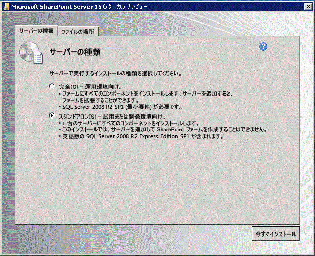
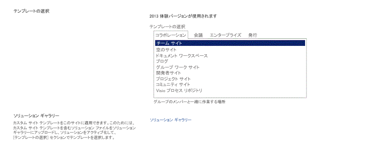

# SharePoint 2013 の一般的な開発環境の設定
SharePoint および Visual Studio をインストールして SharePoint 開発環境をセットアップする手順について説明します。
## 必要な SharePoint 開発環境の決定方法
<a name="SP15_bk_determinedevenv"> </a>

作成するアプリを最初に決定します (SharePoint アドイン の詳細については、「 [SharePoint アドイン](http://msdn.microsoft.com/library/cd1eda9e-8e54-4223-93a9-a6ea0d18df70%28Office.15%29.aspx)」を参照してください)。
  
    
    

- ファーム ソリューション を構築する手順は、この記事で取り上げます。
    
  
- SharePoint アドイン を作成する場合は、「 [SharePoint アドインを開発するためのツールと環境](http://msdn.microsoft.com/library/6906eb86-8270-4098-8106-1e8d0d3c212e%28Office.15%29.aspx)」をご覧ください。
    
  

## Microsoft Azure 仮想マシンでの SharePoint 開発環境の作成
<a name="SP15_bk_devenvazure"> </a>

MSDN サブスクリプションがあれば、Azure の仮想マシンをすぐにプロビジョニングできます。
  
    
    
MSDN サブスクリプションに付いてくる Microsoft Azure の特典をアクティブ化していない場合は、「 [MSDN サブスクライバのための Microsoft Azure 特典](http://azure.microsoft.com/ja-jp/pricing/member-offers/msdn-benefits/)」をご覧ください。
  
    
    

> **メモ**
> Microsoft Azure イメージ ギャラリーでは、SharePoint と Visual Studio がプレインストールされたイメージが提供されなくなりました。しかし、Microsoft Azure VM は、依然として開発用コンピューターの優れた選択肢です。 > 「 [Microsoft Azure 管理ポータル](https://manage.windowsazure.com)」にサインインします。 > Windows Server 2008 R2 Service Pack 1 x64、Windows Server 2012 (またはそれ以降) のギャラリーにあるイメージの 1 つを使用して VM を作成します。仮想マシンの作成ウィザードの指示に従います。SharePoint 開発には、 **X-Large** VM サイズをお勧めします。> マシンのプロビジョニングと実行の後、下記の「 **オンプレミスでの SharePoint 開発環境の作成** 」と同じ手順でセットアップを完了します。(オペレーティング システムのインストールに関するセクションは省略します。)> 開発環境のセットアップが完了したら、Azure ポイント対サイト接続を使用して仮想マシン上の Visual Studio からソース コントロールにアクセスできます。これを行う方法については、「 [Virtual Network へのポイント対サイト VPN 接続の構成](https://azure.microsoft.com/ja-JP/documentation/articles/vpn-gateway-point-to-site-create/)」を参照してください。 
  
    
    


## オンプレミスでの SharePoint 開発環境の作成
<a name="SP15_bk_devenvazure"> </a>


  
    
    

### SharePoint アドイン 開発環境用のオペレーティング システムのインストール
<a name="SP15_bk_InstallOS"> </a>

SharePoint インストール環境の開発環境の要件は、運用環境の要件に比べ、厳しいものではなく、コストも少なくて済みます。どんな開発環境でも、SharePoint をインストールして実行するには、x64 対応の CPU と少なくとも 16 GB の RAM が搭載されているコンピューターを使用する必要があります (24 GB の RAM を推奨)。お客様特有の要件と予算に応じて、以下のいずれかのオプションを選択できます。
  
    
    

- SharePoint を Windows Server 2008 R2 Service Pack 1 x64 または Windows Server 2012 (またはそれ以降) にインストールします。
    
  
- Microsoft Hyper-V を使用して、Windows Server 2008 R2 Service Pack 1 x64 または Windows Server 2012 ゲスト オペレーティング システムが実行されている仮想マシンに SharePoint をインストールします。SharePoint 用に Microsoft Hyper-V 仮想マシンをセットアップする場合のガイダンスについては、「 [SharePoint 2013 仮想マシンと Hyper-V 環境にベスト プラクティスの構成を使用する](http://technet.microsoft.com/ja-jp/library/ff621103%28v=office.15%29.aspx)」を参照してください。
    
  

### オペレーティングシステムと SharePoint 2013 のアプリ開発の前提条件のインストール
<a name="SP15_bk_prereqsOS"> </a>

SharePoint のインストールを始める前にオペレーティングシステムのいくつかの前提条件をインストールする必要があります。このため、SharePoint には前提条件をすべてインストールする PrerequisiteInstaller.exe tool が含まれています。Setup.exe ツールを実行する前にこのツールを実行します。
  
    
    

1. PrerequisiteInstaller.exe ツールを実行します。
    
  
2. インストール ファイルに含まれている Setup.exe ツールを実行します。
    
  
3. マイクロソフト ソフトウェア ライセンス条項に同意します。
    
  
4. [ **インストールの種類を選択してください**] ページで [ **スタンドアロン**] を選択します。
    
   **図 2. インストールの種類の選択**

  


  

  

  
5. インストール中にエラーが発生した場合は、ログ ファイルを確認します。ログ ファイルを見つけるには、コマンド プロンプト ウィンドウを開いて次のコマンドを入力します。インストールの完了時にはログ ファイルへのリンクも表示されます。
    
  ```
  
cd %temp
dir /od *.log
  ```

6. インストールが完了すると、SharePoint 製品とテクノロジ構成ウィザードを開始するように求めるメッセージが表示されます。
    
    > **メモ**
      > SharePoint 製品とテクノロジ構成ウィザードは、ドメインに参加しているのに、ドメイン コントローラーに接続されていないコンピューターでは失敗することがあります。このエラーが発生した場合は、直接または仮想プライベート ネットワーク (VPN) 接続を介してドメイン コントローラーに接続するか、そのコンピューターの管理者特権が付与されているローカル アカウントでサインインします。 
7. 構成ウィザードが完了すると、新しい SharePoint サイトの [ **テンプレートの選択**] ページが表示されます。
    
   **図 3. サイト テンプレートの選択ページ**

  


  

  

  

### Visual Studio のインストール
<a name="SP15_bk_installVS"> </a>

Visual Studio をインストールすると、ローカルの開発マシン上で SharePoint を開発するためのテンプレートとツールがすべて手に入ります。
  
    
    
Visual Studio のインストール手順については、「 [Visual Studio のインストール](http://msdn.microsoft.com/ja-jp/library/e2h7fzkw.aspx)」を参照してください。
  
    
    

#### Visual Studio での詳細ログ

詳細ログを有効にする場合、次の手順を実行してください。
  
    
    

1. レジストリを開き、 **HKEY_CURRENT_USER\\Software\\Microsoft\\VisualStudio\\ _nn.n_\\SharePointTools** に移動します。 _nn.n_ は Visual Studio のバージョン (12.0、14.0 など) です。
    
  
2. **EnableDiagnostics** という DWORD キーを追加します。
    
  
3. キーの値を **1** にします。
    
  
レジストリ パスは Visual Studio の将来のバージョンで変更されます。
  
    
    

## 次の手順
<a name="SP15_bk_devenvazure"> </a>

ワークフローを作成する予定の場合、続けて「 [SharePoint 2013 ワークフロー マネージャーをセットアップおよび構成する](set-up-and-configure-sharepoint-2013-workflow-manager.md)」を実行します。
  
    
    

## その他の技術情報
<a name="SP15_bk_AddlResources"> </a>


-  [Visual Studio のインストール](http://msdn.microsoft.com/ja-jp/library/e2h7fzkw.aspx)
    
  
-  [SharePoint アドインを開発するためのツールと環境](http://msdn.microsoft.com/library/6906eb86-8270-4098-8106-1e8d0d3c212e%28Office.15%29.aspx)
    
  

  
    
    

