# SharePoint Server 2013 のアプリケーション ライフサイクル管理
SharePoint Server 2013 テクノロジを使用して、アプリケーション開発に共通のアプリケーション ライフサイクル管理 (ALM) の概念およびプラクティスを適用します。
 * **提供元:*** Eric Charran, Microsoft Corporation
  
    
    

 * **投稿者:*** Vesa Juvonen、Microsoft Corporation | Steve Peschka、Microsoft Corporation

  
    
    

> **重要**
> このトピックは、自動的にホストされる SharePoint アドイン について取り上げます。自動的にホストされるアプリのプレビュー プログラムは終了しました。自動的にホストされる SharePoint アドイン に対するすべての参照を無視してください。 
  
    
    

## アプリケーション ライフサイクル管理 (ALM) の概要

Microsoft SharePoint Server 2013 は、開発者がオンプレミスとホストまたはパブリック クラウドの両方のプラットフォーム用に、SharePoint テクノロジに基づいたアプリケーションを作成および展開するための複数のオプションを提供します。SharePoint Server 2013 は、アプリケーションが採用できる形態の柔軟性を拡大するほか、標準ベースのテクノロジをアプリケーションに使用するための新しいオプションを提供します。SharePoint の新しいアプリケーション モデルによるこれらのアプリケーションの機能および展開オプションは、開発者が新しい没入型のアプリケーションを作成するための効果的な手段を提供しますが、開発者は開発プロセスに、品質、テスト、および ALM の注意点を導入できる必要があります。この記事では SharePoint Server 2013 テクノロジを使用して、共通の ALM の概念およびプラクティスをアプリケーション開発に適用します。
  
    
    

### 新しい機能

SharePoint Server 2013 は、アプリケーションを実装するための新しいパラダイムを確立します。SharePoint テクノロジによるアプリケーション開発のこのシフトにより、開発者と事業計画担当者には、新しいアプリケーション開発のパターン、プラクティス、および SharePoint Server 2013 の展開モデルの完全な理解が必要となりました。重要な注意点は、SharePoint を使用した開発ソリューションのアプリケーション モデルが変更されても、テクノロジの選択などのソリューション開発に使用されるパターンの多くでは、実装技術と既存の Web アプリケーション開発テクノロジとの整合性は保たれていることです。
  
    
    
次のリソースは、SharePoint Server 2013 テクノロジを使用して作成可能なアプリケーションの種類を説明し、オンプレミスおよびクラウド アプリケーションの両方の考慮事項が含まれています。SharePoint アドイン のホスティング オプションを理解するには「 [SharePoint アドインを開発およびホスティングするためのパターンを選択する](http://msdn.microsoft.com/library/05ce5435-0a03-4ddc-976b-c33b08d03457%28Office.15%29.aspx)」を参照してください。
  
    
    
またマイクロソフトでは、SharePoint Server 2013 でアプリケーションを開発するときに使用したテクノロジを評価するよう顧客に勧めています。ソリューション実装には広範な選択のセットがあるためです。アプリケーションを作成する際、顧客は HTML5 および JavaScript などのプレゼンテーションやユーザー エクスペリエンス レイヤー用の標準ベースのテクノロジの使用に集中することができる一方、SharePoint などのバックエンドサービスへサービスベースでアクセスするには OData と OAuth を使用することができます。このパラダイムを継続的に使用する場合には、顧客は完全な信頼コード (つまり、SharePoint に展開されるコンパイルされたアセンブリ) が必要かどうかを慎重に検討する必要があります。たとえそれが有効であり必要な状況であっても、ALM プロセスには大きなオーバーヘッドとなるためです。
  
    
    
SharePoint Server 2013 のアプリケーションのための新しい柔軟な開発テクノロジの詳細については、「 [SharePoint 2013 開発の概要](sharepoint-2013-development-overview.md)」を参照してください。
  
    
    

### 利点と変更点

現在、SharePoint がサポートするアプリケーション開発テクノロジは、より柔軟な言語やプログラミング アーキテクチャの品揃えを提案できます。開発者が、主流の開発技法周辺の既存の ALM プラクティスに応じて変化する必要があるのは、SharePoint 内のそのような存在に順応するためです。テスト、ビルド確立、展開、および品質管理などの概念を拡張して、SharePoint への展開を SharePoint アプリケーションとして含めることができます。これが意味するのは、多くの開発者が SharePoint のコア機能を拡張するサーバー側ファームのソリューションの記述や展開に習熟しているが、SharePoint Server 2013 アプリケーションによる新しい柔軟な開発モデル用の共通の ALM プラクティスを実装プロセスへ適用する必要があるということです。
  
    
    
顧客がクラウド ホスト型の SharePoint Server 2013 の実装へと移行し続けるに伴い、開発者は、組織の物理境界の外部にある開発、テスト、展開の対象環境を取り込むために ALM 概念の拡張方法を理解する必要が出てきます。これには、アプリケーションの開発、テスト、展開を行うためのテクノロジ戦略の評価作業が含まれます。
  
    
    
開発者と事業計画担当者はいずれも、さまざまな種類のホスティング オプションからなる、またはそれらを組み合わせた、複数のアプリケーション コンポーネントで構成されるソリューションを合成することに熟知するようになります。この適応プロセスの間、これらのアプリケーションに ALM 手順を一方的に適応する必要があります。たとえば開発者は、アプリケーション コンポーネントをテストして品質を決定する、または前回のビルド以降に回帰が実行されたかどうかを決定する機能を保ちながら、オンプレミスのサービス展開 (IIS、ASP.NET、MVC、Web API、WCF)、Microsoft Azure、SharePoint Server 2013、SQL Azure にいたるアプリケーションを展開しなければならない場合があります。これらの要件は、日常のビルドおよびオンプレミスまたはサーバー側ソリューションでは周知の手順の開発プロセスにおいて、開発者とチームの認識に重要な変化があることを意味します。
  
    
    

### 開発チームの注意点

複数のアプリケーション開発者または事業計画担当者がいる組織では、最高品質のアプリケーションを提供するとともに開発者の十分な生産性をサポートするために、SharePoint Server 2013 のチーム開発は慎重に計画する必要があります。アプリケーション開発の実施方法の柔軟性が高まっているため、各チームは、ALM プラクティスおよびパターンだけでなく各開発者のコードの記述法についても明確化して自信を持ち、品質の高いコードがアプリケーションのビルド プロセスの一環になることを確実にする必要があります。
  
    
    
これらの注意点は、適当な開発環境を選択するところから始まります。従来の開発は、Visual Studio TFS 2012 のようにビルド、展開、およびテスト機能を提供する共通のコード リポジトリに接続された仮想マシンにおいて個別の開発を行うことでした。TFS は、現在でも ALM 戦略の強力なインストルメンタル コンポーネントであり開発作業の中心ですが、各チームは各種の開発環境オプションにわたって TFS の使用方法を検討する必要があります。
  
    
    
対象環境、ソリューションの種類 (どのコンポーネントがオンプレミスに、どのコンポーネントがクラウド インフラストラクチャまたはサービスにホストされるか) に応じて、開発者は新しい開発環境オプションの組み合わせから選択できるようになりました。これらのオプションは、SharePoint 開発者サイト テンプレート、Office 365 開発者テナントなどの新しい選択肢、および Windows 8 または Windows Server 2012 の Hyper-V を使用する仮想マシンベースの開発などのレガシの選択肢からなります。
  
    
    
次のセクションでは、アプリケーション開発者および開発チームのために開発環境の注意点を説明します。
  
    
    

## 開発環境の注意点

開発環境の選択は、さまざまな要因に基づいて決定します。これらの注意点は、開発するアプリケーションの種類やアプリケーションの対象プラットフォームによって大きな影響を受けます。従来は、SharePoint Server 2010 用にアプリケーションを作成する場合、開発者は仮想マシンを準備して他とは隔離した状態で開発を行いました。これは、完全に信頼されるソリューションの展開には、IIS などのコア SharePoint の依存関係のリスタートが必要とされていたという事実によるものであり、複数の開発者が単一の SharePoint 環境を使用することを防いでいます。開発テクノロジが変化して、開発者の開発用アプリケーションのオプションも増えたため、開発者およびチームは自分たちが利用できる開発環境の選択肢を理解する必要があります。図 1 に開発環境とツールの組み合わせを示し、さらに対象環境に展開できるソリューションの種類も示します。
  
    
    

**図 1. 開発環境のコンポーネントとツール**

  
    
    
 [
  
    
    
](http://go.microsoft.com/fwlink/?LinkId=391723) [クリックすると拡大します](http://go.microsoft.com/fwlink/?LinkId=391723)
  
    
    

### 開発環境の哲学

SharePoint Server 2013 を使用してアプリケーションを設計および実装する方法について投資が行われているために、開発者は、サーバー側のコードを使用した開発を実施する必要があるかどうかを決定する必要があります。開発者がホスト型クラウド モデルを使用するアプリケーションを作成する場合、仮想化環境に依存する開発を実施するための必要条件は、特に SharePoint に関しては小さくなります。開発者は、既存のクラウドベース (パブリックとプライベートの両方) のインフラストラクチャを使用するリモート開発モデルのソリューションのビルドを追求する必要があります。仮想化を作成および組織する必要なく素早く容易に開発環境を準備できる場合、開発者はインフラストラクチャ管理よりも生産性と品質の開発に焦点を合わせて時間を投資することができます。
  
    
    
SharePoint Server 2013 の仮想化インスタンスと新しい SharePoint 開発サイト テンプレートを対比して必要性を決定する場合、そのアプリケーションが完全な信頼コードを SharePoint に展開して動作させる必要があるかどうかによって決まります。完全な信頼コードの必要がない場合は、Office 365 開発者テナントまたはオンプレミス SharePoint の組織の実装内で見つかる開発者サイト テンプレートの使用をお勧めします。開発者サイト テンプレートは、SharePoint から Visual Studio へ開発者がアプリケーションを直接に展開できるように設計されています。Office 365 の開発者サイトはアプリケーションの隔離と OAuth のために事前に構成されていますので、開発者は直ちにアプリケーションの記述とテストを始めることができます。
  
    
    
以降のセクションでは、開発者が各種の環境オプションをいつ使用してアプリケーションをビルドできるかを詳細に説明します。
  
    
    

### O365 開発サイト (パブリック クラウド)

図 2 は、開発者が Office 365 を開発環境として使用する方法、および Office 365 でホストできる SharePoint アプリケーションを作成する各種のツールを含める方法を示します。
  
    
    

**図 2. Office 365 のアプリケーション開発**

  
    
    
 [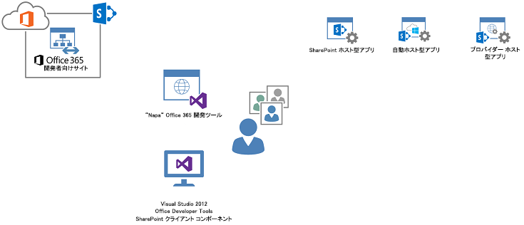
  
    
    
](http://go.microsoft.com/fwlink/?LinkId=391724) [クリックすると拡大表示します](http://go.microsoft.com/fwlink/?LinkId=391724)
  
    
    
MSDN サブスクリプションが有効な開発者は、SharePoint開発者向けサイト を含む開発テナントを取得することができます。SharePoint開発者向けサイト は、アプリケーションの開発用に事前構成されています。ユーザーは、アプリケーションの開発に Visual Studio 2012 を使用できるだけでなく、Office 365 の開発サイトの利用により、アプリケーションを構築するサイト内で Napa を使用することができます。Office 365 開発者向けサイト の作業の開始についての詳細は、「 [Office 365 開発者向けサイトにサインアップする](http://msdn.microsoft.com/library/b22ce52a-ae9e-4831-9b68-c9210af6dc54%28Office.15%29.aspx)」を参照してください。
  
    
    
開発者は、Office 365、オンプレミス、またはプロバイダー ホスト型モデルによる他のインフラストラクチャでホストされるアプリケーションの作成を始めることができます。この環境の利点は、SharePoint 開発環境用のインフラストラクチャ、仮想化、およびその他のホスティングの注意点が Office 365 によって抽象化されることで、開発者が瞬時にアプリケーションを作成できるようになることです。この種類の開発環境での主な注意点は、SharePoint へ展開する完全な信頼コードが必要なアプリケーションには対応できないことです。Microsoft では、できる限り SharePoint のクライアント側オブジェクト モデル (csom) および、JavaScript などのクライアント側テクノロジを使用することを推奨しています。完全な信頼コードが必要なイベント (しかし SharePoint で動作するコードの展開は不要) では、自動ホストまたはプロバイダー向けのホスト型モデルによるサーバー側コードの展開を推奨します。プロバイダー向けのホスト型インフラストラクチャに展開されるこれらの完全な信頼コード ソリューションでは、CSOM も使用しますが C# などの言語も使用できることに注意してください。さらに、プロバイダー向けのホスト型モデルで展開されるこれらのアプリケーションは他のテクノロジ スタックを使用することができますが、SharePoint Server 2013 と相互に作用するために CSOM を使用することにも注意が必要です。
  
    
    
より大きなソリューションを含む個別の機能またはアプリケーションを作成する開発チームは、統合テスト コンポーネントへの集中展開対象を必要とします。各開発者は、独自の Office 365 開発者サイト上で機能またはアプリケーションを作成するため、各開発者のアプリケーションのコンポーネントがそこに展開されるように、対象テナントまたはオンプレミス環境内に集中サイト コレクションを用意する必要があります。このアプローチでは、ソリューション コンポーネント間での統合テストを集中して実施する場所を提供します。「 [この文書のテストのセクション](#Testing)」 では、このプロセスを詳しく再検討します。
  
    
    

#### NapaOffice 365 開発ツール

Napa 開発者ツールは、開発者が Office 365 開発者サイト内でアプリケーションの簡単な作成に使用することができます。Napa ツールの目的は、クライアント側テクノロジに精通した開発者あるいはパワー ユーザーが、短時間でアプリケーションをプロトタイプ、検証、または迅速なビジネス ソリューション シナリオにおいて開発/展開することです。これらのツールは、アプリケーションの機能を SharePoint 上で開発する手段を提供します。ただし、アプリケーションのライフサイクル内には、アプリケーションが Visual Studio にインポートされる場合があるかもしれません。そのような条件を次に示します。
  
    
    

- 2 つ以上の開発者がソリューションの一部に貢献または開発する場合
    
  
- アプリケーションが、ライフサイクル管理プラクティスのアプリケーションが必要なユーザーにより依存関係レベルに到達した場合
    
  
- 時間とともに、アプリケーションの機能要件が変化して追加のソリューション コンポーネントが必要になった場合 (コンパイル済みのサービスやデータ ソースなど)
    
  
- アプリケーションに、他のアプリケーションまたはソリューション コンポーネントとの統合が必要になった場合
    
  
- 開発者が、自動化ビルドおよびテストなどの品質管理対策を使用しなければならない場合
    
  
これらやその他同種の条件が発生した場合、アプリケーションの将来の開発のために、開発者はソリューションを TFS などのソース管理環境にエクスポートし、ALM 設計注意事項および手順を適用する必要があります。
  
    
    

### 開発サイト (リモート開発)

Office 365 開発者サイトを SharePoint アプリケーション開発の主な手段として使うことを選択しなかった組織または開発者は、オンプレミスの開発者サイトを使用して SharePoint アプリケーションを開発することができます。このモデルでは、Office 365 開発者サイトの機能が SharePoint ファーム内にホストされたオンプレミスの開発者サイトに置き換えられます。顧客は、SharePoint ファームを展開して開発者サイトのインスタンスを収容することによって開発用のプライベート クラウドを作成することができます。顧客は、独自のガバナンス オートメーションを提供することができます。この目的は、開発者サイト テンプレート作成の提供または SharePoint のインプロダクト機能の使用により、開発者サイト インスタンスを提供するためです。図 3 ではこのセットアップを説明します。
  
    
    

**図 3. 開発者サイト テンプレートを使用したオンプレミス アプリケーション開発**

  
    
    
 [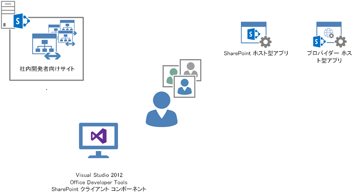
  
    
    
](http://go.microsoft.com/fwlink/?LinkId=391725) [クリックすると拡大表示します](http://go.microsoft.com/fwlink/?LinkId=391725)
  
    
    
図 3 は、オンプレミスの SharePoint ファームをホストとして使用したときに、開発者サイトで有効となる開発ツールおよびアプリケーションの種類を示します。NapaOffice 365 開発ツールは、この環境では使用できないことに注意してください。これらの開発ツールは、Office 365 開発サイトにのみ存在する機能です。
  
    
    
開発者向けサイト インスタンスをホストする SharePoint ファームは、監視を受ける必要があり、サービス ポイントと回復ポイントおよび時間レベルの目的に一致する必要があります。このファームに依存してアプリケーションを作成する開発者の作業を中断することなく生産性を確保するためです。顧客はこの環境に、弾力性や各種単位などプライベート クラウドの概念および管理構造を適用することができます。開発者サイトもホストされている SharePoint ファームには作業および管理を適用する必要があります。これにより、古いまたは未使用の複数の開発者サイトが監視を受けないまま不規則に拡散するのを制御するほか、環境を拡張すべきタイミングを知る手段ともなります。
  
    
    
顧客は、開発者サイトを収容しホストする SharePoint ファームをホストするために Microsoft Azure のようなサービスとしてのインフラストラクチャ (IaaS) 機能の使用、または独自に保有するオンプレミスの仮想または物理環境の使用を決定することができます。このモデルの使用のために、SharePoint を開発者ごとにインストールする必要はないことに注意してください。リモートのアプリケーション開発に必要なのは、Visual Studio および開発ワークステーション上の Office および SharePoint 2013 の開発ツールだけです。
  
    
    
開発者は、プロバイダー向けのホスト型アプリケーションを展開するためにプロバイダー ホスト型インフラストラクチャを構築する必要があります。SharePoint アプリケーションのプロバイダー ホスト型コンポーネントは、幅広いテクノロジで実装可能ですが、SharePoint の外部で動作するアプリケーションのコンポーネントをホストするためのインフラストラクチャを提供する必要があります。たとえば、チームが SharePoint アプリケーションを開発していて、そのユーザー エクスペリエンスおよび他のコンポーネントが ASP.NET アプリケーションに属する場合は、その開発チームはローカル バージョンの IIS、SQL Server、その他 ASP.NET の従来型の ALM チーム開発パターンなどを使用する必要があります。
  
    
    

### 内蔵のファーム環境 (仮想化ファーム開発)

完全な信頼コードの展開を必要とするソリューションが SharePoint ファーム上で動作するためには、SharePoint Server 2013 の完全な実装 (多くは仮想化) が必要です。SharePoint 用のオンプレミス開発環境の構築方法のガイダンスは、「 [SharePoint アドインのオンプレミスの開発環境をセットアップする](http://msdn.microsoft.com/library/b0878c12-27c9-4eea-ae3b-7e79e5a8838d%28Office.15%29.aspx)」を参照してください。
  
    
    
図 4 は、オンプレミスの仮想化環境を使用して作成できるアプリケーションの種類を示しています。
  
    
    

**図 4. 仮想化環境によるオンプレミス開発**

  
    
    
 [
  
    
    
](http://go.microsoft.com/fwlink/?LinkId=391726) [クリックすると拡大表示します](http://go.microsoft.com/fwlink/?LinkId=391726)
  
    
    
開発者は、独自の SharePoint ファーム内の SharePoint およびクラウド ホスト型のアプリケーションの開発、および完全な信頼の ファーム ソリューション の開発をリモートで行うことができます。これらのファームは、開発者のワークステーションか集中仮想化プライベート クラウドの上で動作する、開発者がアクセスしやすい仮想化サーバー内にホストされていることが多くなっています。通常、SharePoint ファームの環境は、他の開発者のファームとは独立させることにより、重要なサービス (IIS を指す) の再起動が必要となる場合がある完全な信頼コードの開発に必要な隔離レベルを提供します。
  
    
    
リモート開発は、内蔵ファームの内部や完全な信頼コードの開発で行えます。それは各開発ファームが分離されて単一の開発者専用となっているためです。
  
    
    
組織または開発者は、仮想コンピュータで動作している SharePoint ファームの管理および更新を行います。単一のアプリケーションについて作業をしている開発者の場合、複数の仮想コンピュータで動作している開発ファーム全体にわたってパリティを維持する必要があります。このプラクティスによって、アプリケーション用に開発されたコードの各コンポーネントに一貫性があることが保証されます。その他の共通の注意点は、ドメイン アクセスおよび資格情報、サービス アプリケーション資格情報、テスト ID またはアカウント、およびその他の環境についての構成要素 (証明書など) など、ファームの標準的な構成です。
  
    
    
開発サイトの集中化ファームと同じく、開発者の SharePoint ファームが動作するこれらの仮想マシンは、Microsoft Azure などの laaS プラットフォームおよびオンプレミスのプライベート クラウドにホストすることができます。
  
    
    
仮想マシンでは、他の開発用仮想マシンから相当に隔離し独立させることができますが、チームでは各仮想マシンの構成の間に均一性を持たせることに苦労しています。これには、共通ドメイン、アカウントおよびセキュリティ、SharePoint 構成および Visual Studio Team Foundation Server (TFS) などのソース管理リポジトリへの接続を含みます。
  
    
    

## ALM 設計の注意点

SharePoint アプリケーションを構築する場合、一貫性と品質のために、ガバナンスおよび共通の開発プラクティスを提供する上で順守すべきいくつかの注意点があります。ALM 原則を SharePoint アプリケーション開発に適用する場合、開発者はプロセス上の注意点と同じく技術上の注意点にも集中する必要があります。
  
    
    
通常、Visual Studio Team Foundation Server 2012 のような ALM プラットフォームのサポートは、アプリケーション開発を行う際の必要条件です。特に、同じプロジェクトのセットで複数の開発者のチームが作業する場合はなおさらです。SharePoint アプリケーションでは、他の技術ソリューションと同様に、コード リポジトリ管理とバージョン管理、ビルド サービス、テスト サービス、およびリリース管理プラクティスが必要です。次のセクションでは、SharePoint アプリケーションの異なるアプリケーション モデルに ALM を適用した場合の注意点を説明します。
  
    
    

### 概要

各種の SharePoint アプリケーションでは、ALM の注意点を一律のコンセプトで適用する必要があります。ただし、ビルド、テスト、および変化の管理についてのプラクティスと手順は調整する必要があります。
  
    
    
一部の SharePoint アプリケーションでは、クライアント側テクノロジを使用します。SharePoint Server 2010 アプリケーションの開発経験のある開発者の多くは、ALM 原則を開発してコンパイルされていないコードに適用する作業を調整しなければなりません。この調整作業には、コンパイルされたコードを含まないソリューションに、「ビルド」などのコンセプトを適用することが含まれます。Visual Studio 2012 などの ALM プラットフォームでは、第一にコードをコンパイルして、第二に、ビルドに対してビルド検証テスト (BVT) を動作することで、ビルドを検証する機能を内蔵しています。
  
    
    
SharePoint アプリケーションでは、ビルドとテストに関連するプロセスは、従来型のアプリケーション開発プロセスと一致している必要があります。これには ALM プラットフォームによるビルド スケジュールの作成を含みます。ALM プラットフォームは、ソリューションをコンパイルして対象の環境へ展開します。
  
    
    

### ビルド プロセス

SharePoint アプリケーションのビルド プロセスは、ALM プラットフォームによって容易になります。Visual Studio Team Foundation Server 2012 は、Visual Studio 2012 (統合の継続) からのソリューションの確認または指定したスケジュール間隔によってトリガーできるビルドおよびテストサービスの両方を提供します。
  
    
    

#### SharePoint ビルド コンポーネント

SharePoint アプリケーション開発のビルド プロセスを計画する場合、図 5 に示すように、開発者はコンポーネント間の相互作用を考慮する必要があります。
  
    
    

**図 5. SharePoint ホスト型のアプリケーション ビルド コンポーネント**

  
    
    

  
    
    
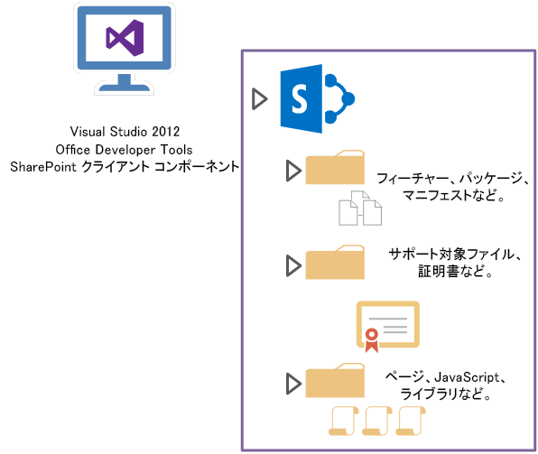
  
    
    
図 5 のイラストは、SharePoint アプリケーションの論理表記です。このイラストは、SharePoint ホスト型アドイン を示し、Visual Studio 2012SharePoint ホスト型アドイン プロジェクトの一部である重要なアプリケーション オブジェクトを強調表示します。SharePoint アプリケーション プロジェクトは、SharePoint に登録される機能、パッケージ、およびマニフェストを含みます。このプロジェクトはさらに、ページ、スクリプト ライブラリ、およびその他の SharePoint アプリケーションを構成するユーザー エクスペリエンスの要素を含みます。さらに SharePoint プロジェクトは、対象の SharePoint 環境への展開に必要な証明書を含む関連ファイルを備えています。
  
    
    

**図 6. プロバイダー向けのホスト型および自動ホスト型のアプリケーション ビルド コンポーネント**

  
    
    

  
    
    
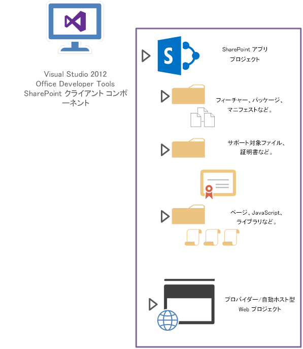
  
    
    
図 6 は、SharePoint クラウド ホスト型アプリケーション (自動ホスト型またはプロバイダー ホスト型)を示します。プロジェクト構造の主な違いは、Visual Studio 2012 ソリューションでは、クラウド ホスト型のアプリケーション コンポーネントを含む 1 つ以上のプロジェクトに加えて SharePoint アプリケーション プロジェクトを含むことです。これらが含むのは、Web アプリケーション、SQL データベース プロジェクト、または Azure に展開されるサービス アプリケーションまたはオンプレミスのプロバイダー ホスト型インフラストラクチャ (ASP.NET など) およびその他のソリューション コンポーネントです。高信頼アプリケーションのパッケージングと展開のガイダンスについては、「 [高信頼 SharePoint アドインをパッケージ化して発行する](http://msdn.microsoft.com/library/3c28aed8-c037-407c-9154-39a74073e170%28Office.15%29.aspx)」を参照してください。
  
    
    

**図 7. ALM と Visual Studio Team Foundation Server**

  
    
    

  
    
    
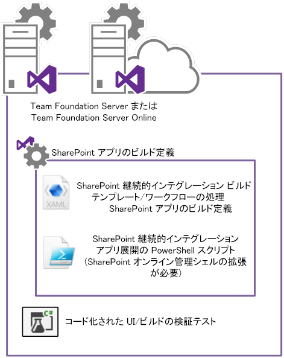
  
    
    
図 7 は、ALM プラットフォームとしての TFS を示します。チームは、TFS を使用してコードを保存し、チーム開発を実施します。このとき TFS のオンプレミス展開またはマイクロソフトのクラウドベースの TFS サービスのどちらかを使用します。TFS は、SharePoint アプリケーションを使用してビルド定義を介して、ビルドおよび展開作業を実行するように構成することができます。TFS は、ビルド確認テスト (BVT) を実行するためにも使用できます。ビルド確認テストは、ビルド定義の一部であるコード化された UI テストの実行を通して自動化することができます。
  
    
    

**図 8. TFS ビルド対象**

  
    
    

  
    
    
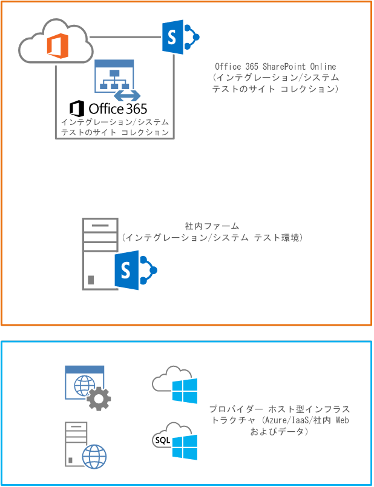
  
    
    
図 8 は、TFS ビルド定義によって実行されるスクリプトが SharePoint アプリケーション コンポーネントを展開する対象環境を示します。SharePoint ホスト型アプリケーションの場合は、SharePoint Online または オンプレミスの SharePoint アプリケーション カタログに向けた展開を含みます。
  
    
    
クラウド ホスト型の SharePoint アプリケーションの場合は、SharePoint の外部にある追加のインフラストラクチャを必要とするソリューションのコンポーネントが対象環境に展開されています。自動ホスト型のアプリケーションの場合は Microsoft Azure です。プロバイダー向けのホスト型アプリケーションの場合、このインフラストラクチャは Microsoft Azure または他のオンプレミスまたは IaaS ホスト型環境です。
  
    
    

#### SharePoint アプリケーション向けのビルドの作成

TFS が提供するビルド サービスは、対象の環境に自動化された方法で、ソース管理に登録されたソリューションをコンパイルし、展開用の集中ドロップ ロケーションに出力を配置することができます。TFS が SharePoint アプリケーションの自動化ビルド、展開、テストを実施するように構成する主なメソッドでは、Visual Studio にビルド定義を作成します。このビルド定義は、どのコード プロジェクトをコンパイルするかや、コンパイル後の作業 (テストや対象環境への実際の展開など) についての情報を含みます。Team Foundation Build Service の詳細については、「 [Team Foundation Build Service のセットアップ](http://msdn.microsoft.com/ja-jp/library/vstudio/ee259687.aspx)」を参照してください。
  
    
    
連続的にインテグレーションを行う場合は、開発者がコードをチェックインするときにビルド定義をトリガーすることができます。さらにビルド定義は、設定した間隔で実行するようにスケジュールすることも可能です。
  
    
    
SharePoint アプリケーションでは、開発者はスケジュール済みビルドや継続的なインテグレーションを実施するために、「 [TFS 2012 による Office/SharePoint 2013 の連続的インテグレーション](http://officesharepointci.codeplex.com/)」のビルド定義プロジェクトを使用する必要があります。このプロジェクトは、連続的インテグレーション モデルで SharePoint アプリケーションをビルドし展開するために、Visual Studio Online を構成する方法に関するビルド定義、Windows PowerShell スクリプト、およびプロセス指示 、または TFS のオンプレミス バージョンを提供します。開発者は、このプロジェクトのコンポーネントをダウンロードし、それぞれの TFS インスタンスを適宜構成する必要があります。SharePoint アプリケーション用に提供されたビルド定義を使用して TFS を構成して、Windows PowerShell スクリプトを使用するためのビルド定義を構成し、対象環境に SharePoint アプリケーションを展開する方法についての説明は、「 [TFS 2012 による Office/SharePoint 2013 の連続的インテグレーション](http://officesharepointci.codeplex.com/documentation)」を参照してください。
  
    
    

#### ビルドおよび展開プロシージャの構成

図 9 は、ビルド定義の作成、構成、および展開がチームの TFS インスタンスに実行済みの場合の SharePoint アプリケーションのビルドおよび展開の標準プロセスを示します。
  
    
    

**図 9. TFS のビルドおよび展開プロセス**

  
    
    
 [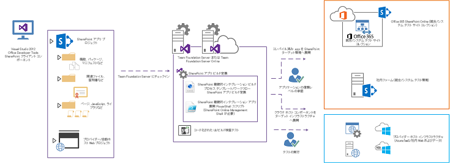
  
    
    
](http://go.microsoft.com/fwlink/?LinkId=391727) [クリックすると拡大表示します](http://go.microsoft.com/fwlink/?LinkId=391727)
  
    
    
開発者は、SharePoint アプリケーション Visual Studio 2012 ソリューションをチェックインします。目的の構成 (連続的インテグレーションまたはスケジュール済みビルド) によって、TFS ビルド サービスは SharePoint アプリケーション ビルド定義で定義されるステップを実行します。開発者が構成するこの定義には、連続的インテグレーション ビルド プロセス テンプレートおよびビルド後に実行する指示が含まれ、アプリケーション展開用の Windows PowerShell スクリプトを実行します。SharePoint Online にアプリケーションを展開するには、SharePoint Online Management Shell 拡張が必要となることに注意してください。SharePoint Online Management Shell 拡張の詳細については、ダウンロード センターの「 [SharePoint Online Management Shell](http://www.microsoft.com/ja-jp/download/details.aspx?id=35588)」を参照してください。
  
    
    
ビルドが一度トリガーされると、TFS は SharePoint アプリケーションに関連するプロジェクトをコンパイルし Windows PowerShell スクリプトを実行して、対象の SharePoint 環境にソリューションを展開します。
  
    
    

#### SharePoint アプリケーションを信頼する

対象環境へのアプリケーション コンポーネントの展開に続いて、ビルドの一環として行われることがある自動化テストを含めて、アプリケーションへのアクセスが始まる前に、テナント (またはサイト コレクションの) 管理者は、SharePoint 内のアプリ情報ページでアプリケーションを信頼しておく必要があることに注意してください。この必要条件は、自動ホスト型および SharePoint ホスト型アプリに適用されます。この手動プロセスは、ビルド プロセスの変化を表しています。通常は、対象環境への展開に続いて動作していたテストが、アプリケーションが信頼されるまで待機しなければならないからです。
  
    
    
クラウド ホスト型 (自動およびプロバイダー) アプリケーションの場合、開発者は SharePoint に展開されたアプリケーション パッケージとは独立して、非 SharePoint コンポーネントをクラウド ホスト型インフラストラクチャに展開することができることに注意してください。
  
    
    

**図 10. 非 SharePoint コンポーネントの展開**

  
    
    
 [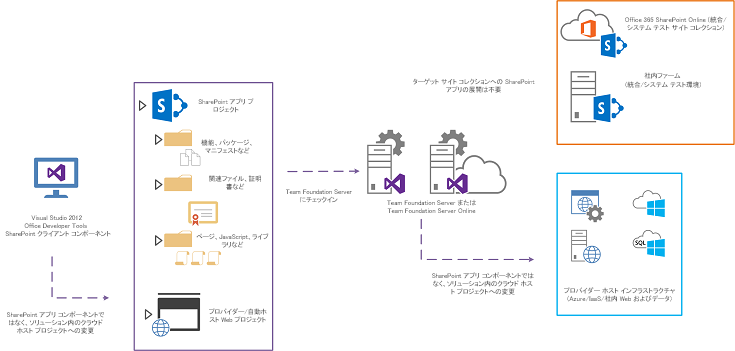
  
    
    
](http://go.microsoft.com/fwlink/?LinkId=391728) [クリックすると拡大表示します](http://go.microsoft.com/fwlink/?LinkId=391728)
  
    
    
図 10 に示すように、SharePoint アプリケーションであるソリューションに変更を加えた場合、状況によってはソリューション内のプロジェクトに加えた変更が SharePoint アプリケーション プロジェクト自体には適用されない場合があります。このような状況では、SharePoint アプリケーション プロジェクトは変更されていないため、再表示される必要はありません。クラウド ホスト型プロジェクトに関連する変更は再表示される必要があります。
  
    
    
SharePoint の外のインフラストラクチャに展開されるアプリケーションへの変更は、対象のサイト コレクションまたはテナントに展開されるアプリケーション コンポーネントとは独立して実行することができます。これは開発者にとっては、クラウド ホスト型コンポーネントを頻繁 (トリガーされる) にそして SharePoint アプリケーション プロジェクトから独立して展開するために、自動化ビルド プロセスを作成できることを意味します。そのため、SharePoint のアプリ情報ページでアプリケーションのアクセス許可を承認する手動ステップは必要ありません。これにより連続的な展開とビルド定義のテスト プロセスが可能になります。ソリューションの SharePoint アプリケーション コンポーネントは、変更があり再展開が必要な状況になったプロジェクト内のアイテムだけです。
  
    
    

### テスト

「 [ビルド プロセス セクション](#ALMBuildProcess)」 で説明したように、アプリケーション テストとは、アプリケーションのコンパイルおよび展開が完了したかどうかを確認する方法です。アプリケーションのビルドと展開を確認する手段としてテストを使用することによって、チームは、品質を把握すると同時に、アプリケーション コードへの最近の変更により、いつ SharePoint アプリケーションが侵害を受けたかを知る手段を得ました。
  
    
    
図 11 に、SharePoint アプリケーション モデルに最適なテスト アプローチの種類を示します。
  
    
    

**図 11. テスト アプローチ**

  
    
    
 [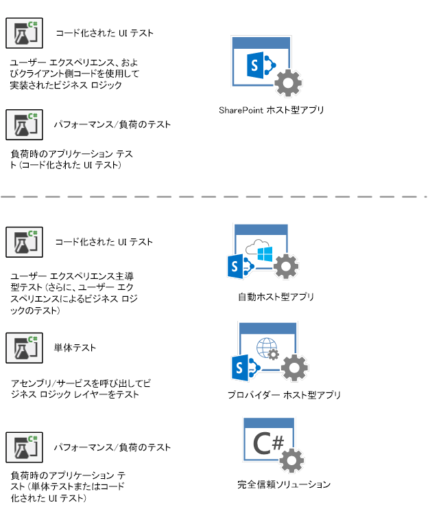
  
    
    
](http://go.microsoft.com/fwlink/?LinkId=391729) [クリックすると拡大表示します](http://go.microsoft.com/fwlink/?LinkId=391729)
  
    
    
図 11 は、SharePoint アプリケーションを種類ごとにテストするために、異なる種類のテストの使用を提案しています。コード化された UI テストは、ビジネス ロジックとユーザー エクスペリエンスが同じレイヤーに存在する SharePoint ホスト型のアプリケーションに対して使用します。ビジネス ロジックは JavaScript ライブラリに抽象化できるのに対し、そのロジックをテストする主な手段は、ユーザー エクスペリエンスを経由します。
  
    
    
クラウド ホスト型アプリケーション (つまり自動化およびプロバイダー ホスト型) は、完全にコード化された UI テストを使用できると同時に、ソリューションのサービス コンポーネントの検証のための単体テストも使用することができます。これにより開発者は、機能的な観点からみて、アプリケーションのホスト型インフラストラクチャの品質に自信を持てるようになります。
  
    
    
以降のセクションでは、SharePoint アプリケーションに関して、コード化された UI テストとその他のテストの種類の注意点を検討します。
  
    
    

#### クライアント側コードおよびコード化された UI テスト

ビルド検証テスト (BVT) と完全なシステムテストには、コード化された UI テストが推奨されます。これらのテストは記録済みの操作に依存して、ビジネス ロジックとアプリケーションの中間層だけでなく、ユーザー エクスペリエンスをもテストします。クライアント側コードを使用する SharePoint アプリケーションでは、ビジネス ロジックのエントリ ポイントと実行の大半はユーザー エクスペリエンス層に存在します。このため、コード化された UI テストは、ユーザー エクスペリエンスをテストできるだけでなく、アプリケーションのビジネス ロジックも同様にテストできます。コード化された UI テストの詳細については、「 [UI 自動化によるコード検証](http://msdn.microsoft.com/ja-jp/library/dd286726.aspx)」を参照してください。
  
    
    
コード化された UI テストは、多くの UX とビジネス ロジックを混ぜることができる SharePoint ホスト型アドイン で使用できます。これらのテストは他と同様に、展開後 (およびアプリケーションは SharePoint から信頼後) にアプリケーションの機能を確認できるように、TFS のビルド定義から動作させることができます。
  
    
    

#### 非コード化 UI テスト

クラウド ホスト型アプリケーションなど、アプリケーションの UX 層の外にアプリケーション ロジックが存在する状況では、コード化された UI テストおよび非コード化 UI テストの組み合わせを使用します。従来型の単体テストのようなテストは、プロバイダー向けのホスト型インフラストラクチャに実装されるサービス ロジックのビルド品質の検証に使用することができます。これは開発者に、ソリューション機能のプロバイダー向けのホスト型コンポーネントについての全体的な自信を与えます。これらはテストの視点から考えます。
  
    
    

#### Web のパフォーマンスと負荷テスト

Web のパフォーマンスと負荷テストは、開発者に、期待または予想されたユーザー負荷でアプリケーションが機能する自信を与えます。このテストには、時間とともに合理的に増大する予想可能なユーザー ベースに対して、同時的に対処するアプリケーション能力の決定が含まれます。Web のパフォーマンスと負荷テストでは、コード化された UI テストおよび単体テストの両方をソースとすることができます。ALM プラットフォームを TFS のように使い、これらのテストによってアプリケーションの負荷テストを実行します。
  
    
    
SharePoint アプリケーションをテストする場合、インフラストラクチャのテストはこれらのテストの主な目標ではないことに注意してください。SharePoint ホスト型であれプロバイダー向けのホスト型であれ、このインフラストラクチャは、同等の負荷およびパフォーマンスのベースラインを確立しておく必要があります。アプリケーション用の Web のパフォーマンスおよび負荷テストは、インフラストラクチャの問題を浮き彫りにしますが、主にアプリケーションのパフォーマンスのテストの手段として捉えるようにしてください。
  
    
    
Web のパフォーマンスと負荷テストの詳細については、「 [リリース前のアプリケーションのパフォーマンス テストの実行](http://msdn.microsoft.com/ja-jp/library/vstudio/dn250793.aspx)」を参照してください。
  
    
    

#### 環境の品質とテスト

多くの組織では、物理または仮想で、相互に独立したテスト環境を複数備えています。これらの環境は、チームの ALM プロセス、規制要件、またはそれらの組み合わせに基づき異なります。各チームが使用すべきテスト環境の数と種類を決定するために、次のガイダンスは、SharePoint アプリケーションに固有 の機能的プラクティスに基づいていますが、広くソフトウェア開発用に ALM プラクティスも使用しています。
  
    
    

#### 開発者テスト

開発者がソリューションのコンポーネントを作成する環境では、開発者テストとなることがあります。規模の大きいアプリケーションの異なる側面またはコンポーネントで作業している各開発者は、単体テスト、コード化された UI テスト、および開発サイトに展開されたアプリケーション コードをそれぞれ備えています。
  
    
    

**図 12. 開発者テスト プロセス**

  
    
    
 [
  
    
    
](http://go.microsoft.com/fwlink/?LinkId=391731) [クリックすると拡大表示します](http://go.microsoft.com/fwlink/?LinkId=391731)
  
    
    
開発者は、Visual Studio から、開発者独自の Office 365 またはオンプレミスの開発サイトに展開したソリューション コンポーネントに対してテストを実行します。クラウド ホスト型アプリケーションの場合は、Visual Studio から、プロバイダー向けのホスト型インフラストラクチャにあるソリューション コンポーネントに対して実行します。これらのコンポーネントは、開発者の Microsoft Azure サブスクリプションにあります。
  
    
    
このアプローチでは開発者は、個別の Office 365 開発者サイトか、MSDN サブスクリプションによって提供される Microsoft Azure サブスクリプションを備えていることが前提となっていることに注意してください。開発者がアプリケーションをオンプレミス展開用に作成している場合でも、これらの開発者サービスは開発およびテストで使用されることがあります。
  
    
    
これらのサービスを開発者が持っていない場合、または開発を完全にオンプレミスで行う必要がある場合には、コンポーネントのテストはオンプレミス ファームの開発者サイト コレクションおよび開発者固有のプロバイダー向けのホスト型インフラストラクチャに対して実行します。プロバイダー向けのホスト型インフラストラクチャは、開発者専用の仮想マシンに配置することができます。完全信頼ソリューション開発の場合は、開発者は独自の仮想 SharePoint ファームおよびプロバイダー向けのホスト型インフラストラクチャが必要となります。
  
    
    

#### 統合およびシステム テスト

アプリケーションをテストするには、すべての開発コンポーネントを集中環境に集めて展開する必要があります。この統合環境では、開発者が作成するソリューションのコンポーネントを展開して、他の開発者が書いたソリューションのコンポーネントと相互作用するところを観察する場所を提供することができます。
  
    
    

**図 13. 統合テスト環境**

  
    
    
 [
  
    
    
](http://go.microsoft.com/fwlink/?LinkId=391732) [クリックすると拡大表示します](http://go.microsoft.com/fwlink/?LinkId=391732)
  
    
    
この種類のテストでは、ALM プラットフォームは SharePoint アプリケーションおよび必要なコンポーネントを対象環境にビルドおよび展開します。SharePoint ホスト型アプリケーションでは、Office 365 サイトまたはオンプレミス/IaaS の SharePoint Server 2013 サイト コレクションであり、統合およびシステム テスト用に個別に構築されたものです。SharePoint クラウド ホスト型アプリケーションの場合には、TFS は、統合およびシステム テスト用にサービスを個別に構成する集中化 Microsoft Azure サブスクリプションにコンポーネントを展開します。次に TFS は、コード化された UI テストまたは単体テストを SharePoint アプリケーション、さらにホスト化インフラストラクチャでソリューションが必要とするコンポーネントに対して実行します。
  
    
    

#### UAT および QA テスト

ユーザー受け入れテスト (UAT) の場合、組織は環境を分割することがよくあります。統合およびシステム テストから隔離された状態で機能を実行できるからです。これらのテスト環境を分割すると、アプリケーションの特定のビルドに対してユーザーが長期間テストを実行している場合に、自動化された継続リリースとテストが繰り返されて UAT の作業を妨害するのを防ぎます。
  
    
    

**図 14. UAT テスト**

  
    
    
 [
  
    
    
](http://go.microsoft.com/fwlink/?LinkId=391733) [クリックすると拡大表示します](http://go.microsoft.com/fwlink/?LinkId=391733)
  
    
    
図 14 に示すように、承認テストまたは組織テストの実施を割り当てられたユーザーは、アプリケーションの十分に公開されたビルドを使う安定した環境にある実行テスト スクリプトを用意します。コードの展開とテストは統合環境でも継続しますが、ユーザーは、要求される利用ケースやテスト ケースをアプリケーションが満たしているかを検証するための手動テストを実施します。通常はリリース管理者により、テスト環境にアプリケーションおよび任意のプロバイダー向けのホスト型インフラストラクチャが展開されます。自動化展開も可能です。この種の展開には、専用の UAT ビルド定義を TFS から使用します。このビルド定義は、統合とシステム テスト環境の展開を実施したものをそのままミラーで使用します。
  
    
    
クラウド ホスト型インフラストラクチャの場合、統合およびシステム テスト環境と共有する Microsoft Azure サブスクリプションへの展開は可能ですが、別々のサービスまたはデータベースとして各サービスに名前が付けられ、並行して展開するように構成されている必要があります。このアプローチでは、図 15 に示すようにテスト用 Microsoft Azure サブスクリプションから、統合およびシステム テスト用さらに UAT および QA テスト用の一連のサービスとデータベースを提供します。
  
    
    

**図 15. 統合および UAT テスト**

  
    
    
 [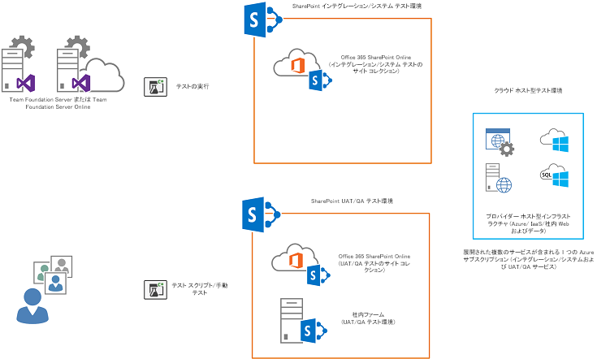
  
    
    
](http://go.microsoft.com/fwlink/?LinkId=391734) [クリックすると拡大表示します](http://go.microsoft.com/fwlink/?LinkId=391734)
  
    
    

#### コード プロモーション プラクティス

コード プロモーション プラクティスは、開発環境とテスト環境の間で動作します。さらに運用環境でも、十分に定義されたリリース管理プロセスを使用して動作します。図 16 で開発者は、単体テスト用にソリューション コンポーネントの開発環境への展開を実行しています。
  
    
    

**図 16. リリース管理プロセス**

  
    
    
 [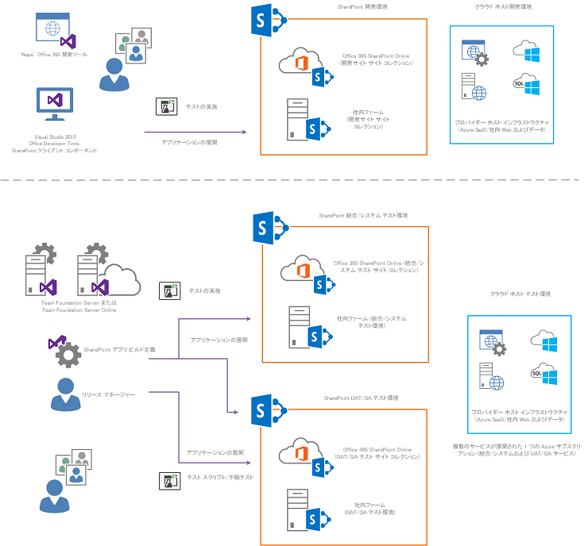
  
    
    
](http://go.microsoft.com/fwlink/?LinkId=391735) [クリックすると拡大表示します](http://go.microsoft.com/fwlink/?LinkId=391735)
  
    
    
TFS へのチェックインに続き、自動化ビルド手続きによってソリューションがコンパイルされ、対象の統合およびシステム テスト環境に展開されます。この環境では、TFS でのビルド定義の一部としてビルド検証テストが実行されます。このアプローチには、ソリューションのプロバイダー向けのホスト型コンポーネントの対象環境 (Microsoft Azure またはオンプレミス環境) への展開が含まれます。ここで Microsoft Azure インフラストラクチャ用の Microsoft Azure サブスクリプションは、統合およびシステム テストと UAT および QA とで同じものを使用できることに注意してください。異なる名前空間および独立した SQL データベースで展開されていることを前提としているのです。
  
    
    
リリース管理者または独立した TFS ビルド定義は多くの場合、手動で呼び出して UA または TQA 環境へ展開することができます。このアプローチは、ユーザーがテスト対象とするビルド バージョンの管理を簡単にしてくれます。リリース管理者は、TFS 共有からビルドを選択して、展開プロセスを各自で実行することができます。プロモーションから実稼働まで、リリース管理は呼び出されてアプリケーションを運用環境に展開し、テストが終わるまでインストールおよびビルド検証を監視します。
  
    
    

## アプリケーションの修正プログラムとアップグレード

マイクロソフトは、アプリケーションの開発者がアプリケーションをアップグレードする方法について固有のガイダンスを持っています。SharePoint Server 2013 プラットフォームは、新しいアプリケーションのバージョンをユーザーへ通知することをサポートします。
  
    
    
SharePoint アプリケーションのアップグレードおよび修正プログラムに関する戦略構築の注意点については、「 [SharePoint アドインを更新する](http://msdn.microsoft.com/library/3edcb33c-fa9e-4e9e-82d6-5519fd981324%28Office.15%29.aspx)」を参照してください。
  
    
    
アプリケーションの変更について守るべき推奨パターンは、既存のコード開発や従来のエンジニアリング パターンと変わりません。これには、バグ修正および機能開発、目標アプリケーション カタログへの増分展開での分岐およびマージに関する規律が含まれます。先行のガイダンスは、SharePoint アプリケーションへの変更を完了するために使用したり、目標アプリケーション カタログに展開するか保存することができます。
  
    
    
「 [SharePoint アドインの更新プロセス](http://msdn.microsoft.com/library/3dba209d-cb98-4e5d-b4b2-fad31e667ca1%28Office.15%29.aspx)」にある情報は、SharePoint アプリケーションを更新するための技術について戦術的なガイダンスを加えてくれます。これは、テスト環境内のファームにアプリケーションの更新プログラムが反映されるサイクルを短縮することによって、展開テストを加速するというものです。さらに、この記事は、さまざまなアプリケーション展開モデル内の状態に適応する方法のガイダンスを提供します。
  
    
    

## その他の技術情報

-  [SharePoint アドインを開発およびホスティングするためのパターンを選択する](http://msdn.microsoft.com/library/05ce5435-0a03-4ddc-976b-c33b08d03457%28Office.15%29.aspx)
    
  
-  [Team Foundation Build Service のセットアップ](http://msdn.microsoft.com/ja-jp/library/vstudio/ee259687.aspx)
    
  
-  [Office 365 SharePoint サイトを使用してオンプレミスの SharePoint サイトのプロバイダー向けのホスト型アドインに権限を付与する](http://msdn.microsoft.com/library/2f65ba3f-b246-4064-b4fb-ad18399d387a%28Office.15%29.aspx)
    
  
-  [SharePoint 2013 開発の概要](sharepoint-2013-development-overview.md)
    
  
-  [Open Data Protocol とは?](http://www.odata.org/)
    
  
-  [OAuth 2.0 の認証フレームワーク](http://oauth.net/)
    
  

  
    
    

