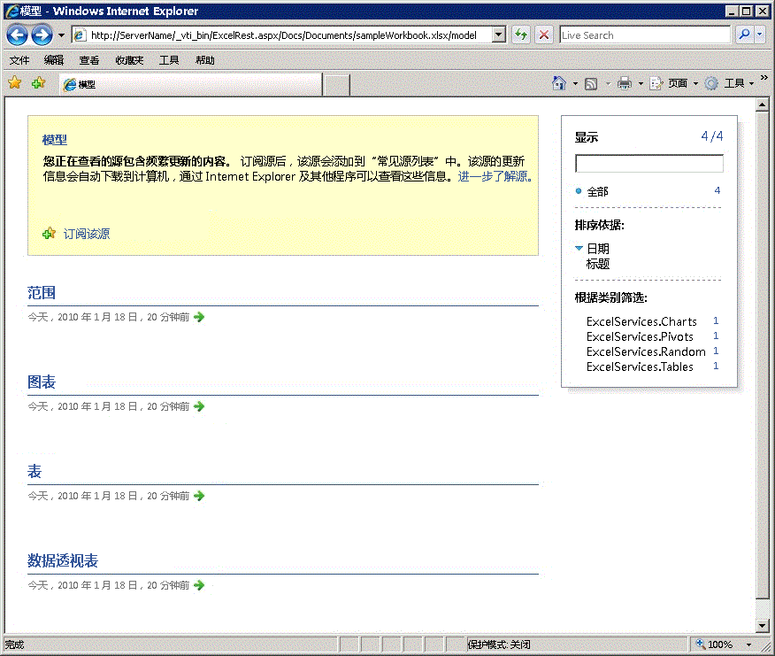

# 基本 URI 结构和路径

本主题介绍在 Excel Services 中如何构建 REST 服务命令的 URI 结构和路径。
  
    
    


> **注释**
> Excel Services REST API 可本地应用于 SharePoint 2013 和 SharePoint 2016。对于 Office 365 教育版、商业版和企业版帐户，请使用作为  [Microsoft Graph](http://graph.microsoft.io/zh-cn/docs/api-reference/v1.0/resources/excel
) 终结点一部分的 Excel REST API。
  
    
    


## 基本 URL 结构和路径

Excel Services 中的 REST API 使您可以直接通过 URL 访问工作簿中的图表、数据透视表、表和指定范围等资源。Excel Services 中的每个 REST URL 由三个部分组成。下面是用于访问工作簿中资源的 URL 的基本结构：
  
    
    

1. **REST aspx 页面 URI**.aspx 页面的入口点
    
  
2. **工作簿位置** 工作簿的路径
    
  
3. **资源位置** 请求的资源在工作簿内的路径
    
  
下面是指向工作簿中特定元素的 REST URL 的构造：
  
    
    


```

http://<ServerName>/_vti_bin/ExcelRest.aspx/<DocumentLibrary>/<FileName>/<ResourceLocation>
```

下面举例说明了 Excel Services 中的 REST URL 将三个部分组合起来之后看起来是什么样的。在本示例中，REST URL 访问名为"sampleWorkbook.xlsx"的工作簿，其中包含一个名为"SampleChart"的图表：
  
    
    


```
http://<ServerName>/_vti_bin/ExcelRest.aspx/Docs/Documents/sampleWorkbook.xlsx/model/Charts('SampleChart')
```

工作簿存储在文档库中。工作簿的完整路径为  `http://` _<ServerName>_ `/Docs/Documents/sampleWorkbook.xlsx`。
  
    
    
REST URL 的三个部分为：
  
    
    

1. **REST aspx 页面 URI** ： `http://` _<ServerName>_ `/_vti_bin/ExcelRest.aspx`
    
  
2. **工作簿位置** ： `/Docs/Documents/sampleWorkbook.xlsx`
    
  
3. **资源位置** ： `/model/Ranges('nameOfTheNamedRange')`
    
  

### 使用发现用户界面进行访问

您还可以使用发现用户界面访问图表。要了解如何使用以下屏幕截图中所示的发现机制访问图表、表、数据透视表和范围等资源，请参阅  [Excel Services REST API 中的发现](discovery-in-excel-services-rest-api.md)。
  
    
    

  
    
    

  
    
    

  
    
    

  
    
    

  
    
    

### 标记路径

下面是 Excel Services 中 REST 服务的 .aspx 页面：
  
    
    

```
http://<ServerName>/_vti_bin/ExcelRest.aspx
```

要访问 Excel Services 中的 REST，您必须为 URL 加上前缀  `http://` _<ServerName>_ `/_vti_bin/ExcelRest.aspx`。
  
    
    

### 工作簿位置

工作簿位置是包含您想访问的资源的工作簿的相对路径。例如，假定您有一个名为 sampleWorkbook.xlsx 且保存到受信任的 SharePoint 文档库的工作簿。在本示例中，下面是 sampleWorkbook.xlsx 所在位置的路径：
  
    
    

```
http://<ServerName>/Docs/Documents/sampleWorkbook.xlsx
```

您获取工作簿的相对路径 ( `Docs/Documents/sampleWorkbook.xlsx`) 并将其附加到标记路径。下面是附加的标记路径和工作簿位置的 URL：
  
    
    


```
http://<ServerName>/_vti_bin/ExcelRest.aspx
```


### 资源位置

资源位置是您请求的元素在工作簿中的路径。例如，如果您想获取图表，资源位置将类似于  `/model/Charts('Chart 1')`。
  
    
    
要获得完整的 URL，将此资源位置附加到工作簿的标记路径和相对路径。下面是完整的 URL 示例：
  
    
    


```
http://<ServerName>/_vti_bin/ExcelRest.aspx/Docs/Documents/sampleWorkbook.xlsx/model/Charts('Chart 1')

```


## 另请参阅


#### 概念


  
    
    
 [Excel Services REST API 的资源 URI](resources-uri-for-excel-services-rest-api.md)
  
    
    
 [Excel Services REST API 中的发现](discovery-in-excel-services-rest-api.md)
