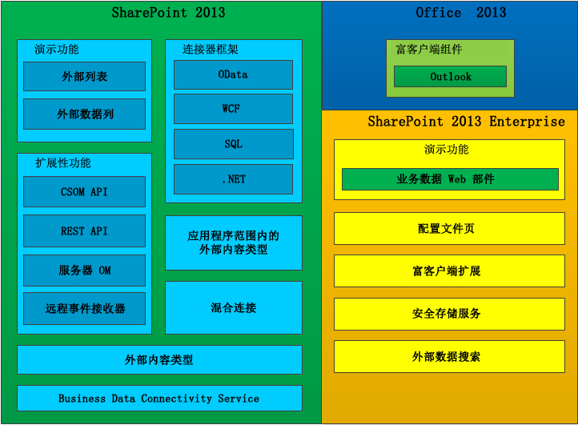

# SharePoint 2013 中的 Business Connectivity Services
了解 Business Connectivity Services (BCS) 是什么、您可以用它来干什么以及在 SharePoint 2013 中开发 BCS 应用程序所需的入门信息。
在创建能够与各种外部系统一起使用的高生产力高协作的解决方案时，您可以将 SharePoint 2013 用作集线器。Business Connectivity Services (BCS) 提供了能使 SharePoint 2013 将数据从这些外部系统引入中央系统的基础结构。通过提供一种灵活可扩展的方法描述外部系统数据源以及如何与其进行交互，BCS 成了一个令人信服的论据，它证明应该将 SharePoint 2013 用作处理遗留商务系统的除了 SharePoint 外接程序以外的中心界面。
  
    
    

## BCS 可以做什么？

BCS 提供了一种使有经验的用户、开发人员和业务部门 IT 专业人员更轻松地执行下列操作的机制：
  
    
    

- 显示 SharePoint Server 2013 和丰富客户端 Office 应用程序中的企业应用程序、Web 服务和 OData 服务的外部数据。
    
  
- 为外部数据和服务提供 Office 类型行为（如联系人、任务和约会）和功能。
    
  
- 提供与数据的完整交互，包括从 Office 应用程序和 SharePoint Server 写回基本外部系统数据和业务对象的功能。
    
  
- 允许脱机使用外部数据和流程。
    
  
- 在非结构化领域的文档、人员和外部系统中锁定的相应结构化数据之间架起桥梁。
    
  

## BCS 的组件

图 1 显示包含在 SharePoint 2013 和 Office 2013 中的功能。
  
    
    

**图 1. Business Connectivity Services 功能集**

  
    
    

  
    
    

  
    
    

  
    
    

  
    
    

## 在 BCS 中使用外部内容类型

外部内容类型是 BCS 的核心。它们使您能够从中心位置管理和重用元数据和商业实体行为，例如"客户"或"订单"。它们能使用户通过一种更有意义的方式与该外部数据进行交互。
  
    
    
例如，假定一个业务实体（如"客户"）。您希望能够从您的专有数据库中提取数据并在 SharePoint 中进行使用。您还希望能够允许您的现场销售人员在 Outlook 2013 中离线获取数据。或者，您可能希望用户能够从 Microsoft Word 内部的"订单"合同文档中的客户列表选取客户。若要使这一切成为可能，您可以创建一个单一外部内容类型，然后在需要它的任何位置重用。
  
    
    
有关在 BCS 中使用外部内容类型的详细信息，请参阅  [SharePoint 2013 中的外部内容类型](external-content-types-in-sharepoint-2013.md)。
  
    
    

## 使用 BCS 开发解决方案

可以使用 SharePoint 2013 在BCS 中构建各种解决方案。其范围从依赖于具有少量自定义或不具有自定义的本机功能的简单解决方案，到涉及 SharePoint 2013 和 Office 2013 中的自定义功能的中间解决方案，再到支持扩展的功能的复杂方案和丰富应用程序的高级解决方案。高级解决方案涉及通过 Visual Studio 编写代码。它可以是完整的端到端解决方案或可包含在中间解决方案中的基于代码的可重用组件。
  
    
    
BCS使业务用户能够使用浏览器和 Microsoft Office 客户端（如 Word 或者 Excel）快速而轻松地满足各种外部数据需求。这些用户可使用 BCS 功能（例如，外部列表和 外部数据列 外部数据列）和可重用的 BCS 组件（这些组件包含在 Office 客户端应用程序和 SharePoint 网站中，它们由开发人员创建并由 IT 专业人员批准）来构建复合解决方案，而无需编写代码。利用这些解决方案，业务用户（及其团队）可像使用 SharePoint 数据一样轻松使用外部数据，不管是在脱机或连接状态下使用，还是直接在 Office 2013 下使用都是如此。
  
    
    
有关如何入门的信息，请参阅 [为 SharePoint 2013 中的 BCS 设置开发环境](setting-up-a-development-environment-for-bcs-in-sharepoint-2013.md)。
  
    
    

## 在 SharePoint 2013 中使用带有 Business Connectivity Services的 OData

开放式数据协议 (OData) 是一种 Web 协议，它允许您采用如 HTTP、JavaScript 对象表示法 (JSON) 和 AtomPub 等技术将数据向 Web 公开。通过特殊构建的 URL 访问数据。这种体系结构允许您使用多种技术与数据进行交互。
  
    
    
有关详细信息，请参阅 [将 OData 源与 SharePoint 2013 中的 Business Connectivity Services 结合使用](using-odata-sources-with-business-connectivity-services-in-sharepoint-2013.md)。
  
    
    

## 本节内容

-  [SharePoint 2013 中的 Business Connectivity Services 的新增功能](what-s-new-in-business-connectivity-services-in-sharepoint-2013.md)
    
  
-  [SharePoint 2013 中的业务连续性服务入门](get-started-with-business-connectivity-services-in-sharepoint-2013.md)
    
  
-  [SharePoint 2013 中的外部内容类型](external-content-types-in-sharepoint-2013.md)
    
  
-  [将 OData 源与 SharePoint 2013 中的 Business Connectivity Services 结合使用](using-odata-sources-with-business-connectivity-services-in-sharepoint-2013.md)
    
  
-  [SharePoint 2013 中的外部事件和警告](external-events-and-alerts-in-sharepoint-2013.md)
    
  
-  [SharePoint 2013 中外接程序范围的外部内容类型](add-in-scoped-external-content-types-in-sharepoint-2013.md)
    
  
-  [在 SharePoint 2013 中使用具有外部数据的客户端对象模型入门](get-started-using-the-client-object-model-with-external-data-in-sharepoint-2013.md)
    
  
-  [SharePoint 2013 的 Business Connectivity Services 程序员参考](business-connectivity-services-programmers-reference-for-sharepoint-2013.md)
    
  

## 其他资源

-  [添加 SharePoint 2013 功能](add-sharepoint-2013-capabilities.md)
    
  
-  [为 SharePoint 2013 中的 BCS 设置开发环境](setting-up-a-development-environment-for-bcs-in-sharepoint-2013.md)
    
  
-  [SharePoint 2013 开发概述](sharepoint-2013-development-overview.md)
    
  

