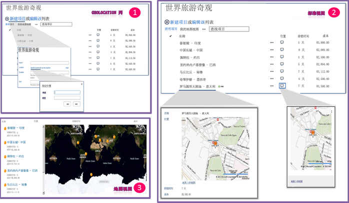

# 集成 SharePoint 2013 中的位置和映射功能
通过使用新的"地理位置"字段或基于"地址位置"创建您自己的基于"地理位置"的字段类型，了解如何将 SharePoint 列表中的位置信息和地图、基于位置的 Web 和 SharePoint 移动应用程序集成在一起。
## SharePoint 2013 中有哪些位置和地图功能？

SharePoint 2013 引入了一个名为"地理位置"的新字段类型，使您能够为用位置信息注释 SharePoint 列表。在"地理位置"类型的列中，您可以以十进制值的经度和纬度形式输入位置信息；如果浏览器实现 W3C Geolocation API，您还可以从浏览器检索用户所在位置的坐标。在列表中，SharePoint 2013 在由 Bing Maps 提供技术支持的地图上显示位置。此外，一个名为"地图视图"的视图在 Bing Maps Ajax control V7 上将列表项显示为图钉，且左窗格中将列表项显示为卡片。图 1 简要显示了 SharePoint 2013 中的默认定位和地图功能。同时，"地理位置"字段和"地图视图"使您能够通过将 SharePoint 中的数据集成到地图体验中提供任何信息的空间背景，并能让您的用户以新的方式参与到您的 Web、移动应用程序和解决方案中。
  
    
    

> **注释**
> 要查看列表中的"地理位置"字段值或数据，必须为每个 SharePoint 前端 Web 服务器上安装一个名为 SQLSysClrTypes.msi 的 MSI 软件包。此软件包安装各种组件以实现 SQL Server 2008 中新的几何、地理、层次 ID 类型。默认情况下，为 SharePoint Online 安装了该文件。但它不适用于 SharePoint Server 2013 的本地部署。只有在您是服务器场管理员群组的成员时，才能执行该操作。要下载 SQL server 2008 的 SQLSysClrTypes.msi，请参阅 Microsoft 下载中心提供的针对 SQL Server 2008 的  [Microsoft SQL Server 2008 R2 SP1 功能包](http://www.microsoft.com/zh-cn/download/details.aspx?id=26728)或针对 SQL Server 2012 的  [Microsoft? SQL Server? 2012 功能包](http://www.microsoft.com/zh-cn/download/details.aspx?id=29065)。 
  
    
    

**图 1. 默认位置和地图功能的摘要视图**

  
    
    

  
    
    

  
    
    

  
    
    

  
    
    

## 您可以用位置和地图功能做什么？

SharePoint 2013 中的位置和地图功能为开发人员提供了独特的机会，使其能将位置、地图和邻近搜索功能纳入其 Web、移动应用程序和解决方案中。表 1 包含一些基本任务，用以帮助您将位置和地图功能集成到应用程序和解决方案中。
  
    
    

**表 1. 集成位置和地图功能的基本任务**

|**任务**|**说明**|
|:-----|:-----|
| [如何：在 SharePoint 2013 中设置 Web 和服务器场级别的必应 Bing 地图密钥](how-to-set-the-bing-maps-key-at-the-web-and-farm-level-in-sharepoint-2013.md)   |SharePoint 2013 使用 Bings Maps 来呈现位置的地图。若要使用 Bing Maps 功能，您需要创建一个 Bings Maps 密钥，并在 Web 或场级别设置该密钥。本文显示在 SharePoint 2013 中设置密钥的各种方法以及如何选择它们。如果您没有使用 Bing Maps 密钥，或者该密钥没有在包含列表的 Web 上或场级别上设置，您将看到有关地图的错误信息。    |
| [如何：在 SharePoint 2013 中以编程方式向列表添加 Geolocation 列](how-to-add-a-geolocation-column-to-a-list-programmatically-in-sharepoint-2013.md)   |默认情况下，用户不能使用 SharePoint 列表上的"地理位置"列。要将该列添加到 SharePoint 列表，您需要编写代码。在本主题中，您将了解如何以编程方式将"地理位置"字段添加到一个列表中。    |
| [如何：使用客户端呈现扩展地理位置字段类型](how-to-extend-the-geolocation-field-type-using-client-side-rendering.md)   |您可以通过创建从"地理位置"字段派生的自定义字段类型，将自己的呈现提供给默认用户界面 (UI)、逻辑和"地理位置"字段行为。SharePoint 2013 通过以下方法简化了自定义字段类型的创建：在"地理位置"字段类中提供一个新的 JSLink 属性，它指向用于呈现该字段的自定义 .js 文件，从而使您能够运行 JavaScript。      **注释**  调查列表或事件列表不支持 JSLink 属性。SharePoint 日历是事件列表。           |
   

## 其他资源

-  [如何：在 SharePoint 2013 中以编程方式向列表添加 Geolocation 列](how-to-add-a-geolocation-column-to-a-list-programmatically-in-sharepoint-2013.md)
    
  
-  [如何：在 SharePoint 2013 中设置 Web 和服务器场级别的必应 Bing 地图密钥](how-to-set-the-bing-maps-key-at-the-web-and-farm-level-in-sharepoint-2013.md)
    
  
-  [如何：使用客户端呈现扩展地理位置字段类型](how-to-extend-the-geolocation-field-type-using-client-side-rendering.md)
    
  
-  [如何：将地图与 Windows Phone 应用程序和 SharePoint 2013 列表集成](how-to-integrate-maps-with-windows-phone-apps-and-sharepoint-2013-lists.md)
    
  
-  [在移动应用程序中使用 SharePoint 2013 位置字段类型](http://technet.microsoft.com/zh-cn/library/fp161355%28office.15%29.aspx)（http://technet.microsoft.com/zh-cn/library/fp161355(office.15).aspx）
    
  
