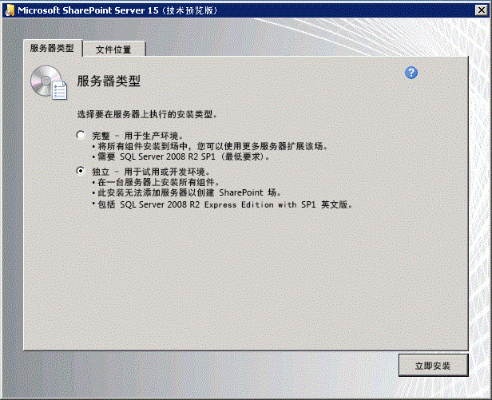

# 设置 SharePoint 2013 的常规开发环境
了解通过安装 SharePoint 和 Visual Studio 设置 SharePoint 开发环境的步骤。
## 如何确定所需的 SharePoint 开发环境
<a name="SP15_bk_determinedevenv"> </a>

首先，决定要构建的内容（若要了解有关 SharePoint 外接程序的更多信息，请参阅  [SharePoint 外接程序](http://msdn.microsoft.com/library/cd1eda9e-8e54-4223-93a9-a6ea0d18df70%28Office.15%29.aspx)）：
  
    
    

- 若要构建 服务器场解决方案，您可以使用我们在本文中提供的步骤。
    
  
- 若要创建 SharePoint 外接程序，请参阅 [SharePoint 外接程序开发工具和环境](http://msdn.microsoft.com/library/6906eb86-8270-4098-8106-1e8d0d3c212e%28Office.15%29.aspx)。
    
  

## 在 Microsoft Azure 虚拟机中构建 SharePoint 开发环境
<a name="SP15_bk_devenvazure"> </a>

如果您拥有 MSDN 订阅，则可以快速预配 Azure 中的虚拟机。
  
    
    
如果您还没有获得 MSDN 订阅为您带来的 Microsoft Azure 权益，可以在 [面向 MSDN 订阅者的 Microsoft Azure 权益](http://azure.microsoft.com/zh-cn/pricing/member-offers/msdn-benefits/)中了解详细信息。
  
    
    

> **注释**
> Microsoft Azure 图像库不再通过预装的 SharePoint 和 Visual Studio 提供图像。但 Microsoft Azure 虚拟机仍然是开发计算机的一个不错的选择。 > 登录到  [Microsoft Azure 管理门户](https://manage.windowsazure.com)。 > 使用针对 Windows Server 2008 R2 Service Pack 1 x64、Windows Server 2012（或更高版本）的库中的图像之一创建 VM。按照虚拟机创建向导提供的说明操作。我们推荐 SharePoint 开发使用 **X-Large** 的 VM 大小。> 预配并运行计算机后，通过以下 **创建 SharePoint 本地开发环境** 部分中的相同过程完成设置。（跳过与安装操作系统相关的部分。）> 设置了开发环境后，就可以使用 Azure 点到站点连接从虚拟机上的 Visual Studio 访问源控件，有关如何执行此操作的说明，请参阅 [配置到 Azure 虚拟网络的点到站点 VPN 连接](https://azure.microsoft.com/zh-cn/documentation/articles/vpn-gateway-point-to-site-create/)。 
  
    
    


## 创建 SharePoint 本地开发环境
<a name="SP15_bk_devenvazure"> </a>


  
    
    

### 为 SharePoint 外接程序开发环境安装操作系统
<a name="SP15_bk_InstallOS"> </a>

与生产环境的要求相比，SharePoint 安装的开发环境的要求略为宽松且成本更低。在任何开发环境中，所使用的计算机都应具有支持 x64 功能的 CPU，以及至少 16 GB 的 RAM 用于安装和运行 SharePoint；最好是 24 GB RAM。根据您的特定要求和预算，可以选择下列选项之一：
  
    
    

- 在 Windows Server 2008 R2 Service Pack 1 x64 或 Windows Server 2012（或更高版本）上安装 SharePoint。
    
  
- 在运行 Windows Server 2008 R2Service Pack 1 x64 或 Windows Server 2012 来宾操作系统的虚拟机上，使用 Microsoft Hyper-V 并安装 SharePoint。有关为 SharePoint 设置 Microsoft Hyper-V 虚拟机的指导，请参阅 [将最佳实践配置用于 SharePoint 2013 虚拟机和 Hyper-V 环境](http://technet.microsoft.com/zh-cn/library/ff621103%28v=office.15%29.aspx)。
    
  

### 为操作系统和 SharePoint 2013 安装应用程序开发必备组件
<a name="SP15_bk_prereqsOS"> </a>

SharePoint 要求您的操作系统在安装开始之前已安装某些必备组件。为此，SharePoint 包含了一个 PrerequisiteInstaller.exe 工具，此工具将为您安装所有必备组件。在运行 Setup.exe 工具之前，请先运行此工具。
  
    
    

1. 运行 PrerequisiteInstaller.exe 工具。
    
  
2. 运行安装文件附带的 Setup.exe 工具。
    
  
3. 接受 Microsoft 软件许可条款。
    
  
4. 在"选择所需的安装"页上，选择"独立"。
    
   **图 2. 安装类型选择**

  


  

  

  
5. 如果在安装中出现任何错误，请查看日志文件。若要查找日志文件，请打开命令提示符窗口并在命令提示符处键入以下命令。此外，在安装完成时，将显示指向日志文件的链接。
    
  ```
  
cd %temp
dir /od *.log
  ```

6. 安装完成后，系统将提示您启动 SharePoint 产品和技术配置向导。
    
    > **注释**
      > 如果您使用加入域但未连接到域控制器的计算机，则 SharePoint 产品和技术配置向导会失败。如果出现此错误，请直接或通过虚拟专用网络 (VPN) 连接来连接到域控制器，或者使用在计算机上拥有管理特权的本地帐户登录。 
7. 完成配置向导后，您会看到新 SharePoint 网站的"模板选择"页面。
    
   **图 3. 选择网站模板页**

  


  

  

  

### 安装 Visual Studio
<a name="SP15_bk_installVS"> </a>

安装 Visual Studio 后，您将获得用于在本地开发计算机上开发 SharePoint 的所有模板、工具和程序集。
  
    
    
请参阅 [安装 Visual Studio](http://msdn.microsoft.com/zh-cn/library/e2h7fzkw.aspx) 了解有关安装 Visual Studio 的说明。
  
    
    

#### Visual Studio 中的详细日志记录

如果想要启用详细日志记录，请执行以下步骤：
  
    
    

1. 打开注册表，导航到 **HKEY_CURRENT_USER\\Software\\Microsoft\\VisualStudio\\ _nn.n_\\SharePointTools** ，其中 _nn.n_ 是 Visual Studio 版本，如 12.0 或 14.0。
    
  
2. 添加名为 EnableDiagnostics 的 DWORD 项。
    
  
3. 为此项提供值 1。
    
  
在 Visual Studio 的将来版本中，注册表路径将会更改。
  
    
    

## 后续步骤
<a name="SP15_bk_devenvazure"> </a>

如果您要创建工作流，请继续执行 [设置和配置 SharePoint 2013 工作流管理器](set-up-and-configure-sharepoint-2013-workflow-manager.md)步骤。
  
    
    

## 其他资源
<a name="SP15_bk_AddlResources"> </a>


-  [安装 Visual Studio](http://msdn.microsoft.com/zh-cn/library/e2h7fzkw.aspx)
    
  
-  [SharePoint 外接程序开发工具和环境](http://msdn.microsoft.com/library/6906eb86-8270-4098-8106-1e8d0d3c212e%28Office.15%29.aspx)
    
  

  
    
    

