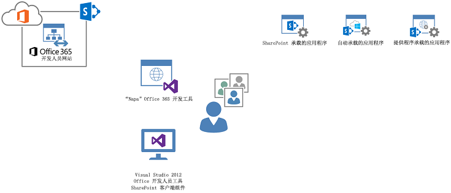
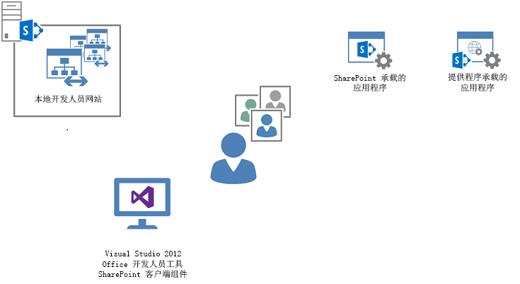
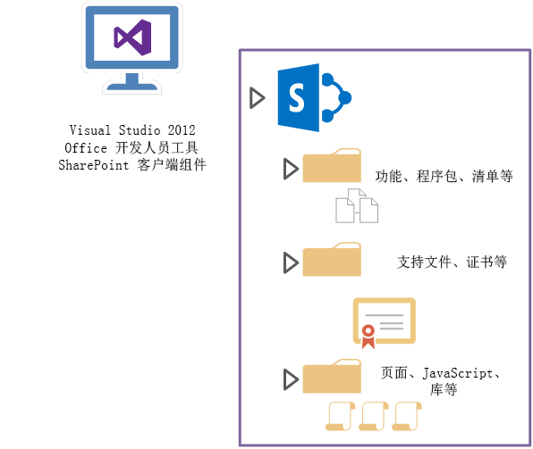
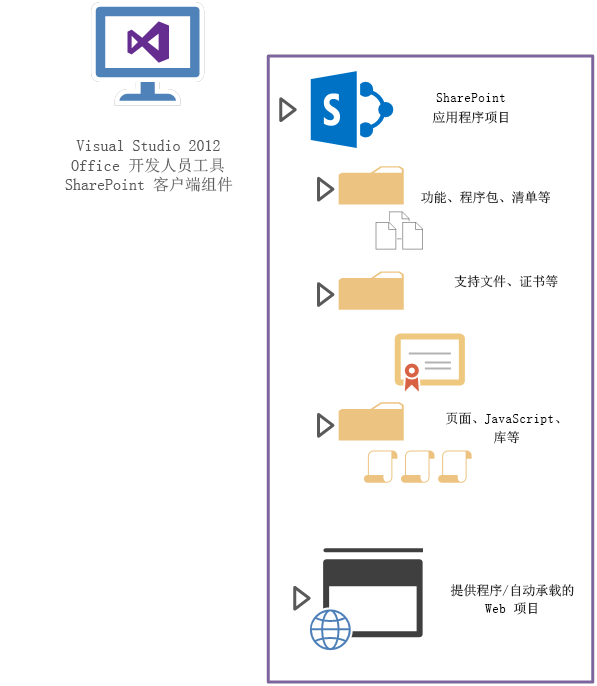
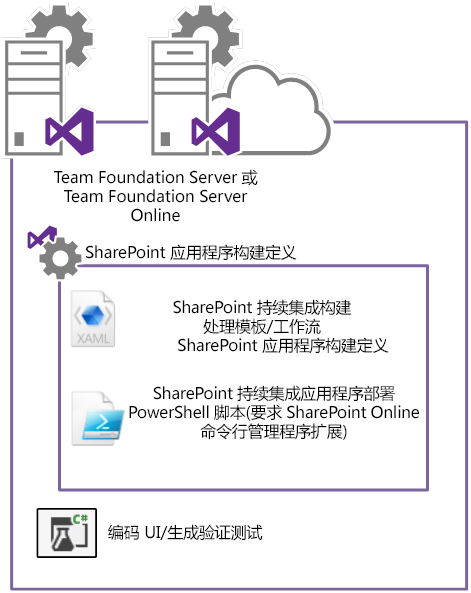
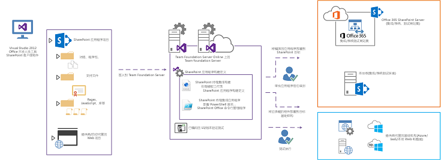
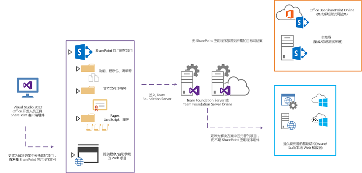
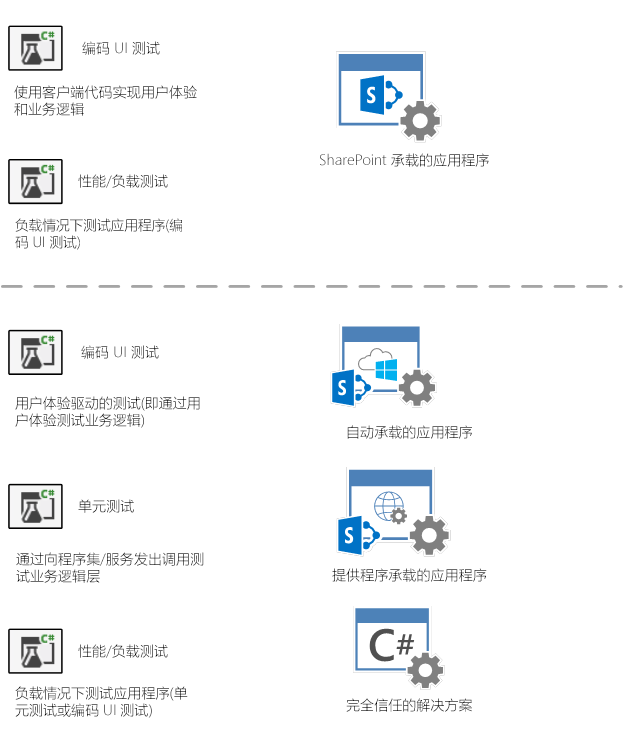
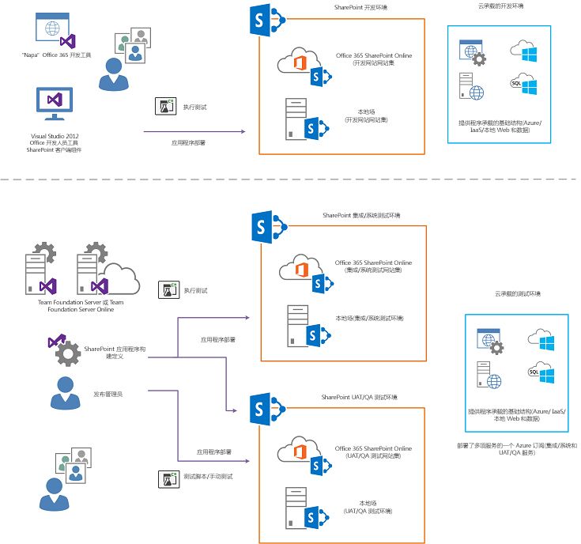

# SharePoint Server 2013 应用程序生命周期管理
将常规应用程序生命周期管理 (ALM) 概念和做法应用于使用 SharePoint Server 2013 技术进行应用程序开发的过程。
 * **提供者：*** Eric Charran，Microsoft Corporation
  
    
    

 * **参与者：*** Vesa Juvonen，Microsoft Corporation | Steve Peschka，Microsoft Corporation

  
    
    

> **重要信息**
> 本主题针对自动托管的 SharePoint 外接程序。自动托管的应用程序的预览计划已终止。请忽略对自动托管的 SharePoint 外接程序的所有引用。 
  
    
    

## 应用程序生命周期管理 (ALM) 概述

Microsoft SharePoint Server 2013 为开发人员提供了多种创建和部署基于 SharePoint 技术的应用程序的选项，包括本地以及托管的云平台或公有云平台中。SharePoint Server 2013 提供更高的应用程序形式灵活性，以及在应用程序中使用标准技术的新选项。尽管 SharePoint 中的新应用程序模型提供的这些应用程序功能和部署选项为开发人员提供了创建新的沉浸式应用程序的方式，开发人员必须能够将质量、测试和 ALM 考虑事项融入开发过程。本文将常规 ALM 概念和做法应用于使用 SharePoint Server 2013 技术进行应用程序开发的过程。
  
    
    

### 新增功能

SharePoint Server 2013 建立了一种实施应用程序的新范例。因为使用 SharePoint 技术的应用程序开发过程的这一转变，开发人员和架构师应该对 SharePoint Server 2013 的新应用程序开发模式、做法和部署模型有一个彻底的了解。需要注意的是，使用 SharePoint 开发解决方案的应用程序模型已经改变，但用于解决方案开发的很多模式（包括技术选择、实施技术等）仍与现有 Web 应用程序开发技术相符。
  
    
    
下列资源概述了使用 SharePoint Server 2013 技术可以构建的应用程序类型，其中包含对于本地和云应用程序的考虑事项。要了解 SharePoint 外接程序的托管选项，请参阅 [为开发和托管 SharePoint 外接程序选择模式](http://msdn.microsoft.com/library/05ce5435-0a03-4ddc-976b-c33b08d03457%28Office.15%29.aspx)。
  
    
    
此外，Microsoft 建议客户在使用 SharePoint Server 2013 开发应用程序时评估所采用的技术，因为解决方案实施的选择更广。创建应用程序时，客户可以专注于利用标准技术（如 HTML5 和 JavaScript）来构建表示层和用户体验层，OData 和 OAuth 则可用于基于服务的后端服务访问（包括 SharePoint）。客户应慎重考虑是否需要完全信任模式（即部署到 SharePoint 的已编译程序集）。尽管继续使用该开发模式在某些情况仍然有效且必要，但对 ALM 过程不会增加太多开销。
  
    
    
有关 SharePoint Server 2013 应用程序的全新灵活开发技术的详细信息，请参阅  [SharePoint 2013 开发概述](sharepoint-2013-development-overview.md)。
  
    
    

### 好处和变化

SharePoint 支持的应用程序开发技术现在提供更为灵活的语言和编程体系结构分类，因此开发人员需要围绕主流开发技术调整现有的 ALM 做法，这样才能适应 SharePoint 的开发环境。测试、内部版本构建、部署和质量控制等概念可以进行扩展，将 SharePoint 部署作为 SharePoint 应用程序。这意味着尽管很多开发人员习惯于编写和部署可扩展 SharePoint 核心功能的服务器端场解决方案，SharePoint Server 2013 应用程序引进的全新灵活开发模型的常规 ALM 做法必须应用于实施过程。
  
    
    
随着客户继续向云托管的 SharePoint Server 2013 实施迁移，开发人员需要了解如何扩展 ALM 概念，以涵盖组织物理边界外的开发、测试以及部署目标环境。这包括评估进行应用程序开发、测试和部署的技术战略。
  
    
    
开发人员和架构师等可能变得非常精通于集成包含多个应用程序组件（跨越或组合了不同类型的托管选项）的解决方案。在这个适应过程中，ALM 程序应单方面应用于这些应用程序。例如，开发人员可能需要部署一个跨内部服务部署（即 IIS、ASP.NET、MVC、WebAPI 和 WCF）、Microsoft Azure、SharePoint Server 2013 和 SQL Azure 的应用程序，同时还应能够测试应用程序组件的质量或确定自上一内部版本以来是否出现了任何回归问题。这些要求意味着开发人员和团队对考虑每日构建和部署过程（本地或服务器端解决方案的众所周知的程序）的方式有了重大改变。
  
    
    

### 开发团队考虑事项

对于具有多位应用程序开发人员或架构师的组织，应认真规划 SharePoint Server 2013 的团队开发，以提供最高质量的应用程序并保证开发人员的充分生产力。由于进行应用程序开发的方法增加了灵活性，因此整个团队需要清楚并确信不仅仅是 ALM 做法和模式，每个开发人员编写代码和确保高质量代码的方式，也成为了应用程序构建过程的一部分。
  
    
    
这些考虑事项首先包括选择合适的开发环境。从传统来看，开发已经降级为在连接到提供构建、部署和测试功能的常规代码库（如 Visual Studio TFS 2012）的虚拟机中执行单独开发。TFS 仍是 ALM 战略的一个重要组成部分，并且是开发工作的核心所在，但团队需要考虑的是，如何在不同类型的开发环境选项中利用 TFS。
  
    
    
现在，根据目标环境和解决方案类型（即哪些组件将位于本地，哪些组件将托管在云基础结构或服务中），开发人员可以从多种新的开发环境选项中进行选择。这些选项包括新的 SharePoint 开发人员网站模板、Office 365 开发人员租户以及一些旧选择，例如在 Windows 8 或 Windows Server 2012 中使用 Hyper-V 进行基于虚拟机的开发。
  
    
    
下一节介绍了应用程序开发人员和开发团队的开发环境考虑事项。
  
    
    

## 开发环境考虑事项

选择开发环境应考虑多个因素。这些考虑事项主要受开发的应用程序类型以及应用程序的目标平台影响。从传统来看，创建 SharePoint Server 2010 应用程序时，开发人员应设置虚拟机并执行单独执行开发。这是因为部署完全信任解决方案可能需要重新启动核心 SharePoint 依赖项（如 IIS），这可能会使多位开发人员无法使用单个 SharePoint 环境。开发技术已经改变，开发人员创建应用程序的选项也已增加，因此开发人员和团队应了解可用的开发选项。图 1 显示了开发环境和工具组合，包括可部署到目标环境的解决方案类型。
  
    
    

**图 1. 开发环境组件和工具**

  
    
    
 [
  
    
    
](http://go.microsoft.com/fwlink/?LinkId=391723) [单击此处查看大图。](http://go.microsoft.com/fwlink/?LinkId=391723)
  
    
    

### 开发环境理念

在考虑如何使用 SharePoint Server 2013 设计和实施应用程序时，开发人员应确定是否需要使用服务器端代码进行开发。在开发人员创建使用云托管的模型的应用程序时，执行依赖于虚拟化环境的开发的要求将降低，尤其是对于 SharePoint。开发人员应通过使用基于云（公有云和私有云）的现有基础结构，努力构建解决方案。如果不必创建和安排虚拟化，即可快速、轻松地设置开发环境，开发人员即可将更多的时间放在开发效率和质量上，而不是基础结构管理上。
  
    
    
决定是否需要 SharePoint Server 2013 虚拟化实例与新的 SharePoint 开发站点模板，将取决于应用程序是否需要将完全信任代码部署到 SharePoint 并在其中运行。如果不需要完全信任代码，我们建议使用开发人员网站模板，您可以在 Office 365 开发租户或组织的本地 SharePoint 实施中找到此模板。开发人员网站模板设计供开发人员将应用程序从 Visual Studio 直接部署到 SharePoint。Office 365 开发人员网站针对应用程序隔离和 OAuth 进行了预先配置，因此开发人员可以立即开始编写和测试应用程序。
  
    
    
以下各节详细说明了开发人员何时可以使用不同的环境选项来构建应用程序。
  
    
    

### O365 开发站点（公有云）

图 2 说明了开发人员如何使用 Office 365 作为开发环境，并且包括用于构建可以托管在 Office 365中的 SharePoint 应用程序的工具类型。
  
    
    

**图 2. Office 365 应用程序开发**

  
    
    
 [
  
    
    
](http://go.microsoft.com/fwlink/?LinkId=391724) [单击此处查看大图。](http://go.microsoft.com/fwlink/?LinkId=391724)
  
    
    
具有 MSDN 订阅的开发人员可以获取包含 SharePoint开发人员网站的开发租户。SharePoint开发人员网站已针对应用程序开发进行预先配置。用户不仅可将 Visual Studio 2008 用于应用程序开发，还可用于 Office 365 开发人员网站，Napa可用于网站中以构建应用程序。有关如何开始使用 Office 365 开发人员网站的详细信息，请参阅 [在 Office 365 上设置 SharePoint 加载项的开发环境](http://msdn.microsoft.com/library/b22ce52a-ae9e-4831-9b68-c9210af6dc54%28Office.15%29.aspx)。
  
    
    
开发人员可以开始创建将托管在 Office 365、本地或提供程序托管的模型中其他基础结构中的应用程序。此环境的好处是 SharePoint 开发环境的基础结构、虚拟化和其他托管考虑事项均由 Office 365 抽象出来，因此开发人员可以立即创建应用程序。此类开发环境的一个主要考虑事项是，需要将完全信任代码部署到 SharePoint 的应用程序无法安置。Microsoft 建议尽量使用 SharePoint 客户端对象模型 (CSOM) 和客户端技术（如 JavaScript）。如果需要完全信任代码（但不需要部署代码以在 SharePoint 上运行），我们建议在自动托管或提供程序托管的模型中部署服务器端代码。请注意，部署到提供程序托管的基础结构的这些完全信任代码解决方案也使用 CSOM，但可以使用 C# 等语言。还需注意的是，部署在提供程序托管的模型中的这些应用程序可以使用其他技术堆栈，且仍使用 CSOM 与 SharePoint Server 2013 进行交互。
  
    
    
创建包含较大解决方案的单独功能或应用程序的开发团队将需要针对集成测试组件的集中部署目标。因为每位开发人员在自己的 Office 365 开发人员网站上创建功能或应用程序，因此应设置目标租户或本地环境中的集中网站集，以便可在其中部署每位开发人员的应用程序组件。这种方法可以有一个集中位置来执行解决方案组件之间的集成测试。 [本文档的测试部分](#Testing)更详细地说明了这一过程。
  
    
    

#### NapaOffice 365 开发工具

Napa可供开发人员使用，以简化 Office 365 开发人员网站中的应用程序创建。Napa工具旨在让开发人员或精通客户端技术的高级用户可以在原型概念证明或快速业务解决方案场景中快速开发和部署应用程序。这些工具提供在 SharePoint 上开发应用程序功能的方式。但是，在应用程序的生命周期内，有时可能应将应用程序导入到 Visual Studio。下面概述了这些条件：
  
    
    

- 当多位开发人员必须参与或开发解决方案的一部分时
    
  
- 当应用程序达到需要应用生命周期管理做法的用户所需的相关性级别时
    
  
- 当应用程序的功能要求随时间变为需要补充解决方案组件（如已编译服务或数据源）时
    
  
- 当应用程序需要与其他应用程序或解决方案组件集成时
    
  
- 当开发人员必须使用质量控制措施时，如自动生成和测试
    
  
出现这些情况或其他类似情况时，开发人员必须将解决方案导出到 TFS 等源控制环境，并将 ALM 设计考虑事项和程序应用于应用程序的未来开发。
  
    
    

### 开发站点（远程开发）

对于选择不将 Office 365 开发人员站点作为 SharePoint 应用程序开发的主要方式的组织或开发人员来说，本地开发人员站点可用于开发 SharePoint 应用程序。在此模型中，Office 365 开发人员站点的功能被托管在 SharePoint 服务器场内的本地开发人员站点所取代。客户可以通过部署一个 SharePoint 服务器场来托管开发人员站点实例，从而创建开发私有云。客户可以提供自己的管理自动化，从而提供开发人员站点模板创建或使用 SharePoint 产品内功能来设置开发人员站点实例。图 3 显示了此步骤。
  
    
    

**图 3. 使用开发人员站点模板的本地应用程序开发**

  
    
    
 [
  
    
    
](http://go.microsoft.com/fwlink/?LinkId=391725) [单击此处查看大图。](http://go.microsoft.com/fwlink/?LinkId=391725)
  
    
    
图 3 介绍了将某个本地 SharePoint 服务器场作为主机时，开发人员站点提供的开发工具和应用程序类型。请注意，在此环境中不能使用NapaOffice 365，因为此功能仅存在于 Office 365 开发站点中。
  
    
    
托管开发人员网站实例的 SharePoint 服务器场必须进行监控，并满足服务、恢复点和级别目标，确保依赖于这些目标创建应用程序的开发人员可以高效工作，且不会出现中断。客户可以将弹性与刻度单位和管理功能组件等私有云概念应用于此环境。运营和管理可能必须应用于还托管开发人员站点的 SharePoint 服务器场。这将有助于控制多个已过时或未使用的开发人员站点的未监控扩张，并提供了一种了解何时扩展环境的方式。
  
    
    
客户可能决定使用基础结构即服务 (IaaS) 功能（如 Microsoft Azure）来托管包含并托管开发人员站点或者其自己的本地虚拟或物理环境的 SharePoint 服务器场。请注意，使用此模型不需要为每个开发人员安装 SharePoint。远程应用程序开发仅需要开发人员工作站上的 Visual Studio 及 Office 和 SharePoint 2013 开发工具。
  
    
    
开发人员必须建立提供程序托管的基础结构，以部署提供程序托管的应用程序。尽管 SharePoint 应用程序的提供程序托管的组件可以通过多种技术实施，开发人员必须提供一个基础结构，用于托管在 SharePoint 之外运行的应用程序的组件。例如，如果团队正在开发一个用户体验组件和其他组件均位于 ASP.NET 应用程序内的 SharePoint 应用程序，开发团队必须使用本地版本的 IIS、SQL Server 等来参与 ASP.NET 的传统 ALM 团队开发模式。
  
    
    

### 自包含服务器场环境（虚拟化服务器场开发）

对于需要部署完全信任代码以便在 SharePoint 服务器场上运行的解决方案，需要完全（通常已虚拟化）实施 SharePoint Server 2013。有关如何为 SharePoint 创建本地开发环境的指导，请参阅 [设置 SharePoint 加载项的本地开发环境](http://msdn.microsoft.com/library/b0878c12-27c9-4eea-ae3b-7e79e5a8838d%28Office.15%29.aspx)。
  
    
    
图 4 显示了使用本地虚拟化环境可以创建的应用程序类型。
  
    
    

**图 4. 虚拟环境中的本地开发**

  
    
    
 [
  
    
    
](http://go.microsoft.com/fwlink/?LinkId=391726) [单击此处查看大图。](http://go.microsoft.com/fwlink/?LinkId=391726)
  
    
    
开发人员可以在自己的 SharePoint 服务器场内执行 SharePoint 和云托管的应用程序的远程开发，以及完全信任服务器场解决方案。这些服务器场通常托管在虚拟化服务器内，这些服务器在开发人员工作站上或在开发人员可轻松访问的集中式虚拟化私有云中运行。SharePoint 服务器场环境通常与其他开发人员的服务器场分开，并且提供了当开发需要重新启动关键服务（即 IIS）的完全信任代码时所需的隔离级别。
  
    
    
远程开发以及完全信任代码开发可以在自包含服务器场内执行，因为各个开发服务器场已经隔离，且仅供一位开发人员使用。
  
    
    
组织或开发人员必须管理和更新在虚拟计算机内运行的 SharePoint 服务器场。对于参与某个应用程序的开发人员来说，必须保持在虚拟计算机内运行的开发服务器场之间的对等。这种做法可以确保为应用程序开发的每个代码组件的一致性。其他常规考虑事项包括服务器场的标准配置及其他环境配置元素，前者包括域访问和凭据、服务应用程序凭据、测试标识或帐户，后者包括证书。
  
    
    
与开发站点的集中式服务器场类似，运行开发人员 SharePoint 服务器场的这些虚拟机可以托管在 Microsoft Azure 等 IaaS 平台以及本地私有云产品中。
  
    
    
请注意，尽管虚拟机提供与其他开发人员虚拟机的较大隔离和独立级别，团队应努力实现虚拟机配置之间的一致性。这包括常规域、帐户与安全、SharePoint 配置以及与源控制存储库（例如 Visual Studio Team Foundation Server (TFS)）的连接。
  
    
    

## ALM 设计考虑事项

构建 SharePoint 应用程序时，必须解决若干考虑事项以提供管理和常规开发做法，从而确保一致性和质量。将 ALM 原则应用到 SharePoint 应用程序开发时，开发人员必须专注于技术考虑事项以及流程驱动的考虑事项。
  
    
    
支持 Visual Studio Team Foundation Server 2012 等 ALM 平台是进行应用程序开发的要求之一，尤其对于开发人员共同处理同一组项目的团队而言。与其他技术解决方案一样，SharePoint 应用程序需要代码存储库管理和版本控制、构建服务、测试服务和版本管理做法。下面一节说明了应用于 SharePoint 应用程序不同模型的 ALM 考虑事项。
  
    
    

### 概述

对于每种类型的 SharePoint 应用程序，必须应用 ALM 考虑事项，概念没有变化。但是，必须调整关于构建、测试和变更管理的做法与程序。
  
    
    
某些 SharePoint 应用程序将使用客户端技术。大部分具有 SharePoint Server 2010 应用程序开发经验的开发人员都必须进行调整，以制定 ALM 原则并将其应用于非编译代码。这一调整包括将"构建"等概念应用到可能不包含已编译代码的解决方案。Visual Studio 2008 等 ALM 平台具有验证内部版本的内置功能，方法是首先编译代码，然后对内部版本运行生成验证测试 (BVT)。
  
    
    
对于 SharePoint 应用程序，与构建和测试相关的过程仍与传统应用程序开发过程一致。这包括创建 ALM 平台规划的内部版本，这将编译解决方案并将其部署到目标环境。
  
    
    

### 构建过程

ALM 平台加速了 SharePoint 应用程序构建过程 。Visual Studio Team Foundation Server 2012 提供构建和测试服务，可以在从 Visual Studio 2008（持续集成）签入解决方案时或按指定的计划间隔触发。
  
    
    

#### SharePoint 构建组件

规划 SharePoint 应用程序开发的构建过程时，开发人员必须考虑组件之间的交互，如图 5 中所示。
  
    
    

**图 5. SharePoint 托管的应用程序构建组件**

  
    
    

  
    
    

  
    
    
图 5 中的图例是 SharePoint 应用程序的逻辑表示。此图例显示了 SharePoint 承载的外接程序 并突显了作为 Visual Studio 2008SharePoint 承载的外接程序项目一部分的关键应用程序对象。SharePoint 应用程序项目包含将通过 SharePoint 注册的功能、软件包和清单。项目还包含构成 SharePoint 应用程序的页面、脚本库以及用户体验的其他元素。此外，SharePoint 项目还具有支持文件，其中包含用于部署到目标 SharePoint 环境的必要证书。
  
    
    

**图 6. 提供程序托管和自动托管的应用程序构建组件**

  
    
    

  
    
    

  
    
    
图 6 显示了云托管的 SharePoint 应用程序（即自动托管或提供程序托管）。项目结构的主要区别在于除包含云托管的应用程序组件的一个或多个项目外，Visual Studio 2008 解决方案还包含一个 SharePoint 应用程序项目。这些项目可能包括 Web 应用程序、SQL 数据库项目，或者将部署到 Azure 或本地提供程序托管的基础结构（如 ASP.NET）的服务应用程序，以及其他解决方案组件。有关打包和部署高信任应用程序的指南，请参阅 [打包和发布高度可信的 SharePoint 外接程序](http://msdn.microsoft.com/library/3c28aed8-c037-407c-9154-39a74073e170%28Office.15%29.aspx)。
  
    
    

**图 7. Visual Studio Team Foundation Server 的 ALM**

  
    
    

  
    
    

  
    
    
图 7 显示了作为 ALM 平台的 TFS。团队将使用 TFS 存储代码，并使用本地 TFS 或基于云的 Microsoft TFS 服务进行团队开发。TFS 可以配置为通过构建定义来执行 SharePoint 应用程序的构建和部署活动。TFS 还可用于执行生成验证测试 (BVT)，该测试可能已通过执行作为构建定义的一部分的编码 UI 测试实现自动化。
  
    
    

**图 8. TFS 构建目标**

  
    
    

  
    
    

  
    
    
图 8 显示了 TFS 构建定义执行的脚本将部署 SharePoint 应用程序组件的目标环境。对于 SharePoint 托管的应用程序，这包括部署到 SharePoint Online 或本地 SharePoint 应用程序目录。
  
    
    
对于云托管的 SharePoint 应用程序，若解决方案的组件需要位于 SharePoint 外部的其他基础结构，这些组件将部署到目标环境中。对于自动托管的应用程序，这是指 Microsoft Azure。对于提供程序托管的应用程序，此基础结构可以为 Microsoft Azure 或其他本地或 IaaS 托管的环境。
  
    
    

#### 为 SharePoint 应用程序创建一个内部版本

TFS 提供构建服务，可以编译已签入源控制的解决方案并将输出放在一个集中放置位置，以便自动部署到目标环境。将 TFS 配置为执行 SharePoint 应用程序自动构建、部署和测试的主要方法是，在 Visual Studio 中创建构建定义。构建定义包含关于要编译的代码项目的信息，以及任何编译后活动，如测试和实际部署到目标环境。有关 Team Foundation 生成服务的详细信息，请参阅 [安装 Team Foundation Build Service](http://msdn.microsoft.com/library/vstudio/ee259687)。
  
    
    
为实现持续集成，构建定义可以在开发人员签入代码时触发。此外，构建定义可以计划为按设定间隔执行。
  
    
    
对于 SharePoint 应用程序，开发人员应使用  [Office/SharePoint 2013 与 TFS 2012 持续集成](http://officesharepointci.codeplex.com/)构建定义项目来实现预定构建或持续集成。此项目提供构建定义、Windows PowerShell 脚本，以及关于如何配置 Visual Studio Online 或 TFS 本地版本的流程说明，以便在持续集成模型中构建和部署 SharePoint 应用程序。开发人员应下载此项目中的组件并相应地配置其 TFS 实例。有关如何使用为 SharePoint 应用程序提供的构建定义配置 TFS 的说明，以及如何将构建定义配置为使用 Windows PowerShell 脚本将 SharePoint 应用程序部署到目标环境的说明，请参阅  [Office/SharePoint 2013 与 TFS 2012 持续集成文档](http://officesharepointci.codeplex.com/documentation)。
  
    
    

#### 配置构建和部署过程

图 9 显示了创建和配置构建定义并将其部署到团队的 TFS 实例时 SharePoint 应用程序构建和部署的标准过程。
  
    
    

**图 9. TFS 的构建和部署过程**

  
    
    
 [
  
    
    
](http://go.microsoft.com/fwlink/?LinkId=391727) [单击此处查看大图。](http://go.microsoft.com/fwlink/?LinkId=391727)
  
    
    
开发人员签入 SharePoint 应用程序 Visual Studio 2008 解决方案。根据所需配置（即持续集成还是预定构建），TFS 构建服务将执行 SharePoint 应用程序构建定义所确定的步骤。该定义由开发人员配置，其中包含持续集成构建流程模板以及执行 Windows PowerShell 脚本以进行应用程序部署的构建后说明。请注意，需要 SharePoint Online Management Shell 扩展，以便将应用程序部署到 SharePoint Online。有关 SharePoint Online Management Shell 扩展的详细信息，请参阅下载中心上的  [SharePoint Online Management Shell 页](http://www.microsoft.com/zh-cn/download/details.aspx?id=35588)。
  
    
    
构建触发后，TFS 将编译与 SharePoint 应用程序相关的项目并执行 Windows PowerShell 脚本，以便将解决方案部署到目标 SharePoint 环境。
  
    
    

#### 信任 SharePoint 应用程序

将应用程序组件部署到目标环境之后，必须注意的是，在任何人访问应用程序之前，包括可能成为构建一部分的自动化测试，租户（或站点集）管理员必须信任 SharePoint 应用程序信息页上的应用程序。此要求适用于自动托管的应用程序以及 SharePoint 托管的应用程序。此手动过程表示构建过程发生变化，因为在应用程序被信任之前，通常在部署到目标环境之后运行的测试将必须暂停。
  
    
    
请注意，对于云托管（自动托管和提供程序托管）的应用程序，开发人员可以将非 SharePoint 组件与部署到 SharePoint 的应用程序包分开，部署到云托管的基础结构。
  
    
    

**图 10. 部署非 SharePoint 组件**

  
    
    
 [
  
    
    
](http://go.microsoft.com/fwlink/?LinkId=391728) [单击此处查看大图。](http://go.microsoft.com/fwlink/?LinkId=391728)
  
    
    
如图 10 中所示，当开发人员对表示 SharePoint 应用程序的解决方案做出更改时，可能会出现这种情况，对解决方案中的项目所做的更改不适用于 SharePoint 应用程序项目本身。在这种情况下，SharePoint 应用程序项目不需要重新部署，因为它没有变化。与云托管的项目相关的更改必须重新部署。
  
    
    
对将部署到 SharePoint 外部基础结构的应用程序的更改可以与部署到目标站点集或租户的应用程序组件分开进行。对于开发人员，这意味着可以创建自动化构建过程，在与 SharePoint 应用程序项目分开的前提下频繁（触发）部署云托管的组件。因此，不需要批准 SharePoint 中应用程序信息页面上的应用程序权限的手动步骤，这样可以实现构建定义更持续的部署和测试过程。仅当此项目中的项发生更改且需要重新部署时，才需部署解决方案的 SharePoint 应用程序组件。
  
    
    

### 测试

如 [构建流程部分](#ALMBuildProcess)中所述，应用程序测试是一种确定应用程序编译和部署成功与否的方法。通过使用测试来检验应用程序的构建和部署，团队将可以了解质量，以及最近对应用程序代码的更改是否了危及 SharePoint 应用程序。
  
    
    
图 11 显示了最适用于 SharePoint 应用程序模型的测试方法的类型。
  
    
    

**图 11. 测试方法**

  
    
    
 [
  
    
    
](http://go.microsoft.com/fwlink/?LinkId=391729) [单击此处查看大图。](http://go.microsoft.com/fwlink/?LinkId=391729)
  
    
    
图 11 建议使用不同类型的测试来按类型测试 SharePoint 应用程序。编码 UI 测试应针对 SharePoint 托管的应用程序执行，其中业务逻辑和用户体验位于同一层。业务逻辑可以抽象到 JavaScript 库，测试该逻辑的一种主要方法就是通过用户体验。
  
    
    
云托管的应用程序（即自动托管或提供程序托管）可以使用完全编码的 UI 测试，同时还可使用单元测试来验证解决方案的服务组件。因此从功能角度来看，开发人员可以对应用程序托管的基础结构实施质量充满信心。
  
    
    
下列各节介绍了编码 UI 测试以及与 SharePoint 应用程序相关的其他测试类型的考虑事项。
  
    
    

#### 客户端代码和编码 UI 测试

对于生成验证测试 (BVT) 以及全面的系统测试，建议采用编码 UI 测试。这些测试依赖于记录的操作，不仅可以测试应用程序的业务逻辑和中间层，还可以测试用户体验。对于使用客户端代码的 SharePoint 应用程序，业务逻辑的大部分入口点和执行都在用户体验层执行。因此，编码 UI 测试不仅可以测试用户体验，还可以测试应用程序的业务逻辑。有关编码 UI 测试的详细信息，请参阅 [使用 UI 自动化验证代码](http://msdn.microsoft.com/zh-cn/library/dd286726.aspx)。
  
    
    
编码 UI 测试可以用于大部分 UX 和业务逻辑相互混合的 SharePoint 承载的外接程序。这些测试与其他测试一样，可以从 TFS 中的构建定义运行，因此可以在部署之后验证应用程序的功能（且应用程序受 SharePoint 信任）。
  
    
    

#### 非编码 UI 测试

对于应用程序逻辑存在于应用程序 UX 层之外的情况，例如在云托管的应用程序中，应结合使用编码 UI 测试和非编码 UI 测试。传统单元测试等可用于验证在提供程序托管的基础结构上实施的服务逻辑的构建质量。因此，开发人员将对解决方案的提供程序托管的组件充满信心，这些组件运行正常且涵盖在测试中。
  
    
    

#### Web 性能测试和负载测试

通过执行 Web 性能测试和负载测试，开发人员可以确信应用程序在预期或预见的用户负载下仍可正常运行。该测试包括确定应用程序并发处理将随时间合理扩展的可预见用户群的功能。编码 UI 测试和单元测试可以作为 Web 性能测试和负载测试的源。使用 TFS 等 ALM 平台，这些测试即可用于对应用程序进行负载测试。
  
    
    
请注意，使用这些测试来测试 SharePoint 应用程序时，测试基础结构并非其主要目标。不论是 SharePoint 托管的基础结构还是提供程序托管的基础结构，都应制定相似的负载和性能基准。应用程序的 Web 性能和负载测试将着重于基础结构挑战，但应主要视为测试应用程序性能的一种手段。
  
    
    
有关 Web 性能测试和负载测试的详细信息，请参阅 [在发布之前对应用程序运行性能测试](http://msdn.microsoft.com/library/vstudio/dn250793)。
  
    
    

#### 质量和测试环境

很多组织都有多个测试环境，这些环境可能为物理环境，也可能为虚拟环境，且相互分开。根据团队的 ALM 过程和/或法规要求，这些环境可能有所不同。为了确定团队应使用的测试环境数量和类型，我们根据 SharePoint 应用程序的特定功能做法制定了以下指南，但主要还是使用 ALM 做法进行软件开发。
  
    
    

#### 开发人员测试

开发人员测试可以在开发人员创建解决方案组件的环境中进行。多位开发人员处理一个大型项目的不同方面或组件，每位开发人员均将单元测试、编码 UI 测试和应用程序代码部署到开发站点中。
  
    
    

**图 12. 开发人员测试过程**

  
    
    
 [
  
    
    
](http://go.microsoft.com/fwlink/?LinkId=391731) [单击此处查看大图。](http://go.microsoft.com/fwlink/?LinkId=391731)
  
    
    
针对部署在其自己的 Office 365 中或本地开发人员站点中的解决方案组件，开发人员将从 Visual Studio 执行测试。对于云托管的应用程序，还将针对位于提供程序托管结构中的解决方案组件从 Visual Studio 执行测试。这些组件将位于开发人员的 Microsoft Azure 订阅中。
  
    
    
请注意，此方法假定开发人员具有单独的 Office 365 开发人员站点和 Microsoft Azure 订阅（通过 MSDN 订阅提供）。即使开发人员正在为本地环境创建应用程序，这些开发人员服务也可用于开发和测试。
  
    
    
如果开发人员没有这些服务，或者需要完全在内部进行开发，他们将在本地服务器场的开发人员站点集和开发人员特定的提供程序托管的基础结构中为组件执行测试。提供程序托管的基础结构可能位于开发人员专用的虚拟机中。对于完全信任解决方案的开发，开发人员需要自己的虚拟 SharePoint 服务器场和提供程序托管的基础结构。
  
    
    

#### 集成和系统测试

为了测试应用程序，必须在集中式环境中组合并部署所有开发组件。在此集成环境中，开发人员可以部署他们创建的解决方案组件，并观察这些组件如何与其他开发人员编写的解决方案组件交互。
  
    
    

**图 13. 集成测试环境**

  
    
    
 [
  
    
    
](http://go.microsoft.com/fwlink/?LinkId=391732) [单击此处查看大图。](http://go.microsoft.com/fwlink/?LinkId=391732)
  
    
    
对于此类型的测试，ALM 平台将构建 SharePoint 应用程序和任何所需的组件，并将其部署到目标环境中。对于 SharePoint 托管的应用程序，这是指专为集成和系统测试而构建的 Office 365 站点或本地/IaaS SharePoint Server 2013 站点集。对于云托管的 SharePoint 应用程序，TFS 还会将组件部署到集中式 Microsoft Azure 订阅中，其中服务将专门针对集成/系统测试进行配置。然后 TFS 将针对 SharePoint 应用程序以及解决方案在托管的基础结构上所需的任何组件执行编码 UI 测试或单元测试。
  
    
    

#### UAT 和 QA 测试

对于用户验收测试 (UAT)，组织通常具有单独的环境，其中此功能将与集成和系统测试分开进行。通过隔离这些测试环境，可以防止持续发布和测试的节奏干扰 UAT 活动，用户可以在一段较长的时间内对应用程序的指定内部版本执行测试。
  
    
    

**图 14. UAT 测试**

  
    
    
 [
  
    
    
](http://go.microsoft.com/fwlink/?LinkId=391733) [单击此处查看大图。](http://go.microsoft.com/fwlink/?LinkId=391733)
  
    
    
如图 14 中所示，分配到进行验收测试或组织测试资源的用户在稳定的环境中执行测试脚本，此环境着重于众所周知的应用程序内部版本。代码部署和测试在集成环境中继续，用户将执行手动测试，以验证应用程序是否满足所需的使用或测试案例。通常由发布管理器将应用程序和任何提供程序托管的基础结构部署到此测试环境中。也可以进行自动化部署。此类部署使用 TFS 中的专用 UAT 构建定义，它反映了为集成和系统测试环境执行部署的测试。
  
    
    
对于云托管的基础结构，如果服务已命名且配置为作为不同服务或数据库并排部署，则可以部署到与集成和系统测试环境共享的 Microsoft Azure 订阅中。此方法在测试 Microsoft Azure 订阅中为集成和系统测试以及 UAT 和 QA 测试提供了一组服务和数据库，如图 15 中所示。
  
    
    

**图 15. 集成和 UAT 测试**

  
    
    
 [
  
    
    
](http://go.microsoft.com/fwlink/?LinkId=391734) [单击此处查看大图。](http://go.microsoft.com/fwlink/?LinkId=391734)
  
    
    

#### 代码升级做法

开发和测试环境以及生产环境之间的代码升级过程应使用明确定义的发布管理流程执行。在图 16 中，开发人员将解决方案组件部署到开发环境以进行单元测试。
  
    
    

**图 16. 发布管理流程**

  
    
    
 [
  
    
    
](http://go.microsoft.com/fwlink/?LinkId=391735) [单击此处查看大图。](http://go.microsoft.com/fwlink/?LinkId=391735)
  
    
    
签入到 TFS 之后，自动构建过程会将解决方案编译并部署到目标集成和系统测试环境，此环境中生成验证测试将作为 TFS 中构建定义的一部分执行。这种方法包括将解决方案的提供程序托管的组件部署到目标环境（Microsoft Azure 环境或本地环境）。请注意，对于 Microsoft Azure 基础结构，Microsoft Azure 订阅可能与用于集成和系统测试以及 UAT 和 QA 测试的订阅相同，这些测试假定他们已部署到不同的命名空间和单独的 SQL 数据库。
  
    
    
发布管理器或单独的 TFS 构建定义在大多数情况下为手动调用，它们可以部署到 UA 或 TQA 环境。这种方法有助于控制用户将对其进行测试的内部版本。发布管理器可以从 TFS 共享中选择内部版本，并自动执行部署过程。要升级到生产环境，将需要使用发布管理将应用程序部署到生产环境，并通过测试监控其安装和构建验证。
  
    
    

## 应用程序修补和升级

Microsoft 提供针对应用程序开发人员如何升级应用程序的特定指南。SharePoint Server 2013 平台支持将新应用程序版本通知给用户。
  
    
    
有关围绕 SharePoint 应用程序升级和修补制定策略的考虑事项，请参阅 [更新 SharePoint 外接程序](http://msdn.microsoft.com/library/3edcb33c-fa9e-4e9e-82d6-5519fd981324%28Office.15%29.aspx)。
  
    
    
对于应用程序更改，建议应遵循的模式与现有的代码开发和持续工程模式一致。这包括错误修复程序的规定分离与合并和功能开发，以及目标应用程序目录的增量开发。前面的指南可用于完成 SharePoint 相关应用程序的更改，并将更改部署到目标应用程序目录或存储。
  
    
    
 [SharePoint 外接程序更新过程](http://msdn.microsoft.com/library/3dba209d-cb98-4e5d-b4b2-fad31e667ca1%28Office.15%29.aspx)中的信息提供了关于更新 SharePoint 应用程序的技术的其他技术指南。这包括加速部署测试，方法是通过缩短应用程序更新在测试环境下的服务器场中的反映周期。此外，本文还包含有关如何适应各种应用程序部署模型中状态的指南。
  
    
    

## 其他资源

-  [为开发和托管 SharePoint 外接程序选择模式](http://msdn.microsoft.com/library/05ce5435-0a03-4ddc-976b-c33b08d03457%28Office.15%29.aspx)
    
  
-  [安装 Team Foundation Build Service](http://msdn.microsoft.com/library/vstudio/ee259687)
    
  
-  [使用 Office 365 SharePoint 网站在本地 SharePoint 网站中对提供程序托管的外接程序进行授权](http://msdn.microsoft.com/library/2f65ba3f-b246-4064-b4fb-ad18399d387a%28Office.15%29.aspx)
    
  
-  [SharePoint 2013 开发概述](sharepoint-2013-development-overview.md)
    
  
-  [什么是开放式数据协议？](http://www.odata.org/)
    
  
-  [OAuth 2.0 授权框架](http://oauth.net/)
    
  

  
    
    

