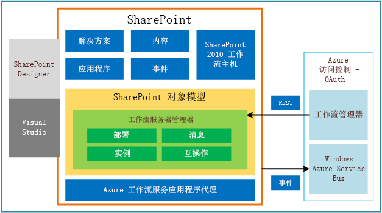

# SharePoint 2013 工作流的新增功能
了解 SharePoint 2013 中的工作流的新增功能和特性。
SharePoint 2013 中的工作流框架与早期版本相比有了明显的改变。以下各节提供了有关工作流基础结构的最重要的更新和增强的概要说明。
  
    
    

## 完全重新设计的工作流基础结构

SharePoint 2013 工作流由 Windows Workflow Foundation 4 (WF) 提供支持，它实际上是基于早期版本重新设计的版本。反过来说，Windows Workflow Foundation 是基于由  [Windows Communication Foundation (WCF)](http://msdn.microsoft.com/zh-cn/vstudio/aa496123) 提供的消息功能构建的。
  
    
    
新的工作流基础结构的最突出的功能可能是将 Microsoft Azure 作为新的工作流执行主机引入。工作流执行引擎现在位于 SharePoint 的外部（在 Microsoft Azure 中）。图 1 提供了新的工作流基础结构的通用高级视图。有关图 1 中呈现的概念的更全面的讨论，请参阅  [SharePoint 2013 工作流基础](sharepoint-2013-workflow-fundamentals.md)。
  
    
    

**图 1. 工作流基础结构的高级体系结构**

  
    
    

  
    
    

  
    
    

  
    
    

  
    
    

## 完全声明性的无代码创作环境

另一项显著的更改是，WF 4 平台上的工作流是完全声明性的。也就是说，不再将工作流编译为托管程序集和部署到程序集缓存。相反，XAML 文件将定义您的工作流并设计其执行。
  
    
    

## 增强的 SharePoint Designer 2013 创作支持

已对 SharePoint Designer 2013 进行更新，旨在使其成为用于创作 SharePoint 工作流的可选创作环境。SharePoint Designer 2013 为工作流作者提供了设计器图面和基于文本的工作流创作环境。此外，您可以在 Visual Studio 2008 中开发工作流自定义操作，然后将这些操作部署到 SharePoint Designer 2013 中，随后可以从 Workflow Designer 访问它们。
  
    
    
简而言之，SharePoint 工作流创作和开发环境足以满足信息工作者（"高级用户"）和开发人员的需求。
  
    
    

## Visual Studio 2008 工作流项目类型支持

为了使信息工作者与软件开发人员之间能够更轻松地协作，Visual Studio 2008 提供了 SharePoint 工作流项目类型和工作流自定义操作项类型。有关使用 Visual Studio 2008 开发工作流的详细信息，以及有关在工作流开发中区分 SharePoint Designer 2013 和 Visual Studio 2008 的信息，请参阅 [使用 Visual Studio 开发 SharePoint 2013 工作流](develop-sharepoint-2013-workflows-using-visual-studio.md)。
  
    
    

## 针对创建自定义操作的支持

为了满足工作流作者的业务要求，我们已做了大量工作过，包括在 SharePoint Designer 2013 和 Visual Studio 2008 中提供工作流模板、操作和活动。但我们也知道，我们无法满足每个人的特定需求。为此，Visual Studio 2008 提供了工作流自定义操作项类型，开发人员可使用此类型创建自定义操作。有关工作流自定义操作的详细信息，请参阅 [如何：生成和部署工作流自定义操作](how-to-build-and-deploy-workflow-custom-actions.md)。
  
    
    

## 针对 SharePoint 工作流的工具支持

Visual Studio 2008 提供了用于在 SharePoint 2013 工作流框架上创建工作流的模板和支持。SharePoint 2013 工作流与早期版本的工作流类似，只不过它们由 WF 4 提供支持并运行于 Microsoft Azure 中。此外，它们是仅声明性的 (XAML)，旨在与云进行交互并与 SharePoint 外接程序一起使用。其主要好处之一是，使您能够在 SharePoint Server 外部远程承载和运行工作流。
  
    
    

## 新工作流操作

以下是 SharePoint 2013 中提供的新工作流操作。有关新的和弃用的操作的详细信息，请参阅  [SharePoint 2013 的工作流操作和活动引用](workflow-actions-and-activities-reference-for-sharepoint-2013.md)。SharePoint 2013 中的工作流的新增内容是一组工作流操作，允许您与 Project 2013 集成和创建基于 Project 的工作流。
  
    
    

**表 1. SharePoint 2013 中的新工作流操作**

|**操作**|**说明**|
|:-----|:-----|
|分配任务    |向用户或组分配单个工作流任务。    |
|启动任务流程    |启动任务流程的执行。    |
|转到此阶段    |指定应将流控制提交到的工作流中的下一个阶段。    |
|调用 HTTP Web 服务    |与针对代表性状态传输 (REST) 终结点的方法调用的功能类似。    |
|启动列表工作流    |启动列表范围内的工作流。    |
|启动网站工作流    |启动网站范围内的工作流。    |
|生成 DynamicValue    |创建类型为 **DynamicValue** 的新变量。   |
|从 DynamicValue 中获取属性    |从类型为 **DynamicValue** 的指定变量检索属性值。   |
|对 DynamicValue 中的项数计数    |返回类型为 **DynamicValue** 的变量中的行数。   |
|修整字符串    |删除当前字符串中的所有前导和尾随空白字符。    |
|在字符串中查找子字符串    |返回字符串中的一个或多个字符的第一个出现位置的从 1 开始的索引，或字符串的第一个出现位置。    |
|替换字符串中的子字符串    |返回指定字符或字符串的所有出现位置在其中替换为另一个指定字符或字符串的新字符串。    |
|翻译文档    |与围绕调用同步翻译 API 的 HTTP 活动的包装的功能类似。您必须为运行工作流的 SharePoint 网站配置机器翻译服务应用程序。    |
|设置工作流状态    |更新消息字符串中指定的工作流状态。    |
|从当前项创建项目 [Microsoft Project]    |创建基于当前项的 Project Server 项目。    |
|将当前项目阶段状态设置为此值 [Microsoft Project]    |在项目的当前阶段中设置两个状态域。    |
|将理想列表项中的状态域设置为此值 [Microsoft Project]    |更新原始 SharePoint 列表项的状态域。    |
|等待 Project 事件 [Microsoft Project]    |暂停工作流的当前实例以等待指定的 Project 事件：Project 签入、Project 委托、Project 提交。    |
|将项目中的此域设置为此值 [Microsoft Project]    |设置指定项目的企业自定义域的值。    |
   

## 其他资源

-  [SharePoint 2013 中的工作流入门](get-started-with-workflows-in-sharepoint-2013.md)
    
  
-  [SharePoint 2013 中面向开发人员的新增功能](what’s-new-for-developers-in-sharepoint-2013.md)
    
  
-  [SharePoint 2013 的工作流操作和活动引用](workflow-actions-and-activities-reference-for-sharepoint-2013.md)
    
  
-  [工作流操作快速参考（SharePoint 2013 工作流平台）](workflow-actions-quick-reference-sharepoint-2013-workflow-platform.md)
    
  

